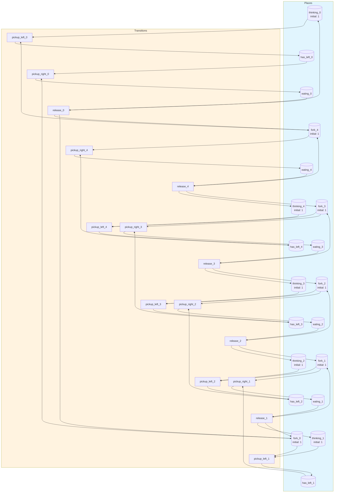

# dining-philosophers

Classic dining philosophers problem demonstrating concurrency and deadlock in Petri nets

## Quick Start

```bash
# Build and run
go build -o server .
./server

# Server starts on http://localhost:8080
```

## Architecture

This application uses **event sourcing** with a **Petri net** state machine to model workflows. All state changes are captured as immutable events, enabling:

- Full audit trail of all transitions
- Time-travel debugging
- Event replay for recovery
- Deterministic state reconstruction

## State Machine

### Places (States)

| Place | Type | Initial | Description |
|-------|------|---------|-------------|
| `thinking_0` | Token | 1 | Philosopher 0 is thinking |
| `thinking_1` | Token | 1 | Philosopher 1 is thinking |
| `thinking_2` | Token | 1 | Philosopher 2 is thinking |
| `thinking_3` | Token | 1 | Philosopher 3 is thinking |
| `thinking_4` | Token | 1 | Philosopher 4 is thinking |
| `fork_0` | Token | 1 | Fork between philosopher 0 and 1 |
| `fork_1` | Token | 1 | Fork between philosopher 1 and 2 |
| `fork_2` | Token | 1 | Fork between philosopher 2 and 3 |
| `fork_3` | Token | 1 | Fork between philosopher 3 and 4 |
| `fork_4` | Token | 1 | Fork between philosopher 4 and 0 |
| `has_left_0` | Token | 0 | Philosopher 0 has left fork |
| `has_left_1` | Token | 0 | Philosopher 1 has left fork |
| `has_left_2` | Token | 0 | Philosopher 2 has left fork |
| `has_left_3` | Token | 0 | Philosopher 3 has left fork |
| `has_left_4` | Token | 0 | Philosopher 4 has left fork |
| `eating_0` | Token | 0 | Philosopher 0 is eating |
| `eating_1` | Token | 0 | Philosopher 1 is eating |
| `eating_2` | Token | 0 | Philosopher 2 is eating |
| `eating_3` | Token | 0 | Philosopher 3 is eating |
| `eating_4` | Token | 0 | Philosopher 4 is eating |


### Transitions (Actions)

| Transition | Event | Guard | Description |
|------------|-------|-------|-------------|
| `pickup_left_0` | `PickupLeft0ed` | - | Philosopher 0 picks up left fork (fork 4) |
| `pickup_left_1` | `PickupLeft1ed` | - | Philosopher 1 picks up left fork (fork 0) |
| `pickup_left_2` | `PickupLeft2ed` | - | Philosopher 2 picks up left fork (fork 1) |
| `pickup_left_3` | `PickupLeft3ed` | - | Philosopher 3 picks up left fork (fork 2) |
| `pickup_left_4` | `PickupLeft4ed` | - | Philosopher 4 picks up left fork (fork 3) |
| `pickup_right_0` | `PickupRight0ed` | - | Philosopher 0 picks up right fork (fork 0) |
| `pickup_right_1` | `PickupRight1ed` | - | Philosopher 1 picks up right fork (fork 1) |
| `pickup_right_2` | `PickupRight2ed` | - | Philosopher 2 picks up right fork (fork 2) |
| `pickup_right_3` | `PickupRight3ed` | - | Philosopher 3 picks up right fork (fork 3) |
| `pickup_right_4` | `PickupRight4ed` | - | Philosopher 4 picks up right fork (fork 4) |
| `release_0` | `Release0ed` | - | Philosopher 0 releases both forks and goes back to thinking |
| `release_1` | `Release1ed` | - | Philosopher 1 releases both forks and goes back to thinking |
| `release_2` | `Release2ed` | - | Philosopher 2 releases both forks and goes back to thinking |
| `release_3` | `Release3ed` | - | Philosopher 3 releases both forks and goes back to thinking |
| `release_4` | `Release4ed` | - | Philosopher 4 releases both forks and goes back to thinking |


### Petri Net Diagram

```mermaid
stateDiagram-v2
    direction LR

    state "thinking_0 (1)" as PlaceThinking0
    state "thinking_1 (1)" as PlaceThinking1
    state "thinking_2 (1)" as PlaceThinking2
    state "thinking_3 (1)" as PlaceThinking3
    state "thinking_4 (1)" as PlaceThinking4
    state "fork_0 (1)" as PlaceFork0
    state "fork_1 (1)" as PlaceFork1
    state "fork_2 (1)" as PlaceFork2
    state "fork_3 (1)" as PlaceFork3
    state "fork_4 (1)" as PlaceFork4
    state "has_left_0" as PlaceHasLeft0
    state "has_left_1" as PlaceHasLeft1
    state "has_left_2" as PlaceHasLeft2
    state "has_left_3" as PlaceHasLeft3
    state "has_left_4" as PlaceHasLeft4
    state "eating_0" as PlaceEating0
    state "eating_1" as PlaceEating1
    state "eating_2" as PlaceEating2
    state "eating_3" as PlaceEating3
    state "eating_4" as PlaceEating4


    state "pickup_left_0" as t_TransitionPickupLeft0
    state "pickup_left_1" as t_TransitionPickupLeft1
    state "pickup_left_2" as t_TransitionPickupLeft2
    state "pickup_left_3" as t_TransitionPickupLeft3
    state "pickup_left_4" as t_TransitionPickupLeft4
    state "pickup_right_0" as t_TransitionPickupRight0
    state "pickup_right_1" as t_TransitionPickupRight1
    state "pickup_right_2" as t_TransitionPickupRight2
    state "pickup_right_3" as t_TransitionPickupRight3
    state "pickup_right_4" as t_TransitionPickupRight4
    state "release_0" as t_TransitionRelease0
    state "release_1" as t_TransitionRelease1
    state "release_2" as t_TransitionRelease2
    state "release_3" as t_TransitionRelease3
    state "release_4" as t_TransitionRelease4


    PlaceThinking0 --> t_TransitionPickupLeft0
    PlaceFork4 --> t_TransitionPickupLeft0
    t_TransitionPickupLeft0 --> PlaceHasLeft0

    PlaceThinking1 --> t_TransitionPickupLeft1
    PlaceFork0 --> t_TransitionPickupLeft1
    t_TransitionPickupLeft1 --> PlaceHasLeft1

    PlaceThinking2 --> t_TransitionPickupLeft2
    PlaceFork1 --> t_TransitionPickupLeft2
    t_TransitionPickupLeft2 --> PlaceHasLeft2

    PlaceThinking3 --> t_TransitionPickupLeft3
    PlaceFork2 --> t_TransitionPickupLeft3
    t_TransitionPickupLeft3 --> PlaceHasLeft3

    PlaceThinking4 --> t_TransitionPickupLeft4
    PlaceFork3 --> t_TransitionPickupLeft4
    t_TransitionPickupLeft4 --> PlaceHasLeft4

    PlaceHasLeft0 --> t_TransitionPickupRight0
    PlaceFork0 --> t_TransitionPickupRight0
    t_TransitionPickupRight0 --> PlaceEating0

    PlaceHasLeft1 --> t_TransitionPickupRight1
    PlaceFork1 --> t_TransitionPickupRight1
    t_TransitionPickupRight1 --> PlaceEating1

    PlaceHasLeft2 --> t_TransitionPickupRight2
    PlaceFork2 --> t_TransitionPickupRight2
    t_TransitionPickupRight2 --> PlaceEating2

    PlaceHasLeft3 --> t_TransitionPickupRight3
    PlaceFork3 --> t_TransitionPickupRight3
    t_TransitionPickupRight3 --> PlaceEating3

    PlaceHasLeft4 --> t_TransitionPickupRight4
    PlaceFork4 --> t_TransitionPickupRight4
    t_TransitionPickupRight4 --> PlaceEating4

    PlaceEating0 --> t_TransitionRelease0
    t_TransitionRelease0 --> PlaceThinking0
    t_TransitionRelease0 --> PlaceFork4
    t_TransitionRelease0 --> PlaceFork0

    PlaceEating1 --> t_TransitionRelease1
    t_TransitionRelease1 --> PlaceThinking1
    t_TransitionRelease1 --> PlaceFork0
    t_TransitionRelease1 --> PlaceFork1

    PlaceEating2 --> t_TransitionRelease2
    t_TransitionRelease2 --> PlaceThinking2
    t_TransitionRelease2 --> PlaceFork1
    t_TransitionRelease2 --> PlaceFork2

    PlaceEating3 --> t_TransitionRelease3
    t_TransitionRelease3 --> PlaceThinking3
    t_TransitionRelease3 --> PlaceFork2
    t_TransitionRelease3 --> PlaceFork3

    PlaceEating4 --> t_TransitionRelease4
    t_TransitionRelease4 --> PlaceThinking4
    t_TransitionRelease4 --> PlaceFork3
    t_TransitionRelease4 --> PlaceFork4

```



### Workflow Diagram




## Events

Events are immutable records of state transitions. Each event captures the transition that occurred and any associated data.

| Event Type | Transition | Fields |
|------------|------------|--------|
| `PickupLeft0ed` | `pickup_left_0` | `aggregate_id`, `timestamp` |
| `PickupLeft1ed` | `pickup_left_1` | `aggregate_id`, `timestamp` |
| `PickupLeft2ed` | `pickup_left_2` | `aggregate_id`, `timestamp` |
| `PickupLeft3ed` | `pickup_left_3` | `aggregate_id`, `timestamp` |
| `PickupLeft4ed` | `pickup_left_4` | `aggregate_id`, `timestamp` |
| `PickupRight0ed` | `pickup_right_0` | `aggregate_id`, `timestamp` |
| `PickupRight1ed` | `pickup_right_1` | `aggregate_id`, `timestamp` |
| `PickupRight2ed` | `pickup_right_2` | `aggregate_id`, `timestamp` |
| `PickupRight3ed` | `pickup_right_3` | `aggregate_id`, `timestamp` |
| `PickupRight4ed` | `pickup_right_4` | `aggregate_id`, `timestamp` |
| `Release0ed` | `release_0` | `aggregate_id`, `timestamp` |
| `Release1ed` | `release_1` | `aggregate_id`, `timestamp` |
| `Release2ed` | `release_2` | `aggregate_id`, `timestamp` |
| `Release3ed` | `release_3` | `aggregate_id`, `timestamp` |
| `Release4ed` | `release_4` | `aggregate_id`, `timestamp` |

```mermaid
classDiagram
    class Event {
        +string ID
        +string StreamID
        +string Type
        +int Version
        +time.Time Timestamp
        +json.RawMessage Data
    }


    class PickupLeft0edEvent {
        +string AggregateId
        +time.Time Timestamp
    }
    Event <|-- PickupLeft0edEvent

    class PickupLeft1edEvent {
        +string AggregateId
        +time.Time Timestamp
    }
    Event <|-- PickupLeft1edEvent

    class PickupLeft2edEvent {
        +string AggregateId
        +time.Time Timestamp
    }
    Event <|-- PickupLeft2edEvent

    class PickupLeft3edEvent {
        +string AggregateId
        +time.Time Timestamp
    }
    Event <|-- PickupLeft3edEvent

    class PickupLeft4edEvent {
        +string AggregateId
        +time.Time Timestamp
    }
    Event <|-- PickupLeft4edEvent

    class PickupRight0edEvent {
        +string AggregateId
        +time.Time Timestamp
    }
    Event <|-- PickupRight0edEvent

    class PickupRight1edEvent {
        +string AggregateId
        +time.Time Timestamp
    }
    Event <|-- PickupRight1edEvent

    class PickupRight2edEvent {
        +string AggregateId
        +time.Time Timestamp
    }
    Event <|-- PickupRight2edEvent

    class PickupRight3edEvent {
        +string AggregateId
        +time.Time Timestamp
    }
    Event <|-- PickupRight3edEvent

    class PickupRight4edEvent {
        +string AggregateId
        +time.Time Timestamp
    }
    Event <|-- PickupRight4edEvent

    class Release0edEvent {
        +string AggregateId
        +time.Time Timestamp
    }
    Event <|-- Release0edEvent

    class Release1edEvent {
        +string AggregateId
        +time.Time Timestamp
    }
    Event <|-- Release1edEvent

    class Release2edEvent {
        +string AggregateId
        +time.Time Timestamp
    }
    Event <|-- Release2edEvent

    class Release3edEvent {
        +string AggregateId
        +time.Time Timestamp
    }
    Event <|-- Release3edEvent

    class Release4edEvent {
        +string AggregateId
        +time.Time Timestamp
    }
    Event <|-- Release4edEvent

```





## API Endpoints

### Core Endpoints

| Method | Path | Description |
|--------|------|-------------|
| GET | `/health` | Health check |
| GET | `/ready` | Readiness check |
| POST | `/api/dining-philosophers` | Create new instance |
| GET | `/api/dining-philosophers/{id}` | Get instance state |


### Transition Endpoints

| Method | Path | Transition | Description |
|--------|------|------------|-------------|
| POST | `/api/pickup_left_0` | `pickup_left_0` | Philosopher 0 picks up left fork (fork 4) |
| POST | `/api/pickup_left_1` | `pickup_left_1` | Philosopher 1 picks up left fork (fork 0) |
| POST | `/api/pickup_left_2` | `pickup_left_2` | Philosopher 2 picks up left fork (fork 1) |
| POST | `/api/pickup_left_3` | `pickup_left_3` | Philosopher 3 picks up left fork (fork 2) |
| POST | `/api/pickup_left_4` | `pickup_left_4` | Philosopher 4 picks up left fork (fork 3) |
| POST | `/api/pickup_right_0` | `pickup_right_0` | Philosopher 0 picks up right fork (fork 0) |
| POST | `/api/pickup_right_1` | `pickup_right_1` | Philosopher 1 picks up right fork (fork 1) |
| POST | `/api/pickup_right_2` | `pickup_right_2` | Philosopher 2 picks up right fork (fork 2) |
| POST | `/api/pickup_right_3` | `pickup_right_3` | Philosopher 3 picks up right fork (fork 3) |
| POST | `/api/pickup_right_4` | `pickup_right_4` | Philosopher 4 picks up right fork (fork 4) |
| POST | `/api/release_0` | `release_0` | Philosopher 0 releases both forks and goes back to thinking |
| POST | `/api/release_1` | `release_1` | Philosopher 1 releases both forks and goes back to thinking |
| POST | `/api/release_2` | `release_2` | Philosopher 2 releases both forks and goes back to thinking |
| POST | `/api/release_3` | `release_3` | Philosopher 3 releases both forks and goes back to thinking |
| POST | `/api/release_4` | `release_4` | Philosopher 4 releases both forks and goes back to thinking |


### Request/Response Format

#### Create Instance
```bash
curl -X POST http://localhost:8080/api/dining-philosophers \
  -H "Content-Type: application/json" \
  -H "Authorization: Bearer <token>"
```

#### Execute Transition
```bash
curl -X POST http://localhost:8080/api/<transition> \
  -H "Content-Type: application/json" \
  -H "Authorization: Bearer <token>" \
  -d '{
    "aggregate_id": "<instance-id>",
    "data": { ... }
  }'
```

#### Response Format
```json
{
  "success": true,
  "aggregate_id": "uuid",
  "version": 1,
  "state": { "place1": 1, "place2": 0 },
  "enabled_transitions": ["transition1", "transition2"]
}
```


## Configuration

### Environment Variables

| Variable | Default | Description |
|----------|---------|-------------|
| `PORT` | `8080` | HTTP server port |
| `DB_PATH` | `./dining-philosophers.db` | SQLite database path |
| `DEBUG` | `false` | Enable debug endpoints |


## Development

### Project Structure

```
.
├── main.go           # Application entry point
├── workflow.go       # Petri net definition
├── aggregate.go      # Event-sourced aggregate
├── events.go         # Event type definitions
├── api.go            # HTTP handlers
├── debug.go          # Debug handlers
├── frontend/         # Web UI (ES modules)
│   ├── index.html
│   └── src/
│       ├── main.js
│       ├── router.js
│       └── ...
└── go.mod
```

### Testing

```bash
# Run unit tests
go test ./...

# Run with test coverage
go test -cover ./...
```

---

Generated by [petri-pilot](https://github.com/pflow-xyz/petri-pilot)
