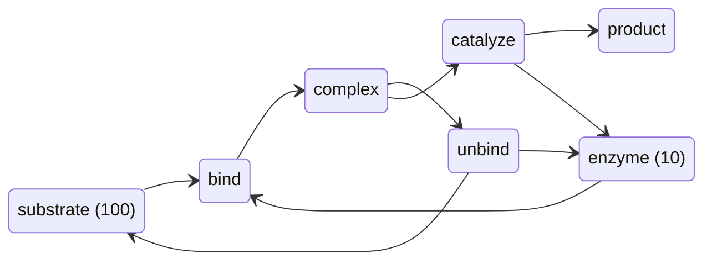
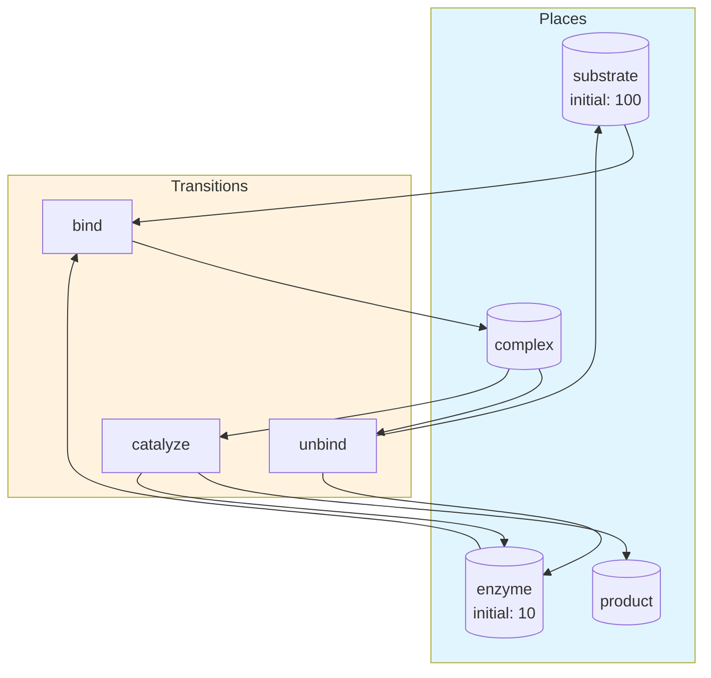
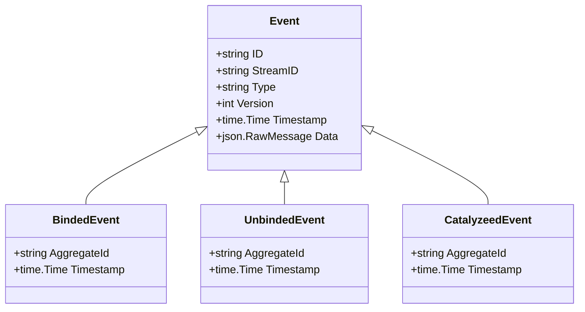

# enzyme-kinetics

Michaelis-Menten enzyme kinetics modeled as a Petri net with ODE simulation

## Quick Start

```bash
# Build and run
go build -o server .
./server

# Server starts on http://localhost:8080
```

## Architecture

This application uses **event sourcing** with a **Petri net** state machine to model workflows. All state changes are captured as immutable events, enabling:

- Full audit trail of all transitions
- Time-travel debugging
- Event replay for recovery
- Deterministic state reconstruction

## State Machine

### Places (States)

| Place | Type | Initial | Description |
|-------|------|---------|-------------|
| `substrate` | Token | 100 | Substrate molecules (S) |
| `enzyme` | Token | 10 | Free enzyme molecules (E) |
| `complex` | Token | 0 | Enzyme-substrate complex (ES) |
| `product` | Token | 0 | Product molecules (P) |


### Transitions (Actions)

| Transition | Event | Guard | Description |
|------------|-------|-------|-------------|
| `bind` | `Binded` | - | Substrate binds to enzyme forming complex (rate k1) |
| `unbind` | `Unbinded` | - | Complex dissociates back to substrate and enzyme (rate k-1) |
| `catalyze` | `Catalyzeed` | - | Complex converts substrate to product, releasing enzyme (rate kcat) |


### Petri Net Diagram



### Workflow Diagram




## Events

Events are immutable records of state transitions. Each event captures the transition that occurred and any associated data.

| Event Type | Transition | Fields |
|------------|------------|--------|
| `Binded` | `bind` | `aggregate_id`, `timestamp` |
| `Unbinded` | `unbind` | `aggregate_id`, `timestamp` |
| `Catalyzeed` | `catalyze` | `aggregate_id`, `timestamp` |





## API Endpoints

### Core Endpoints

| Method | Path | Description |
|--------|------|-------------|
| GET | `/health` | Health check |
| GET | `/ready` | Readiness check |
| POST | `/api/enzyme-kinetics` | Create new instance |
| GET | `/api/enzyme-kinetics/{id}` | Get instance state |


### Transition Endpoints

| Method | Path | Transition | Description |
|--------|------|------------|-------------|
| POST | `/api/bind` | `bind` | Substrate binds to enzyme forming complex (rate k1) |
| POST | `/api/unbind` | `unbind` | Complex dissociates back to substrate and enzyme (rate k-1) |
| POST | `/api/catalyze` | `catalyze` | Complex converts substrate to product, releasing enzyme (rate kcat) |


### Request/Response Format

#### Create Instance
```bash
curl -X POST http://localhost:8080/api/enzyme-kinetics \
  -H "Content-Type: application/json" \
  -H "Authorization: Bearer <token>"
```

#### Execute Transition
```bash
curl -X POST http://localhost:8080/api/<transition> \
  -H "Content-Type: application/json" \
  -H "Authorization: Bearer <token>" \
  -d '{
    "aggregate_id": "<instance-id>",
    "data": { ... }
  }'
```

#### Response Format
```json
{
  "success": true,
  "aggregate_id": "uuid",
  "version": 1,
  "state": { "place1": 1, "place2": 0 },
  "enabled_transitions": ["transition1", "transition2"]
}
```


## Configuration

### Environment Variables

| Variable | Default | Description |
|----------|---------|-------------|
| `PORT` | `8080` | HTTP server port |
| `DB_PATH` | `./enzyme-kinetics.db` | SQLite database path |
| `DEBUG` | `false` | Enable debug endpoints |


## Development

### Project Structure

```
.
├── main.go           # Application entry point
├── workflow.go       # Petri net definition
├── aggregate.go      # Event-sourced aggregate
├── events.go         # Event type definitions
├── api.go            # HTTP handlers
├── debug.go          # Debug handlers
├── frontend/         # Web UI (ES modules)
│   ├── index.html
│   └── src/
│       ├── main.js
│       ├── router.js
│       └── ...
└── go.mod
```

### Testing

```bash
# Run unit tests
go test ./...

# Run with test coverage
go test -cover ./...
```

---

Generated by [petri-pilot](https://github.com/pflow-xyz/petri-pilot)
