# galton-board

8-row Galton board demonstrating how Petri net topology produces the binomial distribution (Pascal's triangle row 8)

## Quick Start

```bash
# Build and run
go build -o server .
./server

# Server starts on http://localhost:8080
```

## Architecture

This application uses **event sourcing** with a **Petri net** state machine to model workflows. All state changes are captured as immutable events, enabling:

- Full audit trail of all transitions
- Time-travel debugging
- Event replay for recovery
- Deterministic state reconstruction

## State Machine

### Places (States)

| Place | Type | Initial | Description |
|-------|------|---------|-------------|
| `top` | Token | 256 | Ball entry point |
| `r1_0` | Token | 0 | Row 1, position 0 |
| `r1_1` | Token | 0 | Row 1, position 1 |
| `r2_0` | Token | 0 | Row 2, position 0 |
| `r2_1` | Token | 0 | Row 2, position 1 |
| `r2_2` | Token | 0 | Row 2, position 2 |
| `r3_0` | Token | 0 | Row 3, position 0 |
| `r3_1` | Token | 0 | Row 3, position 1 |
| `r3_2` | Token | 0 | Row 3, position 2 |
| `r3_3` | Token | 0 | Row 3, position 3 |
| `r4_0` | Token | 0 | Row 4, position 0 |
| `r4_1` | Token | 0 | Row 4, position 1 |
| `r4_2` | Token | 0 | Row 4, position 2 |
| `r4_3` | Token | 0 | Row 4, position 3 |
| `r4_4` | Token | 0 | Row 4, position 4 |
| `r5_0` | Token | 0 | Row 5, position 0 |
| `r5_1` | Token | 0 | Row 5, position 1 |
| `r5_2` | Token | 0 | Row 5, position 2 |
| `r5_3` | Token | 0 | Row 5, position 3 |
| `r5_4` | Token | 0 | Row 5, position 4 |
| `r5_5` | Token | 0 | Row 5, position 5 |
| `r6_0` | Token | 0 | Row 6, position 0 |
| `r6_1` | Token | 0 | Row 6, position 1 |
| `r6_2` | Token | 0 | Row 6, position 2 |
| `r6_3` | Token | 0 | Row 6, position 3 |
| `r6_4` | Token | 0 | Row 6, position 4 |
| `r6_5` | Token | 0 | Row 6, position 5 |
| `r6_6` | Token | 0 | Row 6, position 6 |
| `r7_0` | Token | 0 | Row 7, position 0 |
| `r7_1` | Token | 0 | Row 7, position 1 |
| `r7_2` | Token | 0 | Row 7, position 2 |
| `r7_3` | Token | 0 | Row 7, position 3 |
| `r7_4` | Token | 0 | Row 7, position 4 |
| `r7_5` | Token | 0 | Row 7, position 5 |
| `r7_6` | Token | 0 | Row 7, position 6 |
| `r7_7` | Token | 0 | Row 7, position 7 |
| `bin_0` | Token | 0 | Bin 0 |
| `bin_1` | Token | 0 | Bin 1 |
| `bin_2` | Token | 0 | Bin 2 |
| `bin_3` | Token | 0 | Bin 3 |
| `bin_4` | Token | 0 | Bin 4 |
| `bin_5` | Token | 0 | Bin 5 |
| `bin_6` | Token | 0 | Bin 6 |
| `bin_7` | Token | 0 | Bin 7 |
| `bin_8` | Token | 0 | Bin 8 |


### Transitions (Actions)

| Transition | Event | Guard | Description |
|------------|-------|-------|-------------|
| `p00L` | `P00Led` | - | Peg 0,0 bounce left |
| `p00R` | `P00Red` | - | Peg 0,0 bounce right |
| `p10L` | `P10Led` | - | Peg 1,0 bounce left |
| `p10R` | `P10Red` | - | Peg 1,0 bounce right |
| `p11L` | `P11Led` | - | Peg 1,1 bounce left |
| `p11R` | `P11Red` | - | Peg 1,1 bounce right |
| `p20L` | `P20Led` | - | Peg 2,0 bounce left |
| `p20R` | `P20Red` | - | Peg 2,0 bounce right |
| `p21L` | `P21Led` | - | Peg 2,1 bounce left |
| `p21R` | `P21Red` | - | Peg 2,1 bounce right |
| `p22L` | `P22Led` | - | Peg 2,2 bounce left |
| `p22R` | `P22Red` | - | Peg 2,2 bounce right |
| `p30L` | `P30Led` | - | Peg 3,0 bounce left |
| `p30R` | `P30Red` | - | Peg 3,0 bounce right |
| `p31L` | `P31Led` | - | Peg 3,1 bounce left |
| `p31R` | `P31Red` | - | Peg 3,1 bounce right |
| `p32L` | `P32Led` | - | Peg 3,2 bounce left |
| `p32R` | `P32Red` | - | Peg 3,2 bounce right |
| `p33L` | `P33Led` | - | Peg 3,3 bounce left |
| `p33R` | `P33Red` | - | Peg 3,3 bounce right |
| `p40L` | `P40Led` | - | Peg 4,0 bounce left |
| `p40R` | `P40Red` | - | Peg 4,0 bounce right |
| `p41L` | `P41Led` | - | Peg 4,1 bounce left |
| `p41R` | `P41Red` | - | Peg 4,1 bounce right |
| `p42L` | `P42Led` | - | Peg 4,2 bounce left |
| `p42R` | `P42Red` | - | Peg 4,2 bounce right |
| `p43L` | `P43Led` | - | Peg 4,3 bounce left |
| `p43R` | `P43Red` | - | Peg 4,3 bounce right |
| `p44L` | `P44Led` | - | Peg 4,4 bounce left |
| `p44R` | `P44Red` | - | Peg 4,4 bounce right |
| `p50L` | `P50Led` | - | Peg 5,0 bounce left |
| `p50R` | `P50Red` | - | Peg 5,0 bounce right |
| `p51L` | `P51Led` | - | Peg 5,1 bounce left |
| `p51R` | `P51Red` | - | Peg 5,1 bounce right |
| `p52L` | `P52Led` | - | Peg 5,2 bounce left |
| `p52R` | `P52Red` | - | Peg 5,2 bounce right |
| `p53L` | `P53Led` | - | Peg 5,3 bounce left |
| `p53R` | `P53Red` | - | Peg 5,3 bounce right |
| `p54L` | `P54Led` | - | Peg 5,4 bounce left |
| `p54R` | `P54Red` | - | Peg 5,4 bounce right |
| `p55L` | `P55Led` | - | Peg 5,5 bounce left |
| `p55R` | `P55Red` | - | Peg 5,5 bounce right |
| `p60L` | `P60Led` | - | Peg 6,0 bounce left |
| `p60R` | `P60Red` | - | Peg 6,0 bounce right |
| `p61L` | `P61Led` | - | Peg 6,1 bounce left |
| `p61R` | `P61Red` | - | Peg 6,1 bounce right |
| `p62L` | `P62Led` | - | Peg 6,2 bounce left |
| `p62R` | `P62Red` | - | Peg 6,2 bounce right |
| `p63L` | `P63Led` | - | Peg 6,3 bounce left |
| `p63R` | `P63Red` | - | Peg 6,3 bounce right |
| `p64L` | `P64Led` | - | Peg 6,4 bounce left |
| `p64R` | `P64Red` | - | Peg 6,4 bounce right |
| `p65L` | `P65Led` | - | Peg 6,5 bounce left |
| `p65R` | `P65Red` | - | Peg 6,5 bounce right |
| `p66L` | `P66Led` | - | Peg 6,6 bounce left |
| `p66R` | `P66Red` | - | Peg 6,6 bounce right |
| `p70L` | `P70Led` | - | Peg 7,0 bounce left |
| `p70R` | `P70Red` | - | Peg 7,0 bounce right |
| `p71L` | `P71Led` | - | Peg 7,1 bounce left |
| `p71R` | `P71Red` | - | Peg 7,1 bounce right |
| `p72L` | `P72Led` | - | Peg 7,2 bounce left |
| `p72R` | `P72Red` | - | Peg 7,2 bounce right |
| `p73L` | `P73Led` | - | Peg 7,3 bounce left |
| `p73R` | `P73Red` | - | Peg 7,3 bounce right |
| `p74L` | `P74Led` | - | Peg 7,4 bounce left |
| `p74R` | `P74Red` | - | Peg 7,4 bounce right |
| `p75L` | `P75Led` | - | Peg 7,5 bounce left |
| `p75R` | `P75Red` | - | Peg 7,5 bounce right |
| `p76L` | `P76Led` | - | Peg 7,6 bounce left |
| `p76R` | `P76Red` | - | Peg 7,6 bounce right |
| `p77L` | `P77Led` | - | Peg 7,7 bounce left |
| `p77R` | `P77Red` | - | Peg 7,7 bounce right |


### Petri Net Diagram

```mermaid
stateDiagram-v2
    direction LR

    state "top (256)" as PlaceTop
    state "r1_0" as PlaceR10
    state "r1_1" as PlaceR11
    state "r2_0" as PlaceR20
    state "r2_1" as PlaceR21
    state "r2_2" as PlaceR22
    state "r3_0" as PlaceR30
    state "r3_1" as PlaceR31
    state "r3_2" as PlaceR32
    state "r3_3" as PlaceR33
    state "r4_0" as PlaceR40
    state "r4_1" as PlaceR41
    state "r4_2" as PlaceR42
    state "r4_3" as PlaceR43
    state "r4_4" as PlaceR44
    state "r5_0" as PlaceR50
    state "r5_1" as PlaceR51
    state "r5_2" as PlaceR52
    state "r5_3" as PlaceR53
    state "r5_4" as PlaceR54
    state "r5_5" as PlaceR55
    state "r6_0" as PlaceR60
    state "r6_1" as PlaceR61
    state "r6_2" as PlaceR62
    state "r6_3" as PlaceR63
    state "r6_4" as PlaceR64
    state "r6_5" as PlaceR65
    state "r6_6" as PlaceR66
    state "r7_0" as PlaceR70
    state "r7_1" as PlaceR71
    state "r7_2" as PlaceR72
    state "r7_3" as PlaceR73
    state "r7_4" as PlaceR74
    state "r7_5" as PlaceR75
    state "r7_6" as PlaceR76
    state "r7_7" as PlaceR77
    state "bin_0" as PlaceBin0
    state "bin_1" as PlaceBin1
    state "bin_2" as PlaceBin2
    state "bin_3" as PlaceBin3
    state "bin_4" as PlaceBin4
    state "bin_5" as PlaceBin5
    state "bin_6" as PlaceBin6
    state "bin_7" as PlaceBin7
    state "bin_8" as PlaceBin8


    state "p00L" as t_TransitionP00l
    state "p00R" as t_TransitionP00r
    state "p10L" as t_TransitionP10l
    state "p10R" as t_TransitionP10r
    state "p11L" as t_TransitionP11l
    state "p11R" as t_TransitionP11r
    state "p20L" as t_TransitionP20l
    state "p20R" as t_TransitionP20r
    state "p21L" as t_TransitionP21l
    state "p21R" as t_TransitionP21r
    state "p22L" as t_TransitionP22l
    state "p22R" as t_TransitionP22r
    state "p30L" as t_TransitionP30l
    state "p30R" as t_TransitionP30r
    state "p31L" as t_TransitionP31l
    state "p31R" as t_TransitionP31r
    state "p32L" as t_TransitionP32l
    state "p32R" as t_TransitionP32r
    state "p33L" as t_TransitionP33l
    state "p33R" as t_TransitionP33r
    state "p40L" as t_TransitionP40l
    state "p40R" as t_TransitionP40r
    state "p41L" as t_TransitionP41l
    state "p41R" as t_TransitionP41r
    state "p42L" as t_TransitionP42l
    state "p42R" as t_TransitionP42r
    state "p43L" as t_TransitionP43l
    state "p43R" as t_TransitionP43r
    state "p44L" as t_TransitionP44l
    state "p44R" as t_TransitionP44r
    state "p50L" as t_TransitionP50l
    state "p50R" as t_TransitionP50r
    state "p51L" as t_TransitionP51l
    state "p51R" as t_TransitionP51r
    state "p52L" as t_TransitionP52l
    state "p52R" as t_TransitionP52r
    state "p53L" as t_TransitionP53l
    state "p53R" as t_TransitionP53r
    state "p54L" as t_TransitionP54l
    state "p54R" as t_TransitionP54r
    state "p55L" as t_TransitionP55l
    state "p55R" as t_TransitionP55r
    state "p60L" as t_TransitionP60l
    state "p60R" as t_TransitionP60r
    state "p61L" as t_TransitionP61l
    state "p61R" as t_TransitionP61r
    state "p62L" as t_TransitionP62l
    state "p62R" as t_TransitionP62r
    state "p63L" as t_TransitionP63l
    state "p63R" as t_TransitionP63r
    state "p64L" as t_TransitionP64l
    state "p64R" as t_TransitionP64r
    state "p65L" as t_TransitionP65l
    state "p65R" as t_TransitionP65r
    state "p66L" as t_TransitionP66l
    state "p66R" as t_TransitionP66r
    state "p70L" as t_TransitionP70l
    state "p70R" as t_TransitionP70r
    state "p71L" as t_TransitionP71l
    state "p71R" as t_TransitionP71r
    state "p72L" as t_TransitionP72l
    state "p72R" as t_TransitionP72r
    state "p73L" as t_TransitionP73l
    state "p73R" as t_TransitionP73r
    state "p74L" as t_TransitionP74l
    state "p74R" as t_TransitionP74r
    state "p75L" as t_TransitionP75l
    state "p75R" as t_TransitionP75r
    state "p76L" as t_TransitionP76l
    state "p76R" as t_TransitionP76r
    state "p77L" as t_TransitionP77l
    state "p77R" as t_TransitionP77r


    PlaceTop --> t_TransitionP00l
    t_TransitionP00l --> PlaceR10

    PlaceTop --> t_TransitionP00r
    t_TransitionP00r --> PlaceR11

    PlaceR10 --> t_TransitionP10l
    t_TransitionP10l --> PlaceR20

    PlaceR10 --> t_TransitionP10r
    t_TransitionP10r --> PlaceR21

    PlaceR11 --> t_TransitionP11l
    t_TransitionP11l --> PlaceR21

    PlaceR11 --> t_TransitionP11r
    t_TransitionP11r --> PlaceR22

    PlaceR20 --> t_TransitionP20l
    t_TransitionP20l --> PlaceR30

    PlaceR20 --> t_TransitionP20r
    t_TransitionP20r --> PlaceR31

    PlaceR21 --> t_TransitionP21l
    t_TransitionP21l --> PlaceR31

    PlaceR21 --> t_TransitionP21r
    t_TransitionP21r --> PlaceR32

    PlaceR22 --> t_TransitionP22l
    t_TransitionP22l --> PlaceR32

    PlaceR22 --> t_TransitionP22r
    t_TransitionP22r --> PlaceR33

    PlaceR30 --> t_TransitionP30l
    t_TransitionP30l --> PlaceR40

    PlaceR30 --> t_TransitionP30r
    t_TransitionP30r --> PlaceR41

    PlaceR31 --> t_TransitionP31l
    t_TransitionP31l --> PlaceR41

    PlaceR31 --> t_TransitionP31r
    t_TransitionP31r --> PlaceR42

    PlaceR32 --> t_TransitionP32l
    t_TransitionP32l --> PlaceR42

    PlaceR32 --> t_TransitionP32r
    t_TransitionP32r --> PlaceR43

    PlaceR33 --> t_TransitionP33l
    t_TransitionP33l --> PlaceR43

    PlaceR33 --> t_TransitionP33r
    t_TransitionP33r --> PlaceR44

    PlaceR40 --> t_TransitionP40l
    t_TransitionP40l --> PlaceR50

    PlaceR40 --> t_TransitionP40r
    t_TransitionP40r --> PlaceR51

    PlaceR41 --> t_TransitionP41l
    t_TransitionP41l --> PlaceR51

    PlaceR41 --> t_TransitionP41r
    t_TransitionP41r --> PlaceR52

    PlaceR42 --> t_TransitionP42l
    t_TransitionP42l --> PlaceR52

    PlaceR42 --> t_TransitionP42r
    t_TransitionP42r --> PlaceR53

    PlaceR43 --> t_TransitionP43l
    t_TransitionP43l --> PlaceR53

    PlaceR43 --> t_TransitionP43r
    t_TransitionP43r --> PlaceR54

    PlaceR44 --> t_TransitionP44l
    t_TransitionP44l --> PlaceR54

    PlaceR44 --> t_TransitionP44r
    t_TransitionP44r --> PlaceR55

    PlaceR50 --> t_TransitionP50l
    t_TransitionP50l --> PlaceR60

    PlaceR50 --> t_TransitionP50r
    t_TransitionP50r --> PlaceR61

    PlaceR51 --> t_TransitionP51l
    t_TransitionP51l --> PlaceR61

    PlaceR51 --> t_TransitionP51r
    t_TransitionP51r --> PlaceR62

    PlaceR52 --> t_TransitionP52l
    t_TransitionP52l --> PlaceR62

    PlaceR52 --> t_TransitionP52r
    t_TransitionP52r --> PlaceR63

    PlaceR53 --> t_TransitionP53l
    t_TransitionP53l --> PlaceR63

    PlaceR53 --> t_TransitionP53r
    t_TransitionP53r --> PlaceR64

    PlaceR54 --> t_TransitionP54l
    t_TransitionP54l --> PlaceR64

    PlaceR54 --> t_TransitionP54r
    t_TransitionP54r --> PlaceR65

    PlaceR55 --> t_TransitionP55l
    t_TransitionP55l --> PlaceR65

    PlaceR55 --> t_TransitionP55r
    t_TransitionP55r --> PlaceR66

    PlaceR60 --> t_TransitionP60l
    t_TransitionP60l --> PlaceR70

    PlaceR60 --> t_TransitionP60r
    t_TransitionP60r --> PlaceR71

    PlaceR61 --> t_TransitionP61l
    t_TransitionP61l --> PlaceR71

    PlaceR61 --> t_TransitionP61r
    t_TransitionP61r --> PlaceR72

    PlaceR62 --> t_TransitionP62l
    t_TransitionP62l --> PlaceR72

    PlaceR62 --> t_TransitionP62r
    t_TransitionP62r --> PlaceR73

    PlaceR63 --> t_TransitionP63l
    t_TransitionP63l --> PlaceR73

    PlaceR63 --> t_TransitionP63r
    t_TransitionP63r --> PlaceR74

    PlaceR64 --> t_TransitionP64l
    t_TransitionP64l --> PlaceR74

    PlaceR64 --> t_TransitionP64r
    t_TransitionP64r --> PlaceR75

    PlaceR65 --> t_TransitionP65l
    t_TransitionP65l --> PlaceR75

    PlaceR65 --> t_TransitionP65r
    t_TransitionP65r --> PlaceR76

    PlaceR66 --> t_TransitionP66l
    t_TransitionP66l --> PlaceR76

    PlaceR66 --> t_TransitionP66r
    t_TransitionP66r --> PlaceR77

    PlaceR70 --> t_TransitionP70l
    t_TransitionP70l --> PlaceBin0

    PlaceR70 --> t_TransitionP70r
    t_TransitionP70r --> PlaceBin1

    PlaceR71 --> t_TransitionP71l
    t_TransitionP71l --> PlaceBin1

    PlaceR71 --> t_TransitionP71r
    t_TransitionP71r --> PlaceBin2

    PlaceR72 --> t_TransitionP72l
    t_TransitionP72l --> PlaceBin2

    PlaceR72 --> t_TransitionP72r
    t_TransitionP72r --> PlaceBin3

    PlaceR73 --> t_TransitionP73l
    t_TransitionP73l --> PlaceBin3

    PlaceR73 --> t_TransitionP73r
    t_TransitionP73r --> PlaceBin4

    PlaceR74 --> t_TransitionP74l
    t_TransitionP74l --> PlaceBin4

    PlaceR74 --> t_TransitionP74r
    t_TransitionP74r --> PlaceBin5

    PlaceR75 --> t_TransitionP75l
    t_TransitionP75l --> PlaceBin5

    PlaceR75 --> t_TransitionP75r
    t_TransitionP75r --> PlaceBin6

    PlaceR76 --> t_TransitionP76l
    t_TransitionP76l --> PlaceBin6

    PlaceR76 --> t_TransitionP76r
    t_TransitionP76r --> PlaceBin7

    PlaceR77 --> t_TransitionP77l
    t_TransitionP77l --> PlaceBin7

    PlaceR77 --> t_TransitionP77r
    t_TransitionP77r --> PlaceBin8

```



### Workflow Diagram

```mermaid
flowchart TD
    subgraph Places
        PlaceTop[("top<br/>initial: 256")]
        PlaceR10[("r1_0")]
        PlaceR11[("r1_1")]
        PlaceR20[("r2_0")]
        PlaceR21[("r2_1")]
        PlaceR22[("r2_2")]
        PlaceR30[("r3_0")]
        PlaceR31[("r3_1")]
        PlaceR32[("r3_2")]
        PlaceR33[("r3_3")]
        PlaceR40[("r4_0")]
        PlaceR41[("r4_1")]
        PlaceR42[("r4_2")]
        PlaceR43[("r4_3")]
        PlaceR44[("r4_4")]
        PlaceR50[("r5_0")]
        PlaceR51[("r5_1")]
        PlaceR52[("r5_2")]
        PlaceR53[("r5_3")]
        PlaceR54[("r5_4")]
        PlaceR55[("r5_5")]
        PlaceR60[("r6_0")]
        PlaceR61[("r6_1")]
        PlaceR62[("r6_2")]
        PlaceR63[("r6_3")]
        PlaceR64[("r6_4")]
        PlaceR65[("r6_5")]
        PlaceR66[("r6_6")]
        PlaceR70[("r7_0")]
        PlaceR71[("r7_1")]
        PlaceR72[("r7_2")]
        PlaceR73[("r7_3")]
        PlaceR74[("r7_4")]
        PlaceR75[("r7_5")]
        PlaceR76[("r7_6")]
        PlaceR77[("r7_7")]
        PlaceBin0[("bin_0")]
        PlaceBin1[("bin_1")]
        PlaceBin2[("bin_2")]
        PlaceBin3[("bin_3")]
        PlaceBin4[("bin_4")]
        PlaceBin5[("bin_5")]
        PlaceBin6[("bin_6")]
        PlaceBin7[("bin_7")]
        PlaceBin8[("bin_8")]
    end

    subgraph Transitions
        t_TransitionP00l["p00L"]
        t_TransitionP00r["p00R"]
        t_TransitionP10l["p10L"]
        t_TransitionP10r["p10R"]
        t_TransitionP11l["p11L"]
        t_TransitionP11r["p11R"]
        t_TransitionP20l["p20L"]
        t_TransitionP20r["p20R"]
        t_TransitionP21l["p21L"]
        t_TransitionP21r["p21R"]
        t_TransitionP22l["p22L"]
        t_TransitionP22r["p22R"]
        t_TransitionP30l["p30L"]
        t_TransitionP30r["p30R"]
        t_TransitionP31l["p31L"]
        t_TransitionP31r["p31R"]
        t_TransitionP32l["p32L"]
        t_TransitionP32r["p32R"]
        t_TransitionP33l["p33L"]
        t_TransitionP33r["p33R"]
        t_TransitionP40l["p40L"]
        t_TransitionP40r["p40R"]
        t_TransitionP41l["p41L"]
        t_TransitionP41r["p41R"]
        t_TransitionP42l["p42L"]
        t_TransitionP42r["p42R"]
        t_TransitionP43l["p43L"]
        t_TransitionP43r["p43R"]
        t_TransitionP44l["p44L"]
        t_TransitionP44r["p44R"]
        t_TransitionP50l["p50L"]
        t_TransitionP50r["p50R"]
        t_TransitionP51l["p51L"]
        t_TransitionP51r["p51R"]
        t_TransitionP52l["p52L"]
        t_TransitionP52r["p52R"]
        t_TransitionP53l["p53L"]
        t_TransitionP53r["p53R"]
        t_TransitionP54l["p54L"]
        t_TransitionP54r["p54R"]
        t_TransitionP55l["p55L"]
        t_TransitionP55r["p55R"]
        t_TransitionP60l["p60L"]
        t_TransitionP60r["p60R"]
        t_TransitionP61l["p61L"]
        t_TransitionP61r["p61R"]
        t_TransitionP62l["p62L"]
        t_TransitionP62r["p62R"]
        t_TransitionP63l["p63L"]
        t_TransitionP63r["p63R"]
        t_TransitionP64l["p64L"]
        t_TransitionP64r["p64R"]
        t_TransitionP65l["p65L"]
        t_TransitionP65r["p65R"]
        t_TransitionP66l["p66L"]
        t_TransitionP66r["p66R"]
        t_TransitionP70l["p70L"]
        t_TransitionP70r["p70R"]
        t_TransitionP71l["p71L"]
        t_TransitionP71r["p71R"]
        t_TransitionP72l["p72L"]
        t_TransitionP72r["p72R"]
        t_TransitionP73l["p73L"]
        t_TransitionP73r["p73R"]
        t_TransitionP74l["p74L"]
        t_TransitionP74r["p74R"]
        t_TransitionP75l["p75L"]
        t_TransitionP75r["p75R"]
        t_TransitionP76l["p76L"]
        t_TransitionP76r["p76R"]
        t_TransitionP77l["p77L"]
        t_TransitionP77r["p77R"]
    end


    PlaceTop --> t_TransitionP00l
    t_TransitionP00l --> PlaceR10

    PlaceTop --> t_TransitionP00r
    t_TransitionP00r --> PlaceR11

    PlaceR10 --> t_TransitionP10l
    t_TransitionP10l --> PlaceR20

    PlaceR10 --> t_TransitionP10r
    t_TransitionP10r --> PlaceR21

    PlaceR11 --> t_TransitionP11l
    t_TransitionP11l --> PlaceR21

    PlaceR11 --> t_TransitionP11r
    t_TransitionP11r --> PlaceR22

    PlaceR20 --> t_TransitionP20l
    t_TransitionP20l --> PlaceR30

    PlaceR20 --> t_TransitionP20r
    t_TransitionP20r --> PlaceR31

    PlaceR21 --> t_TransitionP21l
    t_TransitionP21l --> PlaceR31

    PlaceR21 --> t_TransitionP21r
    t_TransitionP21r --> PlaceR32

    PlaceR22 --> t_TransitionP22l
    t_TransitionP22l --> PlaceR32

    PlaceR22 --> t_TransitionP22r
    t_TransitionP22r --> PlaceR33

    PlaceR30 --> t_TransitionP30l
    t_TransitionP30l --> PlaceR40

    PlaceR30 --> t_TransitionP30r
    t_TransitionP30r --> PlaceR41

    PlaceR31 --> t_TransitionP31l
    t_TransitionP31l --> PlaceR41

    PlaceR31 --> t_TransitionP31r
    t_TransitionP31r --> PlaceR42

    PlaceR32 --> t_TransitionP32l
    t_TransitionP32l --> PlaceR42

    PlaceR32 --> t_TransitionP32r
    t_TransitionP32r --> PlaceR43

    PlaceR33 --> t_TransitionP33l
    t_TransitionP33l --> PlaceR43

    PlaceR33 --> t_TransitionP33r
    t_TransitionP33r --> PlaceR44

    PlaceR40 --> t_TransitionP40l
    t_TransitionP40l --> PlaceR50

    PlaceR40 --> t_TransitionP40r
    t_TransitionP40r --> PlaceR51

    PlaceR41 --> t_TransitionP41l
    t_TransitionP41l --> PlaceR51

    PlaceR41 --> t_TransitionP41r
    t_TransitionP41r --> PlaceR52

    PlaceR42 --> t_TransitionP42l
    t_TransitionP42l --> PlaceR52

    PlaceR42 --> t_TransitionP42r
    t_TransitionP42r --> PlaceR53

    PlaceR43 --> t_TransitionP43l
    t_TransitionP43l --> PlaceR53

    PlaceR43 --> t_TransitionP43r
    t_TransitionP43r --> PlaceR54

    PlaceR44 --> t_TransitionP44l
    t_TransitionP44l --> PlaceR54

    PlaceR44 --> t_TransitionP44r
    t_TransitionP44r --> PlaceR55

    PlaceR50 --> t_TransitionP50l
    t_TransitionP50l --> PlaceR60

    PlaceR50 --> t_TransitionP50r
    t_TransitionP50r --> PlaceR61

    PlaceR51 --> t_TransitionP51l
    t_TransitionP51l --> PlaceR61

    PlaceR51 --> t_TransitionP51r
    t_TransitionP51r --> PlaceR62

    PlaceR52 --> t_TransitionP52l
    t_TransitionP52l --> PlaceR62

    PlaceR52 --> t_TransitionP52r
    t_TransitionP52r --> PlaceR63

    PlaceR53 --> t_TransitionP53l
    t_TransitionP53l --> PlaceR63

    PlaceR53 --> t_TransitionP53r
    t_TransitionP53r --> PlaceR64

    PlaceR54 --> t_TransitionP54l
    t_TransitionP54l --> PlaceR64

    PlaceR54 --> t_TransitionP54r
    t_TransitionP54r --> PlaceR65

    PlaceR55 --> t_TransitionP55l
    t_TransitionP55l --> PlaceR65

    PlaceR55 --> t_TransitionP55r
    t_TransitionP55r --> PlaceR66

    PlaceR60 --> t_TransitionP60l
    t_TransitionP60l --> PlaceR70

    PlaceR60 --> t_TransitionP60r
    t_TransitionP60r --> PlaceR71

    PlaceR61 --> t_TransitionP61l
    t_TransitionP61l --> PlaceR71

    PlaceR61 --> t_TransitionP61r
    t_TransitionP61r --> PlaceR72

    PlaceR62 --> t_TransitionP62l
    t_TransitionP62l --> PlaceR72

    PlaceR62 --> t_TransitionP62r
    t_TransitionP62r --> PlaceR73

    PlaceR63 --> t_TransitionP63l
    t_TransitionP63l --> PlaceR73

    PlaceR63 --> t_TransitionP63r
    t_TransitionP63r --> PlaceR74

    PlaceR64 --> t_TransitionP64l
    t_TransitionP64l --> PlaceR74

    PlaceR64 --> t_TransitionP64r
    t_TransitionP64r --> PlaceR75

    PlaceR65 --> t_TransitionP65l
    t_TransitionP65l --> PlaceR75

    PlaceR65 --> t_TransitionP65r
    t_TransitionP65r --> PlaceR76

    PlaceR66 --> t_TransitionP66l
    t_TransitionP66l --> PlaceR76

    PlaceR66 --> t_TransitionP66r
    t_TransitionP66r --> PlaceR77

    PlaceR70 --> t_TransitionP70l
    t_TransitionP70l --> PlaceBin0

    PlaceR70 --> t_TransitionP70r
    t_TransitionP70r --> PlaceBin1

    PlaceR71 --> t_TransitionP71l
    t_TransitionP71l --> PlaceBin1

    PlaceR71 --> t_TransitionP71r
    t_TransitionP71r --> PlaceBin2

    PlaceR72 --> t_TransitionP72l
    t_TransitionP72l --> PlaceBin2

    PlaceR72 --> t_TransitionP72r
    t_TransitionP72r --> PlaceBin3

    PlaceR73 --> t_TransitionP73l
    t_TransitionP73l --> PlaceBin3

    PlaceR73 --> t_TransitionP73r
    t_TransitionP73r --> PlaceBin4

    PlaceR74 --> t_TransitionP74l
    t_TransitionP74l --> PlaceBin4

    PlaceR74 --> t_TransitionP74r
    t_TransitionP74r --> PlaceBin5

    PlaceR75 --> t_TransitionP75l
    t_TransitionP75l --> PlaceBin5

    PlaceR75 --> t_TransitionP75r
    t_TransitionP75r --> PlaceBin6

    PlaceR76 --> t_TransitionP76l
    t_TransitionP76l --> PlaceBin6

    PlaceR76 --> t_TransitionP76r
    t_TransitionP76r --> PlaceBin7

    PlaceR77 --> t_TransitionP77l
    t_TransitionP77l --> PlaceBin7

    PlaceR77 --> t_TransitionP77r
    t_TransitionP77r --> PlaceBin8


    style Places fill:#e1f5fe
    style Transitions fill:#fff3e0
```




## Events

Events are immutable records of state transitions. Each event captures the transition that occurred and any associated data.

| Event Type | Transition | Fields |
|------------|------------|--------|
| `P00Led` | `p00L` | `aggregate_id`, `timestamp` |
| `P00Red` | `p00R` | `aggregate_id`, `timestamp` |
| `P10Led` | `p10L` | `aggregate_id`, `timestamp` |
| `P10Red` | `p10R` | `aggregate_id`, `timestamp` |
| `P11Led` | `p11L` | `aggregate_id`, `timestamp` |
| `P11Red` | `p11R` | `aggregate_id`, `timestamp` |
| `P20Led` | `p20L` | `aggregate_id`, `timestamp` |
| `P20Red` | `p20R` | `aggregate_id`, `timestamp` |
| `P21Led` | `p21L` | `aggregate_id`, `timestamp` |
| `P21Red` | `p21R` | `aggregate_id`, `timestamp` |
| `P22Led` | `p22L` | `aggregate_id`, `timestamp` |
| `P22Red` | `p22R` | `aggregate_id`, `timestamp` |
| `P30Led` | `p30L` | `aggregate_id`, `timestamp` |
| `P30Red` | `p30R` | `aggregate_id`, `timestamp` |
| `P31Led` | `p31L` | `aggregate_id`, `timestamp` |
| `P31Red` | `p31R` | `aggregate_id`, `timestamp` |
| `P32Led` | `p32L` | `aggregate_id`, `timestamp` |
| `P32Red` | `p32R` | `aggregate_id`, `timestamp` |
| `P33Led` | `p33L` | `aggregate_id`, `timestamp` |
| `P33Red` | `p33R` | `aggregate_id`, `timestamp` |
| `P40Led` | `p40L` | `aggregate_id`, `timestamp` |
| `P40Red` | `p40R` | `aggregate_id`, `timestamp` |
| `P41Led` | `p41L` | `aggregate_id`, `timestamp` |
| `P41Red` | `p41R` | `aggregate_id`, `timestamp` |
| `P42Led` | `p42L` | `aggregate_id`, `timestamp` |
| `P42Red` | `p42R` | `aggregate_id`, `timestamp` |
| `P43Led` | `p43L` | `aggregate_id`, `timestamp` |
| `P43Red` | `p43R` | `aggregate_id`, `timestamp` |
| `P44Led` | `p44L` | `aggregate_id`, `timestamp` |
| `P44Red` | `p44R` | `aggregate_id`, `timestamp` |
| `P50Led` | `p50L` | `aggregate_id`, `timestamp` |
| `P50Red` | `p50R` | `aggregate_id`, `timestamp` |
| `P51Led` | `p51L` | `aggregate_id`, `timestamp` |
| `P51Red` | `p51R` | `aggregate_id`, `timestamp` |
| `P52Led` | `p52L` | `aggregate_id`, `timestamp` |
| `P52Red` | `p52R` | `aggregate_id`, `timestamp` |
| `P53Led` | `p53L` | `aggregate_id`, `timestamp` |
| `P53Red` | `p53R` | `aggregate_id`, `timestamp` |
| `P54Led` | `p54L` | `aggregate_id`, `timestamp` |
| `P54Red` | `p54R` | `aggregate_id`, `timestamp` |
| `P55Led` | `p55L` | `aggregate_id`, `timestamp` |
| `P55Red` | `p55R` | `aggregate_id`, `timestamp` |
| `P60Led` | `p60L` | `aggregate_id`, `timestamp` |
| `P60Red` | `p60R` | `aggregate_id`, `timestamp` |
| `P61Led` | `p61L` | `aggregate_id`, `timestamp` |
| `P61Red` | `p61R` | `aggregate_id`, `timestamp` |
| `P62Led` | `p62L` | `aggregate_id`, `timestamp` |
| `P62Red` | `p62R` | `aggregate_id`, `timestamp` |
| `P63Led` | `p63L` | `aggregate_id`, `timestamp` |
| `P63Red` | `p63R` | `aggregate_id`, `timestamp` |
| `P64Led` | `p64L` | `aggregate_id`, `timestamp` |
| `P64Red` | `p64R` | `aggregate_id`, `timestamp` |
| `P65Led` | `p65L` | `aggregate_id`, `timestamp` |
| `P65Red` | `p65R` | `aggregate_id`, `timestamp` |
| `P66Led` | `p66L` | `aggregate_id`, `timestamp` |
| `P66Red` | `p66R` | `aggregate_id`, `timestamp` |
| `P70Led` | `p70L` | `aggregate_id`, `timestamp` |
| `P70Red` | `p70R` | `aggregate_id`, `timestamp` |
| `P71Led` | `p71L` | `aggregate_id`, `timestamp` |
| `P71Red` | `p71R` | `aggregate_id`, `timestamp` |
| `P72Led` | `p72L` | `aggregate_id`, `timestamp` |
| `P72Red` | `p72R` | `aggregate_id`, `timestamp` |
| `P73Led` | `p73L` | `aggregate_id`, `timestamp` |
| `P73Red` | `p73R` | `aggregate_id`, `timestamp` |
| `P74Led` | `p74L` | `aggregate_id`, `timestamp` |
| `P74Red` | `p74R` | `aggregate_id`, `timestamp` |
| `P75Led` | `p75L` | `aggregate_id`, `timestamp` |
| `P75Red` | `p75R` | `aggregate_id`, `timestamp` |
| `P76Led` | `p76L` | `aggregate_id`, `timestamp` |
| `P76Red` | `p76R` | `aggregate_id`, `timestamp` |
| `P77Led` | `p77L` | `aggregate_id`, `timestamp` |
| `P77Red` | `p77R` | `aggregate_id`, `timestamp` |

```mermaid
classDiagram
    class Event {
        +string ID
        +string StreamID
        +string Type
        +int Version
        +time.Time Timestamp
        +json.RawMessage Data
    }


    class P00LedEvent {
        +string AggregateId
        +time.Time Timestamp
    }
    Event <|-- P00LedEvent

    class P00RedEvent {
        +string AggregateId
        +time.Time Timestamp
    }
    Event <|-- P00RedEvent

    class P10LedEvent {
        +string AggregateId
        +time.Time Timestamp
    }
    Event <|-- P10LedEvent

    class P10RedEvent {
        +string AggregateId
        +time.Time Timestamp
    }
    Event <|-- P10RedEvent

    class P11LedEvent {
        +string AggregateId
        +time.Time Timestamp
    }
    Event <|-- P11LedEvent

    class P11RedEvent {
        +string AggregateId
        +time.Time Timestamp
    }
    Event <|-- P11RedEvent

    class P20LedEvent {
        +string AggregateId
        +time.Time Timestamp
    }
    Event <|-- P20LedEvent

    class P20RedEvent {
        +string AggregateId
        +time.Time Timestamp
    }
    Event <|-- P20RedEvent

    class P21LedEvent {
        +string AggregateId
        +time.Time Timestamp
    }
    Event <|-- P21LedEvent

    class P21RedEvent {
        +string AggregateId
        +time.Time Timestamp
    }
    Event <|-- P21RedEvent

    class P22LedEvent {
        +string AggregateId
        +time.Time Timestamp
    }
    Event <|-- P22LedEvent

    class P22RedEvent {
        +string AggregateId
        +time.Time Timestamp
    }
    Event <|-- P22RedEvent

    class P30LedEvent {
        +string AggregateId
        +time.Time Timestamp
    }
    Event <|-- P30LedEvent

    class P30RedEvent {
        +string AggregateId
        +time.Time Timestamp
    }
    Event <|-- P30RedEvent

    class P31LedEvent {
        +string AggregateId
        +time.Time Timestamp
    }
    Event <|-- P31LedEvent

    class P31RedEvent {
        +string AggregateId
        +time.Time Timestamp
    }
    Event <|-- P31RedEvent

    class P32LedEvent {
        +string AggregateId
        +time.Time Timestamp
    }
    Event <|-- P32LedEvent

    class P32RedEvent {
        +string AggregateId
        +time.Time Timestamp
    }
    Event <|-- P32RedEvent

    class P33LedEvent {
        +string AggregateId
        +time.Time Timestamp
    }
    Event <|-- P33LedEvent

    class P33RedEvent {
        +string AggregateId
        +time.Time Timestamp
    }
    Event <|-- P33RedEvent

    class P40LedEvent {
        +string AggregateId
        +time.Time Timestamp
    }
    Event <|-- P40LedEvent

    class P40RedEvent {
        +string AggregateId
        +time.Time Timestamp
    }
    Event <|-- P40RedEvent

    class P41LedEvent {
        +string AggregateId
        +time.Time Timestamp
    }
    Event <|-- P41LedEvent

    class P41RedEvent {
        +string AggregateId
        +time.Time Timestamp
    }
    Event <|-- P41RedEvent

    class P42LedEvent {
        +string AggregateId
        +time.Time Timestamp
    }
    Event <|-- P42LedEvent

    class P42RedEvent {
        +string AggregateId
        +time.Time Timestamp
    }
    Event <|-- P42RedEvent

    class P43LedEvent {
        +string AggregateId
        +time.Time Timestamp
    }
    Event <|-- P43LedEvent

    class P43RedEvent {
        +string AggregateId
        +time.Time Timestamp
    }
    Event <|-- P43RedEvent

    class P44LedEvent {
        +string AggregateId
        +time.Time Timestamp
    }
    Event <|-- P44LedEvent

    class P44RedEvent {
        +string AggregateId
        +time.Time Timestamp
    }
    Event <|-- P44RedEvent

    class P50LedEvent {
        +string AggregateId
        +time.Time Timestamp
    }
    Event <|-- P50LedEvent

    class P50RedEvent {
        +string AggregateId
        +time.Time Timestamp
    }
    Event <|-- P50RedEvent

    class P51LedEvent {
        +string AggregateId
        +time.Time Timestamp
    }
    Event <|-- P51LedEvent

    class P51RedEvent {
        +string AggregateId
        +time.Time Timestamp
    }
    Event <|-- P51RedEvent

    class P52LedEvent {
        +string AggregateId
        +time.Time Timestamp
    }
    Event <|-- P52LedEvent

    class P52RedEvent {
        +string AggregateId
        +time.Time Timestamp
    }
    Event <|-- P52RedEvent

    class P53LedEvent {
        +string AggregateId
        +time.Time Timestamp
    }
    Event <|-- P53LedEvent

    class P53RedEvent {
        +string AggregateId
        +time.Time Timestamp
    }
    Event <|-- P53RedEvent

    class P54LedEvent {
        +string AggregateId
        +time.Time Timestamp
    }
    Event <|-- P54LedEvent

    class P54RedEvent {
        +string AggregateId
        +time.Time Timestamp
    }
    Event <|-- P54RedEvent

    class P55LedEvent {
        +string AggregateId
        +time.Time Timestamp
    }
    Event <|-- P55LedEvent

    class P55RedEvent {
        +string AggregateId
        +time.Time Timestamp
    }
    Event <|-- P55RedEvent

    class P60LedEvent {
        +string AggregateId
        +time.Time Timestamp
    }
    Event <|-- P60LedEvent

    class P60RedEvent {
        +string AggregateId
        +time.Time Timestamp
    }
    Event <|-- P60RedEvent

    class P61LedEvent {
        +string AggregateId
        +time.Time Timestamp
    }
    Event <|-- P61LedEvent

    class P61RedEvent {
        +string AggregateId
        +time.Time Timestamp
    }
    Event <|-- P61RedEvent

    class P62LedEvent {
        +string AggregateId
        +time.Time Timestamp
    }
    Event <|-- P62LedEvent

    class P62RedEvent {
        +string AggregateId
        +time.Time Timestamp
    }
    Event <|-- P62RedEvent

    class P63LedEvent {
        +string AggregateId
        +time.Time Timestamp
    }
    Event <|-- P63LedEvent

    class P63RedEvent {
        +string AggregateId
        +time.Time Timestamp
    }
    Event <|-- P63RedEvent

    class P64LedEvent {
        +string AggregateId
        +time.Time Timestamp
    }
    Event <|-- P64LedEvent

    class P64RedEvent {
        +string AggregateId
        +time.Time Timestamp
    }
    Event <|-- P64RedEvent

    class P65LedEvent {
        +string AggregateId
        +time.Time Timestamp
    }
    Event <|-- P65LedEvent

    class P65RedEvent {
        +string AggregateId
        +time.Time Timestamp
    }
    Event <|-- P65RedEvent

    class P66LedEvent {
        +string AggregateId
        +time.Time Timestamp
    }
    Event <|-- P66LedEvent

    class P66RedEvent {
        +string AggregateId
        +time.Time Timestamp
    }
    Event <|-- P66RedEvent

    class P70LedEvent {
        +string AggregateId
        +time.Time Timestamp
    }
    Event <|-- P70LedEvent

    class P70RedEvent {
        +string AggregateId
        +time.Time Timestamp
    }
    Event <|-- P70RedEvent

    class P71LedEvent {
        +string AggregateId
        +time.Time Timestamp
    }
    Event <|-- P71LedEvent

    class P71RedEvent {
        +string AggregateId
        +time.Time Timestamp
    }
    Event <|-- P71RedEvent

    class P72LedEvent {
        +string AggregateId
        +time.Time Timestamp
    }
    Event <|-- P72LedEvent

    class P72RedEvent {
        +string AggregateId
        +time.Time Timestamp
    }
    Event <|-- P72RedEvent

    class P73LedEvent {
        +string AggregateId
        +time.Time Timestamp
    }
    Event <|-- P73LedEvent

    class P73RedEvent {
        +string AggregateId
        +time.Time Timestamp
    }
    Event <|-- P73RedEvent

    class P74LedEvent {
        +string AggregateId
        +time.Time Timestamp
    }
    Event <|-- P74LedEvent

    class P74RedEvent {
        +string AggregateId
        +time.Time Timestamp
    }
    Event <|-- P74RedEvent

    class P75LedEvent {
        +string AggregateId
        +time.Time Timestamp
    }
    Event <|-- P75LedEvent

    class P75RedEvent {
        +string AggregateId
        +time.Time Timestamp
    }
    Event <|-- P75RedEvent

    class P76LedEvent {
        +string AggregateId
        +time.Time Timestamp
    }
    Event <|-- P76LedEvent

    class P76RedEvent {
        +string AggregateId
        +time.Time Timestamp
    }
    Event <|-- P76RedEvent

    class P77LedEvent {
        +string AggregateId
        +time.Time Timestamp
    }
    Event <|-- P77LedEvent

    class P77RedEvent {
        +string AggregateId
        +time.Time Timestamp
    }
    Event <|-- P77RedEvent

```





## API Endpoints

### Core Endpoints

| Method | Path | Description |
|--------|------|-------------|
| GET | `/health` | Health check |
| GET | `/ready` | Readiness check |
| POST | `/api/galton-board` | Create new instance |
| GET | `/api/galton-board/{id}` | Get instance state |


### Transition Endpoints

| Method | Path | Transition | Description |
|--------|------|------------|-------------|
| POST | `/api/p00L` | `p00L` | Peg 0,0 bounce left |
| POST | `/api/p00R` | `p00R` | Peg 0,0 bounce right |
| POST | `/api/p10L` | `p10L` | Peg 1,0 bounce left |
| POST | `/api/p10R` | `p10R` | Peg 1,0 bounce right |
| POST | `/api/p11L` | `p11L` | Peg 1,1 bounce left |
| POST | `/api/p11R` | `p11R` | Peg 1,1 bounce right |
| POST | `/api/p20L` | `p20L` | Peg 2,0 bounce left |
| POST | `/api/p20R` | `p20R` | Peg 2,0 bounce right |
| POST | `/api/p21L` | `p21L` | Peg 2,1 bounce left |
| POST | `/api/p21R` | `p21R` | Peg 2,1 bounce right |
| POST | `/api/p22L` | `p22L` | Peg 2,2 bounce left |
| POST | `/api/p22R` | `p22R` | Peg 2,2 bounce right |
| POST | `/api/p30L` | `p30L` | Peg 3,0 bounce left |
| POST | `/api/p30R` | `p30R` | Peg 3,0 bounce right |
| POST | `/api/p31L` | `p31L` | Peg 3,1 bounce left |
| POST | `/api/p31R` | `p31R` | Peg 3,1 bounce right |
| POST | `/api/p32L` | `p32L` | Peg 3,2 bounce left |
| POST | `/api/p32R` | `p32R` | Peg 3,2 bounce right |
| POST | `/api/p33L` | `p33L` | Peg 3,3 bounce left |
| POST | `/api/p33R` | `p33R` | Peg 3,3 bounce right |
| POST | `/api/p40L` | `p40L` | Peg 4,0 bounce left |
| POST | `/api/p40R` | `p40R` | Peg 4,0 bounce right |
| POST | `/api/p41L` | `p41L` | Peg 4,1 bounce left |
| POST | `/api/p41R` | `p41R` | Peg 4,1 bounce right |
| POST | `/api/p42L` | `p42L` | Peg 4,2 bounce left |
| POST | `/api/p42R` | `p42R` | Peg 4,2 bounce right |
| POST | `/api/p43L` | `p43L` | Peg 4,3 bounce left |
| POST | `/api/p43R` | `p43R` | Peg 4,3 bounce right |
| POST | `/api/p44L` | `p44L` | Peg 4,4 bounce left |
| POST | `/api/p44R` | `p44R` | Peg 4,4 bounce right |
| POST | `/api/p50L` | `p50L` | Peg 5,0 bounce left |
| POST | `/api/p50R` | `p50R` | Peg 5,0 bounce right |
| POST | `/api/p51L` | `p51L` | Peg 5,1 bounce left |
| POST | `/api/p51R` | `p51R` | Peg 5,1 bounce right |
| POST | `/api/p52L` | `p52L` | Peg 5,2 bounce left |
| POST | `/api/p52R` | `p52R` | Peg 5,2 bounce right |
| POST | `/api/p53L` | `p53L` | Peg 5,3 bounce left |
| POST | `/api/p53R` | `p53R` | Peg 5,3 bounce right |
| POST | `/api/p54L` | `p54L` | Peg 5,4 bounce left |
| POST | `/api/p54R` | `p54R` | Peg 5,4 bounce right |
| POST | `/api/p55L` | `p55L` | Peg 5,5 bounce left |
| POST | `/api/p55R` | `p55R` | Peg 5,5 bounce right |
| POST | `/api/p60L` | `p60L` | Peg 6,0 bounce left |
| POST | `/api/p60R` | `p60R` | Peg 6,0 bounce right |
| POST | `/api/p61L` | `p61L` | Peg 6,1 bounce left |
| POST | `/api/p61R` | `p61R` | Peg 6,1 bounce right |
| POST | `/api/p62L` | `p62L` | Peg 6,2 bounce left |
| POST | `/api/p62R` | `p62R` | Peg 6,2 bounce right |
| POST | `/api/p63L` | `p63L` | Peg 6,3 bounce left |
| POST | `/api/p63R` | `p63R` | Peg 6,3 bounce right |
| POST | `/api/p64L` | `p64L` | Peg 6,4 bounce left |
| POST | `/api/p64R` | `p64R` | Peg 6,4 bounce right |
| POST | `/api/p65L` | `p65L` | Peg 6,5 bounce left |
| POST | `/api/p65R` | `p65R` | Peg 6,5 bounce right |
| POST | `/api/p66L` | `p66L` | Peg 6,6 bounce left |
| POST | `/api/p66R` | `p66R` | Peg 6,6 bounce right |
| POST | `/api/p70L` | `p70L` | Peg 7,0 bounce left |
| POST | `/api/p70R` | `p70R` | Peg 7,0 bounce right |
| POST | `/api/p71L` | `p71L` | Peg 7,1 bounce left |
| POST | `/api/p71R` | `p71R` | Peg 7,1 bounce right |
| POST | `/api/p72L` | `p72L` | Peg 7,2 bounce left |
| POST | `/api/p72R` | `p72R` | Peg 7,2 bounce right |
| POST | `/api/p73L` | `p73L` | Peg 7,3 bounce left |
| POST | `/api/p73R` | `p73R` | Peg 7,3 bounce right |
| POST | `/api/p74L` | `p74L` | Peg 7,4 bounce left |
| POST | `/api/p74R` | `p74R` | Peg 7,4 bounce right |
| POST | `/api/p75L` | `p75L` | Peg 7,5 bounce left |
| POST | `/api/p75R` | `p75R` | Peg 7,5 bounce right |
| POST | `/api/p76L` | `p76L` | Peg 7,6 bounce left |
| POST | `/api/p76R` | `p76R` | Peg 7,6 bounce right |
| POST | `/api/p77L` | `p77L` | Peg 7,7 bounce left |
| POST | `/api/p77R` | `p77R` | Peg 7,7 bounce right |


### Request/Response Format

#### Create Instance
```bash
curl -X POST http://localhost:8080/api/galton-board \
  -H "Content-Type: application/json" \
  -H "Authorization: Bearer <token>"
```

#### Execute Transition
```bash
curl -X POST http://localhost:8080/api/<transition> \
  -H "Content-Type: application/json" \
  -H "Authorization: Bearer <token>" \
  -d '{
    "aggregate_id": "<instance-id>",
    "data": { ... }
  }'
```

#### Response Format
```json
{
  "success": true,
  "aggregate_id": "uuid",
  "version": 1,
  "state": { "place1": 1, "place2": 0 },
  "enabled_transitions": ["transition1", "transition2"]
}
```


## Configuration

### Environment Variables

| Variable | Default | Description |
|----------|---------|-------------|
| `PORT` | `8080` | HTTP server port |
| `DB_PATH` | `./galton-board.db` | SQLite database path |


## Development

### Project Structure

```
.
├── main.go           # Application entry point
├── workflow.go       # Petri net definition
├── aggregate.go      # Event-sourced aggregate
├── events.go         # Event type definitions
├── api.go            # HTTP handlers
├── frontend/         # Web UI (ES modules)
│   ├── index.html
│   └── src/
│       ├── main.js
│       ├── router.js
│       └── ...
└── go.mod
```

### Testing

```bash
# Run unit tests
go test ./...

# Run with test coverage
go test -cover ./...
```

---

Generated by [petri-pilot](https://github.com/pflow-xyz/petri-pilot)
