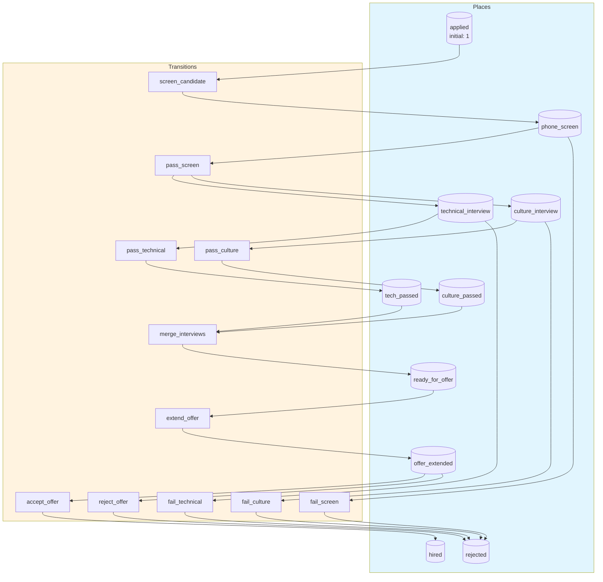

# hiring-pipeline

Multi-stage hiring pipeline with parallel interviews, role-based actions, and fork-join synchronization

## Quick Start

```bash
# Build and run
go build -o server .
./server

# Server starts on http://localhost:8080
```

## Architecture

This application uses **event sourcing** with a **Petri net** state machine to model workflows. All state changes are captured as immutable events, enabling:

- Full audit trail of all transitions
- Time-travel debugging
- Event replay for recovery
- Deterministic state reconstruction

## State Machine

### Places (States)

| Place | Type | Initial | Description |
|-------|------|---------|-------------|
| `applied` | Token | 1 | Candidate has applied |
| `phone_screen` | Token | 0 | In phone screening |
| `technical_interview` | Token | 0 | In technical interview |
| `culture_interview` | Token | 0 | In culture interview |
| `tech_passed` | Token | 0 | Passed technical interview |
| `culture_passed` | Token | 0 | Passed culture interview |
| `ready_for_offer` | Token | 0 | Both interviews passed, ready for offer |
| `offer_extended` | Token | 0 | Offer has been extended to candidate |
| `hired` | Token | 0 | Candidate accepted and hired |
| `rejected` | Token | 0 | Candidate rejected at some stage |


### Transitions (Actions)

| Transition | Event | Guard | Description |
|------------|-------|-------|-------------|
| `screen_candidate` | `ScreenCandidateed` | - | Recruiter conducts phone screen |
| `pass_screen` | `PassScreened` | - | Candidate passes phone screen - begin parallel interviews |
| `fail_screen` | `FailScreened` | - | Candidate fails phone screen |
| `pass_technical` | `PassTechnicaled` | - | Candidate passes technical interview |
| `fail_technical` | `FailTechnicaled` | - | Candidate fails technical interview |
| `pass_culture` | `PassCultureed` | - | Candidate passes culture interview |
| `fail_culture` | `FailCultureed` | - | Candidate fails culture interview |
| `merge_interviews` | `MergeInterviewsed` | - | Both interviews passed - synchronization join |
| `extend_offer` | `ExtendOffered` | - | Manager extends job offer |
| `accept_offer` | `AcceptOffered` | - | Candidate accepts the offer |
| `reject_offer` | `RejectOffered` | - | Candidate declines the offer |


### Petri Net Diagram

```mermaid
stateDiagram-v2
    direction LR

    state "applied (1)" as PlaceApplied
    state "phone_screen" as PlacePhoneScreen
    state "technical_interview" as PlaceTechnicalInterview
    state "culture_interview" as PlaceCultureInterview
    state "tech_passed" as PlaceTechPassed
    state "culture_passed" as PlaceCulturePassed
    state "ready_for_offer" as PlaceReadyForOffer
    state "offer_extended" as PlaceOfferExtended
    state "hired" as PlaceHired
    state "rejected" as PlaceRejected


    state "screen_candidate" as t_TransitionScreenCandidate
    state "pass_screen" as t_TransitionPassScreen
    state "fail_screen" as t_TransitionFailScreen
    state "pass_technical" as t_TransitionPassTechnical
    state "fail_technical" as t_TransitionFailTechnical
    state "pass_culture" as t_TransitionPassCulture
    state "fail_culture" as t_TransitionFailCulture
    state "merge_interviews" as t_TransitionMergeInterviews
    state "extend_offer" as t_TransitionExtendOffer
    state "accept_offer" as t_TransitionAcceptOffer
    state "reject_offer" as t_TransitionRejectOffer


    PlaceApplied --> t_TransitionScreenCandidate
    t_TransitionScreenCandidate --> PlacePhoneScreen

    PlacePhoneScreen --> t_TransitionPassScreen
    t_TransitionPassScreen --> PlaceTechnicalInterview
    t_TransitionPassScreen --> PlaceCultureInterview

    PlacePhoneScreen --> t_TransitionFailScreen
    t_TransitionFailScreen --> PlaceRejected

    PlaceTechnicalInterview --> t_TransitionPassTechnical
    t_TransitionPassTechnical --> PlaceTechPassed

    PlaceTechnicalInterview --> t_TransitionFailTechnical
    t_TransitionFailTechnical --> PlaceRejected

    PlaceCultureInterview --> t_TransitionPassCulture
    t_TransitionPassCulture --> PlaceCulturePassed

    PlaceCultureInterview --> t_TransitionFailCulture
    t_TransitionFailCulture --> PlaceRejected

    PlaceTechPassed --> t_TransitionMergeInterviews
    PlaceCulturePassed --> t_TransitionMergeInterviews
    t_TransitionMergeInterviews --> PlaceReadyForOffer

    PlaceReadyForOffer --> t_TransitionExtendOffer
    t_TransitionExtendOffer --> PlaceOfferExtended

    PlaceOfferExtended --> t_TransitionAcceptOffer
    t_TransitionAcceptOffer --> PlaceHired

    PlaceOfferExtended --> t_TransitionRejectOffer
    t_TransitionRejectOffer --> PlaceRejected

```



### Workflow Diagram




## Events

Events are immutable records of state transitions. Each event captures the transition that occurred and any associated data.

| Event Type | Transition | Fields |
|------------|------------|--------|
| `ScreenCandidateed` | `screen_candidate` | `aggregate_id`, `timestamp` |
| `PassScreened` | `pass_screen` | `aggregate_id`, `timestamp` |
| `FailScreened` | `fail_screen` | `aggregate_id`, `timestamp` |
| `PassTechnicaled` | `pass_technical` | `aggregate_id`, `timestamp` |
| `FailTechnicaled` | `fail_technical` | `aggregate_id`, `timestamp` |
| `PassCultureed` | `pass_culture` | `aggregate_id`, `timestamp` |
| `FailCultureed` | `fail_culture` | `aggregate_id`, `timestamp` |
| `MergeInterviewsed` | `merge_interviews` | `aggregate_id`, `timestamp` |
| `ExtendOffered` | `extend_offer` | `aggregate_id`, `timestamp` |
| `AcceptOffered` | `accept_offer` | `aggregate_id`, `timestamp` |
| `RejectOffered` | `reject_offer` | `aggregate_id`, `timestamp` |

```mermaid
classDiagram
    class Event {
        +string ID
        +string StreamID
        +string Type
        +int Version
        +time.Time Timestamp
        +json.RawMessage Data
    }


    class ScreenCandidateedEvent {
        +string AggregateId
        +time.Time Timestamp
    }
    Event <|-- ScreenCandidateedEvent

    class PassScreenedEvent {
        +string AggregateId
        +time.Time Timestamp
    }
    Event <|-- PassScreenedEvent

    class FailScreenedEvent {
        +string AggregateId
        +time.Time Timestamp
    }
    Event <|-- FailScreenedEvent

    class PassTechnicaledEvent {
        +string AggregateId
        +time.Time Timestamp
    }
    Event <|-- PassTechnicaledEvent

    class FailTechnicaledEvent {
        +string AggregateId
        +time.Time Timestamp
    }
    Event <|-- FailTechnicaledEvent

    class PassCultureedEvent {
        +string AggregateId
        +time.Time Timestamp
    }
    Event <|-- PassCultureedEvent

    class FailCultureedEvent {
        +string AggregateId
        +time.Time Timestamp
    }
    Event <|-- FailCultureedEvent

    class MergeInterviewsedEvent {
        +string AggregateId
        +time.Time Timestamp
    }
    Event <|-- MergeInterviewsedEvent

    class ExtendOfferedEvent {
        +string AggregateId
        +time.Time Timestamp
    }
    Event <|-- ExtendOfferedEvent

    class AcceptOfferedEvent {
        +string AggregateId
        +time.Time Timestamp
    }
    Event <|-- AcceptOfferedEvent

    class RejectOfferedEvent {
        +string AggregateId
        +time.Time Timestamp
    }
    Event <|-- RejectOfferedEvent

```





## API Endpoints

### Core Endpoints

| Method | Path | Description |
|--------|------|-------------|
| GET | `/health` | Health check |
| GET | `/ready` | Readiness check |
| POST | `/api/hiring-pipeline` | Create new instance |
| GET | `/api/hiring-pipeline/{id}` | Get instance state |


### Transition Endpoints

| Method | Path | Transition | Description |
|--------|------|------------|-------------|
| POST | `/api/screen_candidate` | `screen_candidate` | Recruiter conducts phone screen |
| POST | `/api/pass_screen` | `pass_screen` | Candidate passes phone screen - begin parallel interviews |
| POST | `/api/fail_screen` | `fail_screen` | Candidate fails phone screen |
| POST | `/api/pass_technical` | `pass_technical` | Candidate passes technical interview |
| POST | `/api/fail_technical` | `fail_technical` | Candidate fails technical interview |
| POST | `/api/pass_culture` | `pass_culture` | Candidate passes culture interview |
| POST | `/api/fail_culture` | `fail_culture` | Candidate fails culture interview |
| POST | `/api/merge_interviews` | `merge_interviews` | Both interviews passed - synchronization join |
| POST | `/api/extend_offer` | `extend_offer` | Manager extends job offer |
| POST | `/api/accept_offer` | `accept_offer` | Candidate accepts the offer |
| POST | `/api/reject_offer` | `reject_offer` | Candidate declines the offer |


### Request/Response Format

#### Create Instance
```bash
curl -X POST http://localhost:8080/api/hiring-pipeline \
  -H "Content-Type: application/json" \
  -H "Authorization: Bearer <token>"
```

#### Execute Transition
```bash
curl -X POST http://localhost:8080/api/<transition> \
  -H "Content-Type: application/json" \
  -H "Authorization: Bearer <token>" \
  -d '{
    "aggregate_id": "<instance-id>",
    "data": { ... }
  }'
```

#### Response Format
```json
{
  "success": true,
  "aggregate_id": "uuid",
  "version": 1,
  "state": { "place1": 1, "place2": 0 },
  "enabled_transitions": ["transition1", "transition2"]
}
```


## Configuration

### Environment Variables

| Variable | Default | Description |
|----------|---------|-------------|
| `PORT` | `8080` | HTTP server port |
| `DB_PATH` | `./hiring-pipeline.db` | SQLite database path |
| `DEBUG` | `false` | Enable debug endpoints |


## Development

### Project Structure

```
.
├── main.go           # Application entry point
├── workflow.go       # Petri net definition
├── aggregate.go      # Event-sourced aggregate
├── events.go         # Event type definitions
├── api.go            # HTTP handlers
├── debug.go          # Debug handlers
├── frontend/         # Web UI (ES modules)
│   ├── index.html
│   └── src/
│       ├── main.js
│       ├── router.js
│       └── ...
└── go.mod
```

### Testing

```bash
# Run unit tests
go test ./...

# Run with test coverage
go test -cover ./...
```

---

Generated by [petri-pilot](https://github.com/pflow-xyz/petri-pilot)
