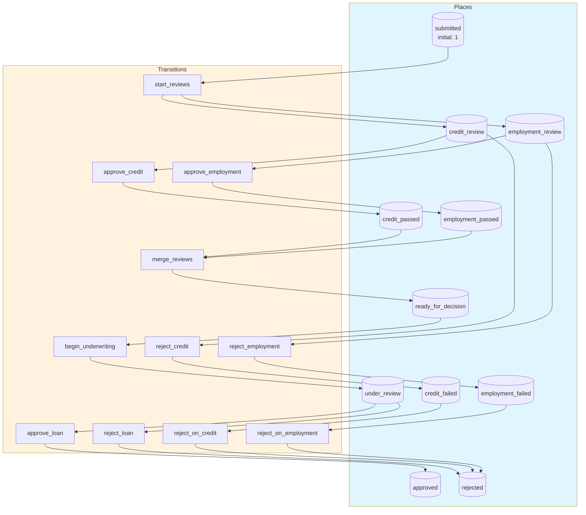

# loan-approval

Loan approval pipeline with parallel reviews, role-based access, and fork-join synchronization

## Quick Start

```bash
# Build and run
go build -o server .
./server

# Server starts on http://localhost:8080
```

## Architecture

This application uses **event sourcing** with a **Petri net** state machine to model workflows. All state changes are captured as immutable events, enabling:

- Full audit trail of all transitions
- Time-travel debugging
- Event replay for recovery
- Deterministic state reconstruction

## State Machine

### Places (States)

| Place | Type | Initial | Description |
|-------|------|---------|-------------|
| `submitted` | Token | 1 | Loan application submitted |
| `credit_review` | Token | 0 | Under credit review |
| `employment_review` | Token | 0 | Under employment review |
| `credit_passed` | Token | 0 | Credit check passed |
| `credit_failed` | Token | 0 | Credit check failed |
| `employment_passed` | Token | 0 | Employment verification passed |
| `employment_failed` | Token | 0 | Employment verification failed |
| `ready_for_decision` | Token | 0 | Both reviews passed, ready for underwriting |
| `under_review` | Token | 0 | Under final underwriter review |
| `approved` | Token | 0 | Loan approved |
| `rejected` | Token | 0 | Loan rejected |


### Transitions (Actions)

| Transition | Event | Guard | Description |
|------------|-------|-------|-------------|
| `start_reviews` | `StartReviewsed` | - | Begin parallel credit and employment reviews |
| `approve_credit` | `ApproveCredited` | - | Approve credit check |
| `reject_credit` | `RejectCredited` | - | Reject credit check |
| `approve_employment` | `ApproveEmploymented` | - | Approve employment verification |
| `reject_employment` | `RejectEmploymented` | - | Reject employment verification |
| `merge_reviews` | `MergeReviewsed` | - | Synchronize: both reviews must pass |
| `begin_underwriting` | `BeginUnderwritinged` | - | Begin final underwriter review |
| `approve_loan` | `ApproveLoaned` | - | Approve the loan application |
| `reject_loan` | `RejectLoaned` | - | Reject the loan application |
| `reject_on_credit` | `RejectOnCredited` | - | Reject due to failed credit check |
| `reject_on_employment` | `RejectOnEmploymented` | - | Reject due to failed employment verification |


### Petri Net Diagram

```mermaid
stateDiagram-v2
    direction LR

    state "submitted (1)" as PlaceSubmitted
    state "credit_review" as PlaceCreditReview
    state "employment_review" as PlaceEmploymentReview
    state "credit_passed" as PlaceCreditPassed
    state "credit_failed" as PlaceCreditFailed
    state "employment_passed" as PlaceEmploymentPassed
    state "employment_failed" as PlaceEmploymentFailed
    state "ready_for_decision" as PlaceReadyForDecision
    state "under_review" as PlaceUnderReview
    state "approved" as PlaceApproved
    state "rejected" as PlaceRejected


    state "start_reviews" as t_TransitionStartReviews
    state "approve_credit" as t_TransitionApproveCredit
    state "reject_credit" as t_TransitionRejectCredit
    state "approve_employment" as t_TransitionApproveEmployment
    state "reject_employment" as t_TransitionRejectEmployment
    state "merge_reviews" as t_TransitionMergeReviews
    state "begin_underwriting" as t_TransitionBeginUnderwriting
    state "approve_loan" as t_TransitionApproveLoan
    state "reject_loan" as t_TransitionRejectLoan
    state "reject_on_credit" as t_TransitionRejectOnCredit
    state "reject_on_employment" as t_TransitionRejectOnEmployment


    PlaceSubmitted --> t_TransitionStartReviews
    t_TransitionStartReviews --> PlaceCreditReview
    t_TransitionStartReviews --> PlaceEmploymentReview

    PlaceCreditReview --> t_TransitionApproveCredit
    t_TransitionApproveCredit --> PlaceCreditPassed

    PlaceCreditReview --> t_TransitionRejectCredit
    t_TransitionRejectCredit --> PlaceCreditFailed

    PlaceEmploymentReview --> t_TransitionApproveEmployment
    t_TransitionApproveEmployment --> PlaceEmploymentPassed

    PlaceEmploymentReview --> t_TransitionRejectEmployment
    t_TransitionRejectEmployment --> PlaceEmploymentFailed

    PlaceCreditPassed --> t_TransitionMergeReviews
    PlaceEmploymentPassed --> t_TransitionMergeReviews
    t_TransitionMergeReviews --> PlaceReadyForDecision

    PlaceReadyForDecision --> t_TransitionBeginUnderwriting
    t_TransitionBeginUnderwriting --> PlaceUnderReview

    PlaceUnderReview --> t_TransitionApproveLoan
    t_TransitionApproveLoan --> PlaceApproved

    PlaceUnderReview --> t_TransitionRejectLoan
    t_TransitionRejectLoan --> PlaceRejected

    PlaceCreditFailed --> t_TransitionRejectOnCredit
    t_TransitionRejectOnCredit --> PlaceRejected

    PlaceEmploymentFailed --> t_TransitionRejectOnEmployment
    t_TransitionRejectOnEmployment --> PlaceRejected

```



### Workflow Diagram




## Events

Events are immutable records of state transitions. Each event captures the transition that occurred and any associated data.

| Event Type | Transition | Fields |
|------------|------------|--------|
| `StartReviewsed` | `start_reviews` | `aggregate_id`, `timestamp` |
| `ApproveCredited` | `approve_credit` | `aggregate_id`, `timestamp` |
| `RejectCredited` | `reject_credit` | `aggregate_id`, `timestamp` |
| `ApproveEmploymented` | `approve_employment` | `aggregate_id`, `timestamp` |
| `RejectEmploymented` | `reject_employment` | `aggregate_id`, `timestamp` |
| `MergeReviewsed` | `merge_reviews` | `aggregate_id`, `timestamp` |
| `BeginUnderwritinged` | `begin_underwriting` | `aggregate_id`, `timestamp` |
| `ApproveLoaned` | `approve_loan` | `aggregate_id`, `timestamp` |
| `RejectLoaned` | `reject_loan` | `aggregate_id`, `timestamp` |
| `RejectOnCredited` | `reject_on_credit` | `aggregate_id`, `timestamp` |
| `RejectOnEmploymented` | `reject_on_employment` | `aggregate_id`, `timestamp` |

```mermaid
classDiagram
    class Event {
        +string ID
        +string StreamID
        +string Type
        +int Version
        +time.Time Timestamp
        +json.RawMessage Data
    }


    class StartReviewsedEvent {
        +string AggregateId
        +time.Time Timestamp
    }
    Event <|-- StartReviewsedEvent

    class ApproveCreditedEvent {
        +string AggregateId
        +time.Time Timestamp
    }
    Event <|-- ApproveCreditedEvent

    class RejectCreditedEvent {
        +string AggregateId
        +time.Time Timestamp
    }
    Event <|-- RejectCreditedEvent

    class ApproveEmploymentedEvent {
        +string AggregateId
        +time.Time Timestamp
    }
    Event <|-- ApproveEmploymentedEvent

    class RejectEmploymentedEvent {
        +string AggregateId
        +time.Time Timestamp
    }
    Event <|-- RejectEmploymentedEvent

    class MergeReviewsedEvent {
        +string AggregateId
        +time.Time Timestamp
    }
    Event <|-- MergeReviewsedEvent

    class BeginUnderwritingedEvent {
        +string AggregateId
        +time.Time Timestamp
    }
    Event <|-- BeginUnderwritingedEvent

    class ApproveLoanedEvent {
        +string AggregateId
        +time.Time Timestamp
    }
    Event <|-- ApproveLoanedEvent

    class RejectLoanedEvent {
        +string AggregateId
        +time.Time Timestamp
    }
    Event <|-- RejectLoanedEvent

    class RejectOnCreditedEvent {
        +string AggregateId
        +time.Time Timestamp
    }
    Event <|-- RejectOnCreditedEvent

    class RejectOnEmploymentedEvent {
        +string AggregateId
        +time.Time Timestamp
    }
    Event <|-- RejectOnEmploymentedEvent

```





## API Endpoints

### Core Endpoints

| Method | Path | Description |
|--------|------|-------------|
| GET | `/health` | Health check |
| GET | `/ready` | Readiness check |
| POST | `/api/loan-approval` | Create new instance |
| GET | `/api/loan-approval/{id}` | Get instance state |


### Transition Endpoints

| Method | Path | Transition | Description |
|--------|------|------------|-------------|
| POST | `/api/start_reviews` | `start_reviews` | Begin parallel credit and employment reviews |
| POST | `/api/approve_credit` | `approve_credit` | Approve credit check |
| POST | `/api/reject_credit` | `reject_credit` | Reject credit check |
| POST | `/api/approve_employment` | `approve_employment` | Approve employment verification |
| POST | `/api/reject_employment` | `reject_employment` | Reject employment verification |
| POST | `/api/merge_reviews` | `merge_reviews` | Synchronize: both reviews must pass |
| POST | `/api/begin_underwriting` | `begin_underwriting` | Begin final underwriter review |
| POST | `/api/approve_loan` | `approve_loan` | Approve the loan application |
| POST | `/api/reject_loan` | `reject_loan` | Reject the loan application |
| POST | `/api/reject_on_credit` | `reject_on_credit` | Reject due to failed credit check |
| POST | `/api/reject_on_employment` | `reject_on_employment` | Reject due to failed employment verification |


### Request/Response Format

#### Create Instance
```bash
curl -X POST http://localhost:8080/api/loan-approval \
  -H "Content-Type: application/json" \
  -H "Authorization: Bearer <token>"
```

#### Execute Transition
```bash
curl -X POST http://localhost:8080/api/<transition> \
  -H "Content-Type: application/json" \
  -H "Authorization: Bearer <token>" \
  -d '{
    "aggregate_id": "<instance-id>",
    "data": { ... }
  }'
```

#### Response Format
```json
{
  "success": true,
  "aggregate_id": "uuid",
  "version": 1,
  "state": { "place1": 1, "place2": 0 },
  "enabled_transitions": ["transition1", "transition2"]
}
```


## Configuration

### Environment Variables

| Variable | Default | Description |
|----------|---------|-------------|
| `PORT` | `8080` | HTTP server port |
| `DB_PATH` | `./loan-approval.db` | SQLite database path |
| `DEBUG` | `false` | Enable debug endpoints |


## Development

### Project Structure

```
.
├── main.go           # Application entry point
├── workflow.go       # Petri net definition
├── aggregate.go      # Event-sourced aggregate
├── events.go         # Event type definitions
├── api.go            # HTTP handlers
├── debug.go          # Debug handlers
├── frontend/         # Web UI (ES modules)
│   ├── index.html
│   └── src/
│       ├── main.js
│       ├── router.js
│       └── ...
└── go.mod
```

### Testing

```bash
# Run unit tests
go test ./...

# Run with test coverage
go test -cover ./...
```

---

Generated by [petri-pilot](https://github.com/pflow-xyz/petri-pilot)
