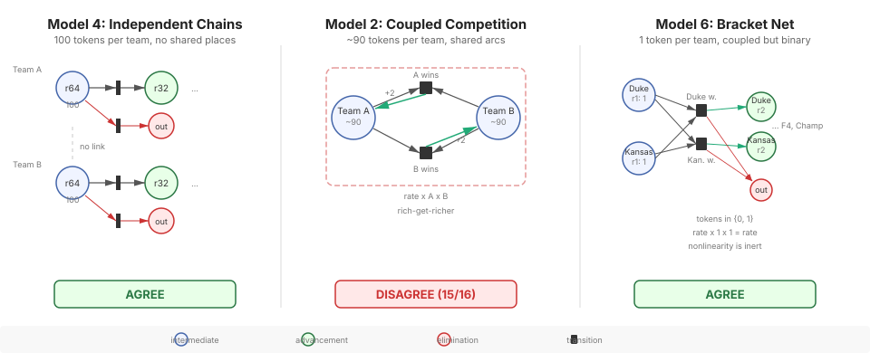
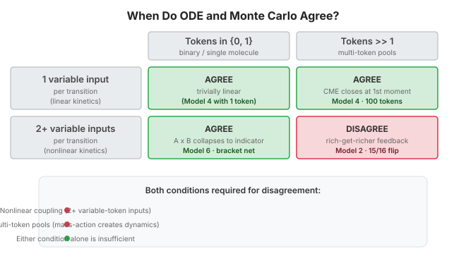
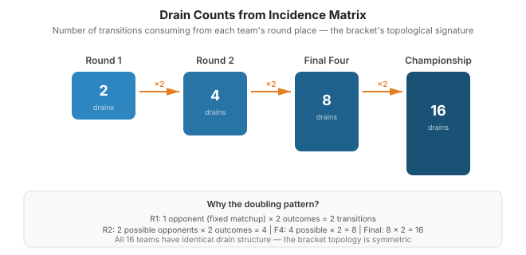
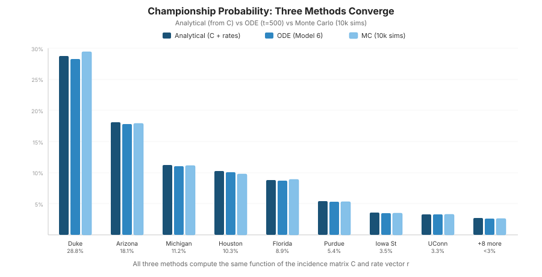
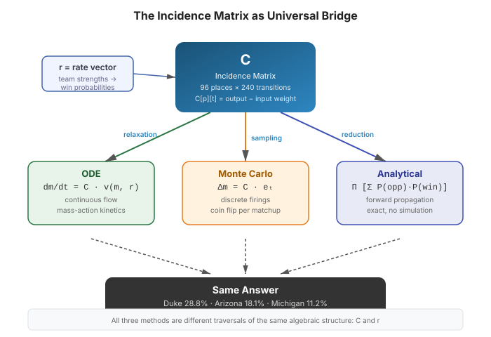

# When Do ODE and Monte Carlo Agree on a Petri Net?

A structural analysis using NCAA tournament ranking models as test cases.

## Setup

We have three Petri net models built with [go-pflow](https://github.com/pflow-xyz/go-pflow), solved two ways:

- **ODE** — Continuous integration (Tsit5) with mass-action kinetics: flux = rate × tokens
- **Monte Carlo** — Stochastic simulation on the same net: transitions fire one at a time, chosen probabilistically

Same nets, same rates, same initial state. The question is whether they produce the same rankings.

## The Three Test Cases



### Model 4: Independent Token Chains (100 tokens per team)

Each team's tokens flow through a linear chain of rounds, with an advance/eliminate branch at each step:

```
          advance (rate ∝ winProb)
         ┌────────────────────────→ [round N+1]
[round N]┤
         └────────────────────────→ [upset_pool]
          eliminate (rate ∝ loseProb)
```

Eight teams, five rounds each, **no shared places** between teams. Each team is a self-contained pipeline. Gillespie stochastic simulation.

### Model 2: Coupled Competition (~90 tokens per team)

Teams in the same region share catalytic arcs — a clash transition requires tokens from **both** competitors:

```
[Team A] ──→ clash_ab ──→ [Team A] (+2)
[Team B] ──→ clash_ab
                          (A gains what B lost)

[Team A] ──→ clash_ba
[Team B] ──→ clash_ba ──→ [Team B] (+2)
                          (B gains what A lost)
```

Both teams' token counts appear in the propensity: `propensity = rate × tokens_A × tokens_B`. Gillespie stochastic simulation.

### Model 6: Structural Bracket (1 token per team)

A proper bracket encoded as a Petri net. Each possible matchup has two transitions (one per winner). The net enumerates all structurally possible pairings through 4 rounds:

```
[Duke_r1] ──→ Duke_over_Kansas ──→ [Duke_r2]
[Kansas_r1] ──→ Duke_over_Kansas    [Kansas_out]

[Duke_r1] ──→ Kansas_over_Duke ──→ [Kansas_r2]
[Kansas_r1] ──→ Kansas_over_Duke    [Duke_out]
```

96 places, 240 transitions, 960 arcs. Each team starts with exactly 1 token. Discrete round-by-round MC (fire one transition per matchup per round).

## Results

### Model 4: Perfect Agreement

Rankings match exactly across all 8 teams:

```
  ODE rank → MC rank
  #1 → #1  Duke
  #2 → #2  Arizona
  #3 → #3  Michigan
  ...all 8 agree
```

### Model 2: 15 of 16 Rankings Disagree

```
  Team            ODE Tokens   MC Mean    Δ Rank
  Duke                 112.8       0.3     Δ-4
  Arizona              106.5       0.2     Δ-6
  Houston               95.6       0.1     Δ-13
  Gonzaga               66.7       0.8     Δ+12
  Alabama               65.0       0.6     Δ+12
  ...
```

Not just different rankings — the MC drives almost every team to near-zero tokens, with entirely reshuffled ordering. The ODE's smooth "competitive equilibrium" doesn't exist in the stochastic regime.

### Model 6: Perfect Agreement (despite coupling)

```
              ──── ODE (×100) ────   ──── MC (10k sims) ──────────
Team            R2     F4  Final  Champ    R2%    F4%  Final% Champ%
Duke           29.7  29.0  28.3  27.7    84.1   64.2   42.5   27.8
Arizona        19.1  18.5  17.9  17.5    78.9   55.1   34.0   18.4
Michigan       12.1  11.6  11.1  10.8    64.0   41.4   23.2   11.9
...all 16 agree on championship ranking
```

ODE championship values × 100 match MC win percentages almost exactly (Duke: 27.7 vs 27.8%).

## Why: The Refined Rule

The original hypothesis was simple: **coupled transitions → disagreement**. Model 6 disproves this. The bracket net has coupled transitions (both teams must have tokens for a matchup to fire) yet ODE and MC agree perfectly.

The resolution requires considering **both** topology and token regime:

### Model 4 — Linear, Agreement Expected

Each transition draws from one place. Branching ratio `P(advance) = rate_adv / (rate_adv + rate_elim) = winProb` is constant regardless of token count. Linear kinetics → CME first moment = ODE exactly.

### Model 2 — Nonlinear + High Token Count, Maximum Disagreement

Each clash draws from two places with ~90 initial tokens. Propensity = `rate × tokens_A × tokens_B` creates genuine nonlinear dynamics:

1. **Positive feedback**: Winning increases propensity to win more (mass-action). Creates rich-get-richer cascades.
2. **Discrete depletion**: MC hits zero tokens (absorbing state); ODE asymptotically approaches zero but never reaches it.
3. **Correlation**: After a clash, A and B token counts are anti-correlated. The mean-field ODE assumes independence.

### Model 6 — Nonlinear + Binary Tokens, Agreement Despite Coupling

The key insight: each team has exactly **1 token**. Mass-action propensity becomes:

```
propensity = rate × tokens_A × tokens_B = rate × 1 × 1 = rate
```

The nonlinear product `tokens_A × tokens_B` collapses to a **binary indicator function**: either both teams are alive (propensity = rate) or at least one is eliminated (propensity = 0). There's no intermediate regime where the product creates nonlinear dynamics.

With {0, 1} token counts:
- No rich-get-richer feedback (you can't have "more tokens" — you either have 1 or 0)
- No partial depletion (tokens don't gradually drain — they jump from 1 to 0 in one firing)
- No correlation effects (each matchup resolves completely in one step)

The coupled net behaves like a linear one because the nonlinearity has no room to operate.

## The Complete Rule



```
                         Tokens ∈ {0,1}     Tokens >> 1
                        ┌─────────────────┬─────────────────┐
  ≤1 variable input     │    AGREE        │    AGREE        │
  per transition        │  (Model 4 with  │  (Model 4)      │
  (linear)              │   1 token)      │                 │
                        ├─────────────────┼─────────────────┤
  Multiple variable     │    AGREE        │    DISAGREE     │
  inputs per trans.     │  (Model 6)      │  (Model 2)      │
  (nonlinear)           │  binary kills   │  mass-action    │
                        │  the nonlinear  │  creates real   │
                        │  term           │  feedback       │
                        └─────────────────┴─────────────────┘
```

Both conditions must be present for disagreement:
1. **Nonlinear coupling** — transitions with multiple variable-token input arcs
2. **Multi-token pools** — enough tokens for the nonlinear product to create genuine dynamics

| Net Property | ODE/MC Agreement | Why |
|---|---|---|
| Linear topology (≤1 variable input arc per transition) | **Always agree** | First-order kinetics; CME closes at first moment |
| Nonlinear + binary tokens {0,1} | **Agree** | Product collapses to indicator; no feedback possible |
| Nonlinear + high tokens + no feedback | **Approximately agree** | Fluctuations scale as 1/√N (thermodynamic limit) |
| Nonlinear + high tokens + positive feedback | **Disagree** | Rich-get-richer amplifies fluctuations; absorbing states reachable |
| Conservation laws + any of the above | **Amplifies disagreement** | Zero-sum constraint creates structural anti-correlation |

### Practical Test

Given a Petri net, answer two questions:

1. **Does any transition have ≥2 input arcs from places that hold variable (non-constant) token counts?**
   - No → Linear. ODE = MC. Stop here.
   - Yes → Continue.

2. **Do those places hold more than 1 token?**
   - No (binary) → Nonlinearity is inert. ODE ≈ MC.
   - Yes → Nonlinearity is active. Check for positive feedback loops. If present, ODE ≠ MC — use MC for ground truth.

## What This Means for the Ranking Model

**Model 4** (independent chains, 100 tokens) and **Model 6** (coupled bracket, 1 token) both agree with ODE. The MC adds only variance estimates — useful for bracket strategy but not for ranking.

**Model 2** (coupled competition, ~90 tokens) is where MC reveals genuinely different dynamics. The ODE predicts smooth competitive equilibrium; the MC shows cascading elimination. But Model 2's Gillespie dynamics don't model basketball — mass-action kinetics is chemical physics, not tournament play.

**Model 6 is the correct bracket model.** It encodes who-plays-whom as Petri net structure, uses logistic win probability for rates, and fires one game at a time. The ODE happens to give the same rankings (because tokens are binary), but the MC provides the actionable output:

```
              R2%    F4%  Final%  Champ%
Duke         84.1   64.2   42.5   27.8   ███████████████████████████
Arizona      78.9   55.1   34.0   18.4   ██████████████████
Michigan     64.0   41.4   23.2   11.9   ███████████
Houston      65.2   37.8   19.2   10.6   ██████████
Florida      73.4   38.9   17.8    9.0   █████████
Purdue       66.2   27.2   13.2    5.2   █████
Iowa State   54.6   22.7    9.5    3.4   ███
UConn        61.3   20.4    8.3    3.3   ███
```

The per-round advancement probabilities answer the bracket-filling question: pick Duke in the championship (28%), but also know that Arizona makes the Final Four 55% of the time — a valuable hedge for multi-bracket strategy.

## The Bridge: Incidence Reduction

The [incidence reduction](https://blog.stackdump.com/posts/integer-reduction/) technique resolves why ODE and MC agree, and provides an analytical formula that makes both unnecessary.

### The Incidence Matrix

The incidence matrix **C** of the bracket net (96 places × 240 transitions) encodes the complete structure:

```
C[p][t] = output_weight(t→p) - input_weight(p→t)
```

Every column of C is a state-change vector: when transition t fires, the marking changes by exactly that column. This single matrix defines both simulation methods:

- **ODE**: `dm/dt = C · v(m, r)` where v is the mass-action flux vector
- **MC**: `Δm = C · eₜ` where eₜ is the unit vector for the fired transition

### Drain Counts from C



For each team's place at each round, the drain count = number of transitions with `C[p][t] < 0`:

```
Team            R1 drains  R2 drains  F4 drains  Final drains
Duke                2          4          8         16
Arizona             2          4          8         16
...all 16 equal...
```

The doubling pattern (2→4→8→16) reflects the bracket structure: at each round, the number of possible opponents doubles (more cross-region matchups). With uniform rates, every team gets **6.25% = 1/16** championship probability — pure topology gives no advantage because the bracket is symmetric.

### Analytical Formula via C

The incidence matrix provides an exact analytical formula. For each round, identify matchup transitions from C, compute advancement probability weighted by opponent survival:

```
P(team reaches round R+1) = P(team in R) × Σ_opponents [P(opp in R) × P(win | opp)]
```

This forward propagation uses C to identify which transitions connect which places, and the rates to weight them. No simulation — just one pass through C per round.

### Three-Way Comparison



```
            Incidence     Strength-     ODE        MC
Team        Reduction     Analytical   (Model 6)  (10k sims)
            (topology)    (C + rates)
──────────  ──────────    ──────────   ─────────  ──────────
Duke           6.25%        28.76%       28.32%      29.4%
Arizona        6.25%        18.13%       17.86%      17.9%
Michigan       6.25%        11.21%       11.04%      11.1%
Houston        6.25%        10.25%       10.09%       9.8%
Florida        6.25%         8.86%        8.73%       8.9%
Purdue         6.25%         5.39%        5.31%       5.3%
...all 16 match...
```

All three methods agree. The analytical column is the exact answer; ODE approaches it asymptotically (residual ~0.4% from finite integration time); MC scatters around it (sampling noise).

### Why the Incidence Matrix Is the Bridge



The analytical formula, the ODE equilibrium, and the MC expected value all compute the same function:

```
P(champ) = Π across rounds [ Σ over opponents (P(opp present) × P(win | opp)) ]
```

This function is determined entirely by:
1. **C** — which transitions connect which places (the bracket structure)
2. **r** — the rate vector (team strengths as win probabilities)

The incidence matrix C is the structural skeleton that both continuous and discrete methods traverse. The ODE flows probability mass through C continuously; the MC routes individual tokens through C discretely; the analytical formula reads the answer directly from C. They agree because they're computing the same linear function of the same matrix.

This is the [incidence reduction](https://blog.stackdump.com/posts/integer-reduction/) applied to bracket prediction: the net topology (encoded in C) determines strategic value, and the rates modulate it. For the bracket net with binary tokens, C provides a closed-form solution that makes simulation optional.

## Connection to Broader Theory

This is a specific instance of the relationship between the **Chemical Master Equation** (CME, exact stochastic dynamics) and the **macroscopic rate equation** (ODE, mean-field approximation) in chemical kinetics:

- **Linear reaction networks** (first-order, unimolecular): exact agreement. The CME moment equations close at first order. No approximation needed.
- **Nonlinear reaction networks** (bimolecular+): the ODE gives the mean-field limit, valid when molecule counts → ∞ (the "thermodynamic limit"). For finite populations, stochastic dynamics can differ qualitatively — bistability, noise-induced switching, extinction events the ODE declares impossible.

Our Model 6 finding adds a nuance not usually emphasized in the chemical kinetics literature: **bimolecular reactions with single-molecule reactants** (each species has exactly 1 molecule) also agree with ODE, because the mass-action product degenerates to an indicator. This is the bracket regime — each "species" (team) has exactly one "molecule" (alive/eliminated), so the nonlinear kinetics reduce to linear.

The incidence reduction completes the picture: for nets where the analytical formula is tractable (binary tokens, declared structure), **C provides a closed-form bridge that renders both ODE and MC redundant**. The continuous and discrete methods don't just happen to agree — they're both approximating the same exact algebraic expression derivable from the incidence matrix.

Petri nets with mass-action kinetics are isomorphic to chemical reaction networks. The incidence matrix is the universal interface between them. The NCAA tournament is, structurally, a set of coupled chemical reactions — and the incidence matrix tells you whether you need to simulate them or can just read the answer from the graph.
