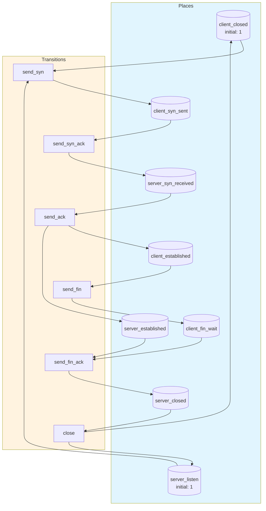
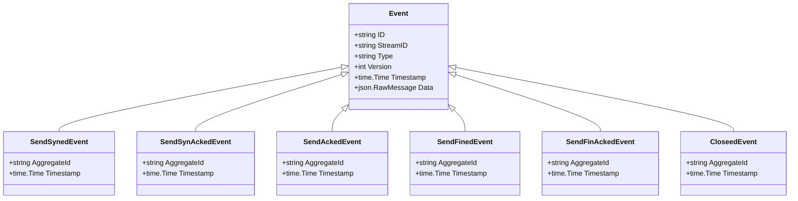

# tcp-handshake

TCP 3-way handshake and connection teardown modeled as two parallel state machines in a Petri net

## Quick Start

```bash
# Build and run
go build -o server .
./server

# Server starts on http://localhost:8080
```

## Architecture

This application uses **event sourcing** with a **Petri net** state machine to model workflows. All state changes are captured as immutable events, enabling:

- Full audit trail of all transitions
- Time-travel debugging
- Event replay for recovery
- Deterministic state reconstruction

## State Machine

### Places (States)

| Place | Type | Initial | Description |
|-------|------|---------|-------------|
| `client_closed` | Token | 1 | Client in CLOSED state |
| `client_syn_sent` | Token | 0 | Client sent SYN, waiting for SYN-ACK |
| `client_established` | Token | 0 | Client connection established |
| `client_fin_wait` | Token | 0 | Client sent FIN, waiting to close |
| `server_listen` | Token | 1 | Server listening for connections |
| `server_syn_received` | Token | 0 | Server received SYN, sent SYN-ACK |
| `server_established` | Token | 0 | Server connection established |
| `server_closed` | Token | 0 | Server connection closed |


### Transitions (Actions)

| Transition | Event | Guard | Description |
|------------|-------|-------|-------------|
| `send_syn` | `SendSyned` | - | Client sends SYN to server |
| `send_syn_ack` | `SendSynAcked` | - | Server receives SYN, sends SYN-ACK |
| `send_ack` | `SendAcked` | - | Client receives SYN-ACK, sends ACK - connection established |
| `send_fin` | `SendFined` | - | Client initiates connection teardown with FIN |
| `send_fin_ack` | `SendFinAcked` | - | Server acknowledges FIN |
| `close` | `Closeed` | - | Both sides close the connection |


### Petri Net Diagram

```mermaid
stateDiagram-v2
    direction LR

    state "client_closed (1)" as PlaceClientClosed
    state "client_syn_sent" as PlaceClientSynSent
    state "client_established" as PlaceClientEstablished
    state "client_fin_wait" as PlaceClientFinWait
    state "server_listen (1)" as PlaceServerListen
    state "server_syn_received" as PlaceServerSynReceived
    state "server_established" as PlaceServerEstablished
    state "server_closed" as PlaceServerClosed


    state "send_syn" as t_TransitionSendSyn
    state "send_syn_ack" as t_TransitionSendSynAck
    state "send_ack" as t_TransitionSendAck
    state "send_fin" as t_TransitionSendFin
    state "send_fin_ack" as t_TransitionSendFinAck
    state "close" as t_TransitionClose


    PlaceClientClosed --> t_TransitionSendSyn
    PlaceServerListen --> t_TransitionSendSyn
    t_TransitionSendSyn --> PlaceClientSynSent

    PlaceClientSynSent --> t_TransitionSendSynAck
    t_TransitionSendSynAck --> PlaceServerSynReceived

    PlaceServerSynReceived --> t_TransitionSendAck
    t_TransitionSendAck --> PlaceClientEstablished
    t_TransitionSendAck --> PlaceServerEstablished

    PlaceClientEstablished --> t_TransitionSendFin
    t_TransitionSendFin --> PlaceClientFinWait

    PlaceClientFinWait --> t_TransitionSendFinAck
    PlaceServerEstablished --> t_TransitionSendFinAck
    t_TransitionSendFinAck --> PlaceServerClosed

    PlaceServerClosed --> t_TransitionClose
    t_TransitionClose --> PlaceClientClosed
    t_TransitionClose --> PlaceServerListen

```



### Workflow Diagram




## Events

Events are immutable records of state transitions. Each event captures the transition that occurred and any associated data.

| Event Type | Transition | Fields |
|------------|------------|--------|
| `SendSyned` | `send_syn` | `aggregate_id`, `timestamp` |
| `SendSynAcked` | `send_syn_ack` | `aggregate_id`, `timestamp` |
| `SendAcked` | `send_ack` | `aggregate_id`, `timestamp` |
| `SendFined` | `send_fin` | `aggregate_id`, `timestamp` |
| `SendFinAcked` | `send_fin_ack` | `aggregate_id`, `timestamp` |
| `Closeed` | `close` | `aggregate_id`, `timestamp` |





## API Endpoints

### Core Endpoints

| Method | Path | Description |
|--------|------|-------------|
| GET | `/health` | Health check |
| GET | `/ready` | Readiness check |
| POST | `/api/tcp-handshake` | Create new instance |
| GET | `/api/tcp-handshake/{id}` | Get instance state |


### Transition Endpoints

| Method | Path | Transition | Description |
|--------|------|------------|-------------|
| POST | `/api/send_syn` | `send_syn` | Client sends SYN to server |
| POST | `/api/send_syn_ack` | `send_syn_ack` | Server receives SYN, sends SYN-ACK |
| POST | `/api/send_ack` | `send_ack` | Client receives SYN-ACK, sends ACK - connection established |
| POST | `/api/send_fin` | `send_fin` | Client initiates connection teardown with FIN |
| POST | `/api/send_fin_ack` | `send_fin_ack` | Server acknowledges FIN |
| POST | `/api/close` | `close` | Both sides close the connection |


### Request/Response Format

#### Create Instance
```bash
curl -X POST http://localhost:8080/api/tcp-handshake \
  -H "Content-Type: application/json" \
  -H "Authorization: Bearer <token>"
```

#### Execute Transition
```bash
curl -X POST http://localhost:8080/api/<transition> \
  -H "Content-Type: application/json" \
  -H "Authorization: Bearer <token>" \
  -d '{
    "aggregate_id": "<instance-id>",
    "data": { ... }
  }'
```

#### Response Format
```json
{
  "success": true,
  "aggregate_id": "uuid",
  "version": 1,
  "state": { "place1": 1, "place2": 0 },
  "enabled_transitions": ["transition1", "transition2"]
}
```


## Configuration

### Environment Variables

| Variable | Default | Description |
|----------|---------|-------------|
| `PORT` | `8080` | HTTP server port |
| `DB_PATH` | `./tcp-handshake.db` | SQLite database path |
| `DEBUG` | `false` | Enable debug endpoints |


## Development

### Project Structure

```
.
├── main.go           # Application entry point
├── workflow.go       # Petri net definition
├── aggregate.go      # Event-sourced aggregate
├── events.go         # Event type definitions
├── api.go            # HTTP handlers
├── debug.go          # Debug handlers
├── frontend/         # Web UI (ES modules)
│   ├── index.html
│   └── src/
│       ├── main.js
│       ├── router.js
│       └── ...
└── go.mod
```

### Testing

```bash
# Run unit tests
go test ./...

# Run with test coverage
go test -cover ./...
```

---

Generated by [petri-pilot](https://github.com/pflow-xyz/petri-pilot)
