# vet-clinic

Veterinary clinic what-if simulator. Every service is two firings — start_X seizes staff and a room, finish_X releases them — so headcount and room counts are observably busy and staffing questions have answers. Queue -> start arcs are kinetic:false with a fast pickup rate (720/h, ~5s): a free vet does not notice a waiting patient faster because more are waiting, so the queue is a prerequisite, not an accelerant; the declared service times live on finish_X. Patience is per queue and kinetic (each waiting client gives up independently), draining to walked_out. Emergencies arrive through their own source (rate 0 until a scenario raises it or injects wait_emergency directly), inhibit routine exam starts so they take the next free DVM, and divert to another hospital if not seen fast. surgery_day is a read arc — a gate analysis can see — and recovery kennels are seized when a procedure finishes, so a full recovery ward backs up into the surgery suite.

## Quick Start

```bash
# Build and run
go build -o server .
./server

# Server starts on http://localhost:8080
```

## Architecture

This application uses **event sourcing** with a **Petri net** state machine to model workflows. All state changes are captured as immutable events, enabling:

- Full audit trail of all transitions
- Time-travel debugging
- Event replay for recovery
- Deterministic state reconstruction

## State Machine

### Places (States)

| Place | Type | Initial | Description |
|-------|------|---------|-------------|
| `dvm_avail` | Token | 2 | Available veterinarians |
| `rvt_avail` | Token | 3 | Available vet techs |
| `receptionist_avail` | Token | 1 | Receptionists for checkout |
| `exam_room_free` | Token | 4 | Free exam rooms |
| `surgery_free` | Token | 1 | Surgery suite available |
| `dental_free` | Token | 1 | Dental suite available |
| `radiology_free` | Token | 1 | X-ray/ultrasound room |
| `treatment_free` | Token | 3 | Treatment area stations |
| `recovery_free` | Token | 6 | Recovery kennels |
| `lab_free` | Token | 1 | Lab equipment |
| `surgery_day` | Token | 1 | Surgery gate (1 = procedures run today) |
| `arrival` | Token | 0 | Patients at triage |
| `wait_exam` | Token | 0 | Waiting for exam |
| `wait_tech` | Token | 0 | Waiting for tech service |
| `wait_surgery` | Token | 0 | Waiting for surgery |
| `wait_dental` | Token | 0 | Waiting for dental |
| `wait_diag` | Token | 0 | Waiting for diagnostics |
| `wait_emergency` | Token | 0 | Emergency awaiting stabilization |
| `wait_lab` | Token | 0 | Sample awaiting lab processing |
| `wait_checkout` | Token | 0 | Waiting at the front desk |
| `in_wellness` | Token | 0 | In wellness exam |
| `in_sick` | Token | 0 | In sick visit |
| `in_vaccine` | Token | 0 | Getting vaccinated |
| `in_nail_trim` | Token | 0 | Getting nail trim |
| `in_weight` | Token | 0 | Weight check |
| `in_suture` | Token | 0 | Suture removal |
| `in_spay` | Token | 0 | In spay surgery |
| `in_neuter` | Token | 0 | In neuter surgery |
| `in_dental` | Token | 0 | In dental cleaning |
| `in_xray` | Token | 0 | Getting x-ray |
| `in_bloodwork` | Token | 0 | Blood draw |
| `in_lab` | Token | 0 | Lab test in progress |
| `in_emergency` | Token | 0 | Emergency stabilization in progress |
| `checking_out` | Token | 0 | Being checked out |
| `in_recovery` | Token | 0 | Post-op recovery (kennel held) |
| `discharged` | Token | 0 | Discharged patients |
| `walked_out` | Token | 0 | Left without being seen |
| `diverted` | Token | 0 | Emergencies sent to another hospital |


### Transitions (Actions)

| Transition | Event | Guard | Description |
|------------|-------|-------|-------------|
| `patient_arrives` | `PatientArrivesed` | - | Scheduled/walk-in patient arrives |
| `emergency_arrives` | `EmergencyArrivesed` | - | Emergency walk-in (rate 0 via simulation.solver.rates — a transition-level 0 would read as unset and default to 1) |
| `triage_to_exam` | `TriageToExamed` | - | Route to exam queue |
| `triage_to_tech` | `TriageToTeched` | - | Route to tech services |
| `triage_to_surgery` | `TriageToSurgeryed` | - | Route to surgery queue |
| `triage_to_dental` | `TriageToDentaled` | - | Route to dental queue |
| `triage_to_diag` | `TriageToDiaged` | - | Route to diagnostics |
| `start_wellness` | `StartWellnessed` | - | Free DVM+RVT+room pick up a wellness exam |
| `finish_wellness` | `FinishWellnessed` | - | Wellness exam (~20 min) |
| `start_sick` | `StartSicked` | - | Free DVM+RVT+room pick up a sick visit |
| `finish_sick` | `FinishSicked` | - | Sick visit (~30 min) |
| `start_vaccine` | `StartVaccineed` | - | Free DVM+RVT+room pick up a vaccination |
| `finish_vaccine` | `FinishVaccineed` | - | Vaccination (~15 min) |
| `start_nail_trim` | `StartNailTrimed` | - | Free RVT+station pick up a nail trim |
| `finish_nail_trim` | `FinishNailTrimed` | - | Nail trim (~15 min) |
| `start_weight` | `StartWeighted` | - | Free RVT+station pick up a weight check |
| `finish_weight` | `FinishWeighted` | - | Weight check (~10 min) |
| `start_suture` | `StartSutureed` | - | Free RVT+room pick up a suture removal |
| `finish_suture` | `FinishSutureed` | - | Suture removal (~15 min) |
| `start_spay` | `StartSpayed` | - | DVM+2 RVT+suite begin a spay (surgery day only) |
| `finish_spay` | `FinishSpayed` | - | Spay (~60 min); needs a free recovery kennel |
| `start_neuter` | `StartNeutered` | - | DVM+2 RVT+suite begin a neuter (surgery day only) |
| `finish_neuter` | `FinishNeutered` | - | Neuter (~45 min); needs a free recovery kennel |
| `start_dental` | `StartDentaled` | - | DVM+RVT+suite begin a dental (surgery day only) |
| `finish_dental` | `FinishDentaled` | - | Dental cleaning (~90 min); needs a free recovery kennel |
| `start_xray` | `StartXrayed` | - | Free RVT+radiology pick up an x-ray |
| `finish_xray` | `FinishXrayed` | - | X-ray (~30 min) |
| `start_bloodwork` | `StartBloodworked` | - | Free RVT+station pick up a blood draw |
| `finish_bloodwork` | `FinishBloodworked` | - | Blood draw (~15 min); sample goes to the lab |
| `start_lab` | `StartLabed` | - | Lab picks up a waiting sample |
| `finish_lab` | `FinishLabed` | - | Lab processing (~30 min) |
| `start_emergency` | `StartEmergencyed` | - | DVM+RVT+station stabilize an emergency |
| `finish_emergency` | `FinishEmergencyed` | - | Stabilization (~45 min); needs a recovery kennel |
| `start_checkout` | `StartCheckouted` | - | Receptionist picks up the next checkout |
| `finish_checkout` | `FinishCheckouted` | - | Checkout (~10 min) |
| `finish_recovery` | `FinishRecoveryed` | - | Recovery (~60 min); kennel freed |
| `abandon_exam` | `AbandonExamed` | - | Exam client gives up (~30 min patience) |
| `abandon_tech` | `AbandonTeched` | - | Tech client gives up (~30 min patience) |
| `abandon_diag` | `AbandonDiaged` | - | Diagnostics client gives up (~30 min patience) |
| `abandon_surgery` | `AbandonSurgeryed` | - | Surgery client reschedules (~2 h patience) |
| `abandon_dental` | `AbandonDentaled` | - | Dental client reschedules (~2 h patience) |
| `divert_emergency` | `DivertEmergencyed` | - | Emergency diverted if unseen (~15 min tolerance) |


### Petri Net Diagram

```mermaid
stateDiagram-v2
    direction LR

    state "dvm_avail (2)" as PlaceDvmAvail
    state "rvt_avail (3)" as PlaceRvtAvail
    state "receptionist_avail (1)" as PlaceReceptionistAvail
    state "exam_room_free (4)" as PlaceExamRoomFree
    state "surgery_free (1)" as PlaceSurgeryFree
    state "dental_free (1)" as PlaceDentalFree
    state "radiology_free (1)" as PlaceRadiologyFree
    state "treatment_free (3)" as PlaceTreatmentFree
    state "recovery_free (6)" as PlaceRecoveryFree
    state "lab_free (1)" as PlaceLabFree
    state "surgery_day (1)" as PlaceSurgeryDay
    state "arrival" as PlaceArrival
    state "wait_exam" as PlaceWaitExam
    state "wait_tech" as PlaceWaitTech
    state "wait_surgery" as PlaceWaitSurgery
    state "wait_dental" as PlaceWaitDental
    state "wait_diag" as PlaceWaitDiag
    state "wait_emergency" as PlaceWaitEmergency
    state "wait_lab" as PlaceWaitLab
    state "wait_checkout" as PlaceWaitCheckout
    state "in_wellness" as PlaceInWellness
    state "in_sick" as PlaceInSick
    state "in_vaccine" as PlaceInVaccine
    state "in_nail_trim" as PlaceInNailTrim
    state "in_weight" as PlaceInWeight
    state "in_suture" as PlaceInSuture
    state "in_spay" as PlaceInSpay
    state "in_neuter" as PlaceInNeuter
    state "in_dental" as PlaceInDental
    state "in_xray" as PlaceInXray
    state "in_bloodwork" as PlaceInBloodwork
    state "in_lab" as PlaceInLab
    state "in_emergency" as PlaceInEmergency
    state "checking_out" as PlaceCheckingOut
    state "in_recovery" as PlaceInRecovery
    state "discharged" as PlaceDischarged
    state "walked_out" as PlaceWalkedOut
    state "diverted" as PlaceDiverted


    state "patient_arrives" as t_TransitionPatientArrives
    state "emergency_arrives" as t_TransitionEmergencyArrives
    state "triage_to_exam" as t_TransitionTriageToExam
    state "triage_to_tech" as t_TransitionTriageToTech
    state "triage_to_surgery" as t_TransitionTriageToSurgery
    state "triage_to_dental" as t_TransitionTriageToDental
    state "triage_to_diag" as t_TransitionTriageToDiag
    state "start_wellness" as t_TransitionStartWellness
    state "finish_wellness" as t_TransitionFinishWellness
    state "start_sick" as t_TransitionStartSick
    state "finish_sick" as t_TransitionFinishSick
    state "start_vaccine" as t_TransitionStartVaccine
    state "finish_vaccine" as t_TransitionFinishVaccine
    state "start_nail_trim" as t_TransitionStartNailTrim
    state "finish_nail_trim" as t_TransitionFinishNailTrim
    state "start_weight" as t_TransitionStartWeight
    state "finish_weight" as t_TransitionFinishWeight
    state "start_suture" as t_TransitionStartSuture
    state "finish_suture" as t_TransitionFinishSuture
    state "start_spay" as t_TransitionStartSpay
    state "finish_spay" as t_TransitionFinishSpay
    state "start_neuter" as t_TransitionStartNeuter
    state "finish_neuter" as t_TransitionFinishNeuter
    state "start_dental" as t_TransitionStartDental
    state "finish_dental" as t_TransitionFinishDental
    state "start_xray" as t_TransitionStartXray
    state "finish_xray" as t_TransitionFinishXray
    state "start_bloodwork" as t_TransitionStartBloodwork
    state "finish_bloodwork" as t_TransitionFinishBloodwork
    state "start_lab" as t_TransitionStartLab
    state "finish_lab" as t_TransitionFinishLab
    state "start_emergency" as t_TransitionStartEmergency
    state "finish_emergency" as t_TransitionFinishEmergency
    state "start_checkout" as t_TransitionStartCheckout
    state "finish_checkout" as t_TransitionFinishCheckout
    state "finish_recovery" as t_TransitionFinishRecovery
    state "abandon_exam" as t_TransitionAbandonExam
    state "abandon_tech" as t_TransitionAbandonTech
    state "abandon_diag" as t_TransitionAbandonDiag
    state "abandon_surgery" as t_TransitionAbandonSurgery
    state "abandon_dental" as t_TransitionAbandonDental
    state "divert_emergency" as t_TransitionDivertEmergency


    t_TransitionPatientArrives --> PlaceArrival

    t_TransitionEmergencyArrives --> PlaceWaitEmergency

    PlaceArrival --> t_TransitionTriageToExam
    t_TransitionTriageToExam --> PlaceWaitExam

    PlaceArrival --> t_TransitionTriageToTech
    t_TransitionTriageToTech --> PlaceWaitTech

    PlaceArrival --> t_TransitionTriageToSurgery
    t_TransitionTriageToSurgery --> PlaceWaitSurgery

    PlaceArrival --> t_TransitionTriageToDental
    t_TransitionTriageToDental --> PlaceWaitDental

    PlaceArrival --> t_TransitionTriageToDiag
    t_TransitionTriageToDiag --> PlaceWaitDiag

    PlaceWaitExam --> t_TransitionStartWellness
    PlaceDvmAvail --> t_TransitionStartWellness
    PlaceRvtAvail --> t_TransitionStartWellness
    PlaceExamRoomFree --> t_TransitionStartWellness
    PlaceWaitEmergency --> t_TransitionStartWellness: inhibit >= 1
    t_TransitionStartWellness --> PlaceInWellness

    PlaceInWellness --> t_TransitionFinishWellness
    t_TransitionFinishWellness --> PlaceDvmAvail
    t_TransitionFinishWellness --> PlaceRvtAvail
    t_TransitionFinishWellness --> PlaceExamRoomFree
    t_TransitionFinishWellness --> PlaceWaitCheckout

    PlaceWaitExam --> t_TransitionStartSick
    PlaceDvmAvail --> t_TransitionStartSick
    PlaceRvtAvail --> t_TransitionStartSick
    PlaceExamRoomFree --> t_TransitionStartSick
    PlaceWaitEmergency --> t_TransitionStartSick: inhibit >= 1
    t_TransitionStartSick --> PlaceInSick

    PlaceInSick --> t_TransitionFinishSick
    t_TransitionFinishSick --> PlaceDvmAvail
    t_TransitionFinishSick --> PlaceRvtAvail
    t_TransitionFinishSick --> PlaceExamRoomFree
    t_TransitionFinishSick --> PlaceWaitCheckout

    PlaceWaitExam --> t_TransitionStartVaccine
    PlaceDvmAvail --> t_TransitionStartVaccine
    PlaceRvtAvail --> t_TransitionStartVaccine
    PlaceExamRoomFree --> t_TransitionStartVaccine
    PlaceWaitEmergency --> t_TransitionStartVaccine: inhibit >= 1
    t_TransitionStartVaccine --> PlaceInVaccine

    PlaceInVaccine --> t_TransitionFinishVaccine
    t_TransitionFinishVaccine --> PlaceDvmAvail
    t_TransitionFinishVaccine --> PlaceRvtAvail
    t_TransitionFinishVaccine --> PlaceExamRoomFree
    t_TransitionFinishVaccine --> PlaceWaitCheckout

    PlaceWaitTech --> t_TransitionStartNailTrim
    PlaceRvtAvail --> t_TransitionStartNailTrim
    PlaceTreatmentFree --> t_TransitionStartNailTrim
    t_TransitionStartNailTrim --> PlaceInNailTrim

    PlaceInNailTrim --> t_TransitionFinishNailTrim
    t_TransitionFinishNailTrim --> PlaceRvtAvail
    t_TransitionFinishNailTrim --> PlaceTreatmentFree
    t_TransitionFinishNailTrim --> PlaceWaitCheckout

    PlaceWaitTech --> t_TransitionStartWeight
    PlaceRvtAvail --> t_TransitionStartWeight
    PlaceTreatmentFree --> t_TransitionStartWeight
    t_TransitionStartWeight --> PlaceInWeight

    PlaceInWeight --> t_TransitionFinishWeight
    t_TransitionFinishWeight --> PlaceRvtAvail
    t_TransitionFinishWeight --> PlaceTreatmentFree
    t_TransitionFinishWeight --> PlaceWaitCheckout

    PlaceWaitTech --> t_TransitionStartSuture
    PlaceRvtAvail --> t_TransitionStartSuture
    PlaceExamRoomFree --> t_TransitionStartSuture
    t_TransitionStartSuture --> PlaceInSuture

    PlaceInSuture --> t_TransitionFinishSuture
    t_TransitionFinishSuture --> PlaceRvtAvail
    t_TransitionFinishSuture --> PlaceExamRoomFree
    t_TransitionFinishSuture --> PlaceWaitCheckout

    PlaceWaitSurgery --> t_TransitionStartSpay
    PlaceDvmAvail --> t_TransitionStartSpay
    PlaceRvtAvail --> t_TransitionStartSpay: 2
    PlaceSurgeryFree --> t_TransitionStartSpay
    PlaceSurgeryDay --> t_TransitionStartSpay: read >= 1
    t_TransitionStartSpay --> PlaceInSpay

    PlaceInSpay --> t_TransitionFinishSpay
    PlaceRecoveryFree --> t_TransitionFinishSpay
    t_TransitionFinishSpay --> PlaceDvmAvail
    t_TransitionFinishSpay --> PlaceRvtAvail: 2
    t_TransitionFinishSpay --> PlaceSurgeryFree
    t_TransitionFinishSpay --> PlaceInRecovery

    PlaceWaitSurgery --> t_TransitionStartNeuter
    PlaceDvmAvail --> t_TransitionStartNeuter
    PlaceRvtAvail --> t_TransitionStartNeuter: 2
    PlaceSurgeryFree --> t_TransitionStartNeuter
    PlaceSurgeryDay --> t_TransitionStartNeuter: read >= 1
    t_TransitionStartNeuter --> PlaceInNeuter

    PlaceInNeuter --> t_TransitionFinishNeuter
    PlaceRecoveryFree --> t_TransitionFinishNeuter
    t_TransitionFinishNeuter --> PlaceDvmAvail
    t_TransitionFinishNeuter --> PlaceRvtAvail: 2
    t_TransitionFinishNeuter --> PlaceSurgeryFree
    t_TransitionFinishNeuter --> PlaceInRecovery

    PlaceWaitDental --> t_TransitionStartDental
    PlaceDvmAvail --> t_TransitionStartDental
    PlaceRvtAvail --> t_TransitionStartDental
    PlaceDentalFree --> t_TransitionStartDental
    PlaceSurgeryDay --> t_TransitionStartDental: read >= 1
    t_TransitionStartDental --> PlaceInDental

    PlaceInDental --> t_TransitionFinishDental
    PlaceRecoveryFree --> t_TransitionFinishDental
    t_TransitionFinishDental --> PlaceDvmAvail
    t_TransitionFinishDental --> PlaceRvtAvail
    t_TransitionFinishDental --> PlaceDentalFree
    t_TransitionFinishDental --> PlaceInRecovery

    PlaceWaitDiag --> t_TransitionStartXray
    PlaceRvtAvail --> t_TransitionStartXray
    PlaceRadiologyFree --> t_TransitionStartXray
    t_TransitionStartXray --> PlaceInXray

    PlaceInXray --> t_TransitionFinishXray
    t_TransitionFinishXray --> PlaceRvtAvail
    t_TransitionFinishXray --> PlaceRadiologyFree
    t_TransitionFinishXray --> PlaceWaitCheckout

    PlaceWaitDiag --> t_TransitionStartBloodwork
    PlaceRvtAvail --> t_TransitionStartBloodwork
    PlaceTreatmentFree --> t_TransitionStartBloodwork
    t_TransitionStartBloodwork --> PlaceInBloodwork

    PlaceInBloodwork --> t_TransitionFinishBloodwork
    t_TransitionFinishBloodwork --> PlaceRvtAvail
    t_TransitionFinishBloodwork --> PlaceTreatmentFree
    t_TransitionFinishBloodwork --> PlaceWaitLab

    PlaceWaitLab --> t_TransitionStartLab
    PlaceLabFree --> t_TransitionStartLab
    t_TransitionStartLab --> PlaceInLab

    PlaceInLab --> t_TransitionFinishLab
    t_TransitionFinishLab --> PlaceLabFree
    t_TransitionFinishLab --> PlaceWaitCheckout

    PlaceWaitEmergency --> t_TransitionStartEmergency
    PlaceDvmAvail --> t_TransitionStartEmergency
    PlaceRvtAvail --> t_TransitionStartEmergency
    PlaceTreatmentFree --> t_TransitionStartEmergency
    t_TransitionStartEmergency --> PlaceInEmergency

    PlaceInEmergency --> t_TransitionFinishEmergency
    PlaceRecoveryFree --> t_TransitionFinishEmergency
    t_TransitionFinishEmergency --> PlaceDvmAvail
    t_TransitionFinishEmergency --> PlaceRvtAvail
    t_TransitionFinishEmergency --> PlaceTreatmentFree
    t_TransitionFinishEmergency --> PlaceInRecovery

    PlaceWaitCheckout --> t_TransitionStartCheckout
    PlaceReceptionistAvail --> t_TransitionStartCheckout
    t_TransitionStartCheckout --> PlaceCheckingOut

    PlaceCheckingOut --> t_TransitionFinishCheckout
    t_TransitionFinishCheckout --> PlaceReceptionistAvail
    t_TransitionFinishCheckout --> PlaceDischarged

    PlaceInRecovery --> t_TransitionFinishRecovery
    t_TransitionFinishRecovery --> PlaceRecoveryFree
    t_TransitionFinishRecovery --> PlaceWaitCheckout

    PlaceWaitExam --> t_TransitionAbandonExam
    t_TransitionAbandonExam --> PlaceWalkedOut

    PlaceWaitTech --> t_TransitionAbandonTech
    t_TransitionAbandonTech --> PlaceWalkedOut

    PlaceWaitDiag --> t_TransitionAbandonDiag
    t_TransitionAbandonDiag --> PlaceWalkedOut

    PlaceWaitSurgery --> t_TransitionAbandonSurgery
    t_TransitionAbandonSurgery --> PlaceWalkedOut

    PlaceWaitDental --> t_TransitionAbandonDental
    t_TransitionAbandonDental --> PlaceWalkedOut

    PlaceWaitEmergency --> t_TransitionDivertEmergency
    t_TransitionDivertEmergency --> PlaceDiverted

```



### Workflow Diagram

```mermaid
flowchart TD
    subgraph Places
        PlaceDvmAvail[("dvm_avail<br/>initial: 2")]
        PlaceRvtAvail[("rvt_avail<br/>initial: 3")]
        PlaceReceptionistAvail[("receptionist_avail<br/>initial: 1")]
        PlaceExamRoomFree[("exam_room_free<br/>initial: 4")]
        PlaceSurgeryFree[("surgery_free<br/>initial: 1")]
        PlaceDentalFree[("dental_free<br/>initial: 1")]
        PlaceRadiologyFree[("radiology_free<br/>initial: 1")]
        PlaceTreatmentFree[("treatment_free<br/>initial: 3")]
        PlaceRecoveryFree[("recovery_free<br/>initial: 6")]
        PlaceLabFree[("lab_free<br/>initial: 1")]
        PlaceSurgeryDay[("surgery_day<br/>initial: 1")]
        PlaceArrival[("arrival")]
        PlaceWaitExam[("wait_exam")]
        PlaceWaitTech[("wait_tech")]
        PlaceWaitSurgery[("wait_surgery")]
        PlaceWaitDental[("wait_dental")]
        PlaceWaitDiag[("wait_diag")]
        PlaceWaitEmergency[("wait_emergency")]
        PlaceWaitLab[("wait_lab")]
        PlaceWaitCheckout[("wait_checkout")]
        PlaceInWellness[("in_wellness")]
        PlaceInSick[("in_sick")]
        PlaceInVaccine[("in_vaccine")]
        PlaceInNailTrim[("in_nail_trim")]
        PlaceInWeight[("in_weight")]
        PlaceInSuture[("in_suture")]
        PlaceInSpay[("in_spay")]
        PlaceInNeuter[("in_neuter")]
        PlaceInDental[("in_dental")]
        PlaceInXray[("in_xray")]
        PlaceInBloodwork[("in_bloodwork")]
        PlaceInLab[("in_lab")]
        PlaceInEmergency[("in_emergency")]
        PlaceCheckingOut[("checking_out")]
        PlaceInRecovery[("in_recovery")]
        PlaceDischarged[("discharged")]
        PlaceWalkedOut[("walked_out")]
        PlaceDiverted[("diverted")]
    end

    subgraph Transitions
        t_TransitionPatientArrives["patient_arrives"]
        t_TransitionEmergencyArrives["emergency_arrives"]
        t_TransitionTriageToExam["triage_to_exam"]
        t_TransitionTriageToTech["triage_to_tech"]
        t_TransitionTriageToSurgery["triage_to_surgery"]
        t_TransitionTriageToDental["triage_to_dental"]
        t_TransitionTriageToDiag["triage_to_diag"]
        t_TransitionStartWellness["start_wellness"]
        t_TransitionFinishWellness["finish_wellness"]
        t_TransitionStartSick["start_sick"]
        t_TransitionFinishSick["finish_sick"]
        t_TransitionStartVaccine["start_vaccine"]
        t_TransitionFinishVaccine["finish_vaccine"]
        t_TransitionStartNailTrim["start_nail_trim"]
        t_TransitionFinishNailTrim["finish_nail_trim"]
        t_TransitionStartWeight["start_weight"]
        t_TransitionFinishWeight["finish_weight"]
        t_TransitionStartSuture["start_suture"]
        t_TransitionFinishSuture["finish_suture"]
        t_TransitionStartSpay["start_spay"]
        t_TransitionFinishSpay["finish_spay"]
        t_TransitionStartNeuter["start_neuter"]
        t_TransitionFinishNeuter["finish_neuter"]
        t_TransitionStartDental["start_dental"]
        t_TransitionFinishDental["finish_dental"]
        t_TransitionStartXray["start_xray"]
        t_TransitionFinishXray["finish_xray"]
        t_TransitionStartBloodwork["start_bloodwork"]
        t_TransitionFinishBloodwork["finish_bloodwork"]
        t_TransitionStartLab["start_lab"]
        t_TransitionFinishLab["finish_lab"]
        t_TransitionStartEmergency["start_emergency"]
        t_TransitionFinishEmergency["finish_emergency"]
        t_TransitionStartCheckout["start_checkout"]
        t_TransitionFinishCheckout["finish_checkout"]
        t_TransitionFinishRecovery["finish_recovery"]
        t_TransitionAbandonExam["abandon_exam"]
        t_TransitionAbandonTech["abandon_tech"]
        t_TransitionAbandonDiag["abandon_diag"]
        t_TransitionAbandonSurgery["abandon_surgery"]
        t_TransitionAbandonDental["abandon_dental"]
        t_TransitionDivertEmergency["divert_emergency"]
    end


    t_TransitionPatientArrives --> PlaceArrival

    t_TransitionEmergencyArrives --> PlaceWaitEmergency

    PlaceArrival --> t_TransitionTriageToExam
    t_TransitionTriageToExam --> PlaceWaitExam

    PlaceArrival --> t_TransitionTriageToTech
    t_TransitionTriageToTech --> PlaceWaitTech

    PlaceArrival --> t_TransitionTriageToSurgery
    t_TransitionTriageToSurgery --> PlaceWaitSurgery

    PlaceArrival --> t_TransitionTriageToDental
    t_TransitionTriageToDental --> PlaceWaitDental

    PlaceArrival --> t_TransitionTriageToDiag
    t_TransitionTriageToDiag --> PlaceWaitDiag

    PlaceWaitExam --> t_TransitionStartWellness
    PlaceDvmAvail --> t_TransitionStartWellness
    PlaceRvtAvail --> t_TransitionStartWellness
    PlaceExamRoomFree --> t_TransitionStartWellness
    PlaceWaitEmergency -.->|inhibit >= 1| t_TransitionStartWellness
    t_TransitionStartWellness --> PlaceInWellness

    PlaceInWellness --> t_TransitionFinishWellness
    t_TransitionFinishWellness --> PlaceDvmAvail
    t_TransitionFinishWellness --> PlaceRvtAvail
    t_TransitionFinishWellness --> PlaceExamRoomFree
    t_TransitionFinishWellness --> PlaceWaitCheckout

    PlaceWaitExam --> t_TransitionStartSick
    PlaceDvmAvail --> t_TransitionStartSick
    PlaceRvtAvail --> t_TransitionStartSick
    PlaceExamRoomFree --> t_TransitionStartSick
    PlaceWaitEmergency -.->|inhibit >= 1| t_TransitionStartSick
    t_TransitionStartSick --> PlaceInSick

    PlaceInSick --> t_TransitionFinishSick
    t_TransitionFinishSick --> PlaceDvmAvail
    t_TransitionFinishSick --> PlaceRvtAvail
    t_TransitionFinishSick --> PlaceExamRoomFree
    t_TransitionFinishSick --> PlaceWaitCheckout

    PlaceWaitExam --> t_TransitionStartVaccine
    PlaceDvmAvail --> t_TransitionStartVaccine
    PlaceRvtAvail --> t_TransitionStartVaccine
    PlaceExamRoomFree --> t_TransitionStartVaccine
    PlaceWaitEmergency -.->|inhibit >= 1| t_TransitionStartVaccine
    t_TransitionStartVaccine --> PlaceInVaccine

    PlaceInVaccine --> t_TransitionFinishVaccine
    t_TransitionFinishVaccine --> PlaceDvmAvail
    t_TransitionFinishVaccine --> PlaceRvtAvail
    t_TransitionFinishVaccine --> PlaceExamRoomFree
    t_TransitionFinishVaccine --> PlaceWaitCheckout

    PlaceWaitTech --> t_TransitionStartNailTrim
    PlaceRvtAvail --> t_TransitionStartNailTrim
    PlaceTreatmentFree --> t_TransitionStartNailTrim
    t_TransitionStartNailTrim --> PlaceInNailTrim

    PlaceInNailTrim --> t_TransitionFinishNailTrim
    t_TransitionFinishNailTrim --> PlaceRvtAvail
    t_TransitionFinishNailTrim --> PlaceTreatmentFree
    t_TransitionFinishNailTrim --> PlaceWaitCheckout

    PlaceWaitTech --> t_TransitionStartWeight
    PlaceRvtAvail --> t_TransitionStartWeight
    PlaceTreatmentFree --> t_TransitionStartWeight
    t_TransitionStartWeight --> PlaceInWeight

    PlaceInWeight --> t_TransitionFinishWeight
    t_TransitionFinishWeight --> PlaceRvtAvail
    t_TransitionFinishWeight --> PlaceTreatmentFree
    t_TransitionFinishWeight --> PlaceWaitCheckout

    PlaceWaitTech --> t_TransitionStartSuture
    PlaceRvtAvail --> t_TransitionStartSuture
    PlaceExamRoomFree --> t_TransitionStartSuture
    t_TransitionStartSuture --> PlaceInSuture

    PlaceInSuture --> t_TransitionFinishSuture
    t_TransitionFinishSuture --> PlaceRvtAvail
    t_TransitionFinishSuture --> PlaceExamRoomFree
    t_TransitionFinishSuture --> PlaceWaitCheckout

    PlaceWaitSurgery --> t_TransitionStartSpay
    PlaceDvmAvail --> t_TransitionStartSpay
    PlaceRvtAvail -->|2| t_TransitionStartSpay
    PlaceSurgeryFree --> t_TransitionStartSpay
    PlaceSurgeryDay -.->|read >= 1| t_TransitionStartSpay
    t_TransitionStartSpay --> PlaceInSpay

    PlaceInSpay --> t_TransitionFinishSpay
    PlaceRecoveryFree --> t_TransitionFinishSpay
    t_TransitionFinishSpay --> PlaceDvmAvail
    t_TransitionFinishSpay -->|2| PlaceRvtAvail
    t_TransitionFinishSpay --> PlaceSurgeryFree
    t_TransitionFinishSpay --> PlaceInRecovery

    PlaceWaitSurgery --> t_TransitionStartNeuter
    PlaceDvmAvail --> t_TransitionStartNeuter
    PlaceRvtAvail -->|2| t_TransitionStartNeuter
    PlaceSurgeryFree --> t_TransitionStartNeuter
    PlaceSurgeryDay -.->|read >= 1| t_TransitionStartNeuter
    t_TransitionStartNeuter --> PlaceInNeuter

    PlaceInNeuter --> t_TransitionFinishNeuter
    PlaceRecoveryFree --> t_TransitionFinishNeuter
    t_TransitionFinishNeuter --> PlaceDvmAvail
    t_TransitionFinishNeuter -->|2| PlaceRvtAvail
    t_TransitionFinishNeuter --> PlaceSurgeryFree
    t_TransitionFinishNeuter --> PlaceInRecovery

    PlaceWaitDental --> t_TransitionStartDental
    PlaceDvmAvail --> t_TransitionStartDental
    PlaceRvtAvail --> t_TransitionStartDental
    PlaceDentalFree --> t_TransitionStartDental
    PlaceSurgeryDay -.->|read >= 1| t_TransitionStartDental
    t_TransitionStartDental --> PlaceInDental

    PlaceInDental --> t_TransitionFinishDental
    PlaceRecoveryFree --> t_TransitionFinishDental
    t_TransitionFinishDental --> PlaceDvmAvail
    t_TransitionFinishDental --> PlaceRvtAvail
    t_TransitionFinishDental --> PlaceDentalFree
    t_TransitionFinishDental --> PlaceInRecovery

    PlaceWaitDiag --> t_TransitionStartXray
    PlaceRvtAvail --> t_TransitionStartXray
    PlaceRadiologyFree --> t_TransitionStartXray
    t_TransitionStartXray --> PlaceInXray

    PlaceInXray --> t_TransitionFinishXray
    t_TransitionFinishXray --> PlaceRvtAvail
    t_TransitionFinishXray --> PlaceRadiologyFree
    t_TransitionFinishXray --> PlaceWaitCheckout

    PlaceWaitDiag --> t_TransitionStartBloodwork
    PlaceRvtAvail --> t_TransitionStartBloodwork
    PlaceTreatmentFree --> t_TransitionStartBloodwork
    t_TransitionStartBloodwork --> PlaceInBloodwork

    PlaceInBloodwork --> t_TransitionFinishBloodwork
    t_TransitionFinishBloodwork --> PlaceRvtAvail
    t_TransitionFinishBloodwork --> PlaceTreatmentFree
    t_TransitionFinishBloodwork --> PlaceWaitLab

    PlaceWaitLab --> t_TransitionStartLab
    PlaceLabFree --> t_TransitionStartLab
    t_TransitionStartLab --> PlaceInLab

    PlaceInLab --> t_TransitionFinishLab
    t_TransitionFinishLab --> PlaceLabFree
    t_TransitionFinishLab --> PlaceWaitCheckout

    PlaceWaitEmergency --> t_TransitionStartEmergency
    PlaceDvmAvail --> t_TransitionStartEmergency
    PlaceRvtAvail --> t_TransitionStartEmergency
    PlaceTreatmentFree --> t_TransitionStartEmergency
    t_TransitionStartEmergency --> PlaceInEmergency

    PlaceInEmergency --> t_TransitionFinishEmergency
    PlaceRecoveryFree --> t_TransitionFinishEmergency
    t_TransitionFinishEmergency --> PlaceDvmAvail
    t_TransitionFinishEmergency --> PlaceRvtAvail
    t_TransitionFinishEmergency --> PlaceTreatmentFree
    t_TransitionFinishEmergency --> PlaceInRecovery

    PlaceWaitCheckout --> t_TransitionStartCheckout
    PlaceReceptionistAvail --> t_TransitionStartCheckout
    t_TransitionStartCheckout --> PlaceCheckingOut

    PlaceCheckingOut --> t_TransitionFinishCheckout
    t_TransitionFinishCheckout --> PlaceReceptionistAvail
    t_TransitionFinishCheckout --> PlaceDischarged

    PlaceInRecovery --> t_TransitionFinishRecovery
    t_TransitionFinishRecovery --> PlaceRecoveryFree
    t_TransitionFinishRecovery --> PlaceWaitCheckout

    PlaceWaitExam --> t_TransitionAbandonExam
    t_TransitionAbandonExam --> PlaceWalkedOut

    PlaceWaitTech --> t_TransitionAbandonTech
    t_TransitionAbandonTech --> PlaceWalkedOut

    PlaceWaitDiag --> t_TransitionAbandonDiag
    t_TransitionAbandonDiag --> PlaceWalkedOut

    PlaceWaitSurgery --> t_TransitionAbandonSurgery
    t_TransitionAbandonSurgery --> PlaceWalkedOut

    PlaceWaitDental --> t_TransitionAbandonDental
    t_TransitionAbandonDental --> PlaceWalkedOut

    PlaceWaitEmergency --> t_TransitionDivertEmergency
    t_TransitionDivertEmergency --> PlaceDiverted


    style Places fill:#e1f5fe
    style Transitions fill:#fff3e0
```




## Events

Events are immutable records of state transitions. Each event captures the transition that occurred and any associated data.

| Event Type | Transition | Fields |
|------------|------------|--------|
| `PatientArrivesed` | `patient_arrives` | `aggregate_id`, `timestamp` |
| `EmergencyArrivesed` | `emergency_arrives` | `aggregate_id`, `timestamp` |
| `TriageToExamed` | `triage_to_exam` | `aggregate_id`, `timestamp` |
| `TriageToTeched` | `triage_to_tech` | `aggregate_id`, `timestamp` |
| `TriageToSurgeryed` | `triage_to_surgery` | `aggregate_id`, `timestamp` |
| `TriageToDentaled` | `triage_to_dental` | `aggregate_id`, `timestamp` |
| `TriageToDiaged` | `triage_to_diag` | `aggregate_id`, `timestamp` |
| `StartWellnessed` | `start_wellness` | `aggregate_id`, `timestamp` |
| `FinishWellnessed` | `finish_wellness` | `aggregate_id`, `timestamp` |
| `StartSicked` | `start_sick` | `aggregate_id`, `timestamp` |
| `FinishSicked` | `finish_sick` | `aggregate_id`, `timestamp` |
| `StartVaccineed` | `start_vaccine` | `aggregate_id`, `timestamp` |
| `FinishVaccineed` | `finish_vaccine` | `aggregate_id`, `timestamp` |
| `StartNailTrimed` | `start_nail_trim` | `aggregate_id`, `timestamp` |
| `FinishNailTrimed` | `finish_nail_trim` | `aggregate_id`, `timestamp` |
| `StartWeighted` | `start_weight` | `aggregate_id`, `timestamp` |
| `FinishWeighted` | `finish_weight` | `aggregate_id`, `timestamp` |
| `StartSutureed` | `start_suture` | `aggregate_id`, `timestamp` |
| `FinishSutureed` | `finish_suture` | `aggregate_id`, `timestamp` |
| `StartSpayed` | `start_spay` | `aggregate_id`, `timestamp` |
| `FinishSpayed` | `finish_spay` | `aggregate_id`, `timestamp` |
| `StartNeutered` | `start_neuter` | `aggregate_id`, `timestamp` |
| `FinishNeutered` | `finish_neuter` | `aggregate_id`, `timestamp` |
| `StartDentaled` | `start_dental` | `aggregate_id`, `timestamp` |
| `FinishDentaled` | `finish_dental` | `aggregate_id`, `timestamp` |
| `StartXrayed` | `start_xray` | `aggregate_id`, `timestamp` |
| `FinishXrayed` | `finish_xray` | `aggregate_id`, `timestamp` |
| `StartBloodworked` | `start_bloodwork` | `aggregate_id`, `timestamp` |
| `FinishBloodworked` | `finish_bloodwork` | `aggregate_id`, `timestamp` |
| `StartLabed` | `start_lab` | `aggregate_id`, `timestamp` |
| `FinishLabed` | `finish_lab` | `aggregate_id`, `timestamp` |
| `StartEmergencyed` | `start_emergency` | `aggregate_id`, `timestamp` |
| `FinishEmergencyed` | `finish_emergency` | `aggregate_id`, `timestamp` |
| `StartCheckouted` | `start_checkout` | `aggregate_id`, `timestamp` |
| `FinishCheckouted` | `finish_checkout` | `aggregate_id`, `timestamp` |
| `FinishRecoveryed` | `finish_recovery` | `aggregate_id`, `timestamp` |
| `AbandonExamed` | `abandon_exam` | `aggregate_id`, `timestamp` |
| `AbandonTeched` | `abandon_tech` | `aggregate_id`, `timestamp` |
| `AbandonDiaged` | `abandon_diag` | `aggregate_id`, `timestamp` |
| `AbandonSurgeryed` | `abandon_surgery` | `aggregate_id`, `timestamp` |
| `AbandonDentaled` | `abandon_dental` | `aggregate_id`, `timestamp` |
| `DivertEmergencyed` | `divert_emergency` | `aggregate_id`, `timestamp` |

```mermaid
classDiagram
    class Event {
        +string ID
        +string StreamID
        +string Type
        +int Version
        +time.Time Timestamp
        +json.RawMessage Data
    }


    class PatientArrivesedEvent {
        +string AggregateId
        +time.Time Timestamp
    }
    Event <|-- PatientArrivesedEvent

    class EmergencyArrivesedEvent {
        +string AggregateId
        +time.Time Timestamp
    }
    Event <|-- EmergencyArrivesedEvent

    class TriageToExamedEvent {
        +string AggregateId
        +time.Time Timestamp
    }
    Event <|-- TriageToExamedEvent

    class TriageToTechedEvent {
        +string AggregateId
        +time.Time Timestamp
    }
    Event <|-- TriageToTechedEvent

    class TriageToSurgeryedEvent {
        +string AggregateId
        +time.Time Timestamp
    }
    Event <|-- TriageToSurgeryedEvent

    class TriageToDentaledEvent {
        +string AggregateId
        +time.Time Timestamp
    }
    Event <|-- TriageToDentaledEvent

    class TriageToDiagedEvent {
        +string AggregateId
        +time.Time Timestamp
    }
    Event <|-- TriageToDiagedEvent

    class StartWellnessedEvent {
        +string AggregateId
        +time.Time Timestamp
    }
    Event <|-- StartWellnessedEvent

    class FinishWellnessedEvent {
        +string AggregateId
        +time.Time Timestamp
    }
    Event <|-- FinishWellnessedEvent

    class StartSickedEvent {
        +string AggregateId
        +time.Time Timestamp
    }
    Event <|-- StartSickedEvent

    class FinishSickedEvent {
        +string AggregateId
        +time.Time Timestamp
    }
    Event <|-- FinishSickedEvent

    class StartVaccineedEvent {
        +string AggregateId
        +time.Time Timestamp
    }
    Event <|-- StartVaccineedEvent

    class FinishVaccineedEvent {
        +string AggregateId
        +time.Time Timestamp
    }
    Event <|-- FinishVaccineedEvent

    class StartNailTrimedEvent {
        +string AggregateId
        +time.Time Timestamp
    }
    Event <|-- StartNailTrimedEvent

    class FinishNailTrimedEvent {
        +string AggregateId
        +time.Time Timestamp
    }
    Event <|-- FinishNailTrimedEvent

    class StartWeightedEvent {
        +string AggregateId
        +time.Time Timestamp
    }
    Event <|-- StartWeightedEvent

    class FinishWeightedEvent {
        +string AggregateId
        +time.Time Timestamp
    }
    Event <|-- FinishWeightedEvent

    class StartSutureedEvent {
        +string AggregateId
        +time.Time Timestamp
    }
    Event <|-- StartSutureedEvent

    class FinishSutureedEvent {
        +string AggregateId
        +time.Time Timestamp
    }
    Event <|-- FinishSutureedEvent

    class StartSpayedEvent {
        +string AggregateId
        +time.Time Timestamp
    }
    Event <|-- StartSpayedEvent

    class FinishSpayedEvent {
        +string AggregateId
        +time.Time Timestamp
    }
    Event <|-- FinishSpayedEvent

    class StartNeuteredEvent {
        +string AggregateId
        +time.Time Timestamp
    }
    Event <|-- StartNeuteredEvent

    class FinishNeuteredEvent {
        +string AggregateId
        +time.Time Timestamp
    }
    Event <|-- FinishNeuteredEvent

    class StartDentaledEvent {
        +string AggregateId
        +time.Time Timestamp
    }
    Event <|-- StartDentaledEvent

    class FinishDentaledEvent {
        +string AggregateId
        +time.Time Timestamp
    }
    Event <|-- FinishDentaledEvent

    class StartXrayedEvent {
        +string AggregateId
        +time.Time Timestamp
    }
    Event <|-- StartXrayedEvent

    class FinishXrayedEvent {
        +string AggregateId
        +time.Time Timestamp
    }
    Event <|-- FinishXrayedEvent

    class StartBloodworkedEvent {
        +string AggregateId
        +time.Time Timestamp
    }
    Event <|-- StartBloodworkedEvent

    class FinishBloodworkedEvent {
        +string AggregateId
        +time.Time Timestamp
    }
    Event <|-- FinishBloodworkedEvent

    class StartLabedEvent {
        +string AggregateId
        +time.Time Timestamp
    }
    Event <|-- StartLabedEvent

    class FinishLabedEvent {
        +string AggregateId
        +time.Time Timestamp
    }
    Event <|-- FinishLabedEvent

    class StartEmergencyedEvent {
        +string AggregateId
        +time.Time Timestamp
    }
    Event <|-- StartEmergencyedEvent

    class FinishEmergencyedEvent {
        +string AggregateId
        +time.Time Timestamp
    }
    Event <|-- FinishEmergencyedEvent

    class StartCheckoutedEvent {
        +string AggregateId
        +time.Time Timestamp
    }
    Event <|-- StartCheckoutedEvent

    class FinishCheckoutedEvent {
        +string AggregateId
        +time.Time Timestamp
    }
    Event <|-- FinishCheckoutedEvent

    class FinishRecoveryedEvent {
        +string AggregateId
        +time.Time Timestamp
    }
    Event <|-- FinishRecoveryedEvent

    class AbandonExamedEvent {
        +string AggregateId
        +time.Time Timestamp
    }
    Event <|-- AbandonExamedEvent

    class AbandonTechedEvent {
        +string AggregateId
        +time.Time Timestamp
    }
    Event <|-- AbandonTechedEvent

    class AbandonDiagedEvent {
        +string AggregateId
        +time.Time Timestamp
    }
    Event <|-- AbandonDiagedEvent

    class AbandonSurgeryedEvent {
        +string AggregateId
        +time.Time Timestamp
    }
    Event <|-- AbandonSurgeryedEvent

    class AbandonDentaledEvent {
        +string AggregateId
        +time.Time Timestamp
    }
    Event <|-- AbandonDentaledEvent

    class DivertEmergencyedEvent {
        +string AggregateId
        +time.Time Timestamp
    }
    Event <|-- DivertEmergencyedEvent

```





## API Endpoints

### Core Endpoints

| Method | Path | Description |
|--------|------|-------------|
| GET | `/health` | Health check |
| GET | `/ready` | Readiness check |
| POST | `/api/vet-clinic` | Create new instance |
| GET | `/api/vet-clinic/{id}` | Get instance state |


### Transition Endpoints

| Method | Path | Transition | Description |
|--------|------|------------|-------------|
| POST | `/api/patient_arrives` | `patient_arrives` | Scheduled/walk-in patient arrives |
| POST | `/api/emergency_arrives` | `emergency_arrives` | Emergency walk-in (rate 0 via simulation.solver.rates — a transition-level 0 would read as unset and default to 1) |
| POST | `/api/triage_to_exam` | `triage_to_exam` | Route to exam queue |
| POST | `/api/triage_to_tech` | `triage_to_tech` | Route to tech services |
| POST | `/api/triage_to_surgery` | `triage_to_surgery` | Route to surgery queue |
| POST | `/api/triage_to_dental` | `triage_to_dental` | Route to dental queue |
| POST | `/api/triage_to_diag` | `triage_to_diag` | Route to diagnostics |
| POST | `/api/start_wellness` | `start_wellness` | Free DVM+RVT+room pick up a wellness exam |
| POST | `/api/finish_wellness` | `finish_wellness` | Wellness exam (~20 min) |
| POST | `/api/start_sick` | `start_sick` | Free DVM+RVT+room pick up a sick visit |
| POST | `/api/finish_sick` | `finish_sick` | Sick visit (~30 min) |
| POST | `/api/start_vaccine` | `start_vaccine` | Free DVM+RVT+room pick up a vaccination |
| POST | `/api/finish_vaccine` | `finish_vaccine` | Vaccination (~15 min) |
| POST | `/api/start_nail_trim` | `start_nail_trim` | Free RVT+station pick up a nail trim |
| POST | `/api/finish_nail_trim` | `finish_nail_trim` | Nail trim (~15 min) |
| POST | `/api/start_weight` | `start_weight` | Free RVT+station pick up a weight check |
| POST | `/api/finish_weight` | `finish_weight` | Weight check (~10 min) |
| POST | `/api/start_suture` | `start_suture` | Free RVT+room pick up a suture removal |
| POST | `/api/finish_suture` | `finish_suture` | Suture removal (~15 min) |
| POST | `/api/start_spay` | `start_spay` | DVM+2 RVT+suite begin a spay (surgery day only) |
| POST | `/api/finish_spay` | `finish_spay` | Spay (~60 min); needs a free recovery kennel |
| POST | `/api/start_neuter` | `start_neuter` | DVM+2 RVT+suite begin a neuter (surgery day only) |
| POST | `/api/finish_neuter` | `finish_neuter` | Neuter (~45 min); needs a free recovery kennel |
| POST | `/api/start_dental` | `start_dental` | DVM+RVT+suite begin a dental (surgery day only) |
| POST | `/api/finish_dental` | `finish_dental` | Dental cleaning (~90 min); needs a free recovery kennel |
| POST | `/api/start_xray` | `start_xray` | Free RVT+radiology pick up an x-ray |
| POST | `/api/finish_xray` | `finish_xray` | X-ray (~30 min) |
| POST | `/api/start_bloodwork` | `start_bloodwork` | Free RVT+station pick up a blood draw |
| POST | `/api/finish_bloodwork` | `finish_bloodwork` | Blood draw (~15 min); sample goes to the lab |
| POST | `/api/start_lab` | `start_lab` | Lab picks up a waiting sample |
| POST | `/api/finish_lab` | `finish_lab` | Lab processing (~30 min) |
| POST | `/api/start_emergency` | `start_emergency` | DVM+RVT+station stabilize an emergency |
| POST | `/api/finish_emergency` | `finish_emergency` | Stabilization (~45 min); needs a recovery kennel |
| POST | `/api/start_checkout` | `start_checkout` | Receptionist picks up the next checkout |
| POST | `/api/finish_checkout` | `finish_checkout` | Checkout (~10 min) |
| POST | `/api/finish_recovery` | `finish_recovery` | Recovery (~60 min); kennel freed |
| POST | `/api/abandon_exam` | `abandon_exam` | Exam client gives up (~30 min patience) |
| POST | `/api/abandon_tech` | `abandon_tech` | Tech client gives up (~30 min patience) |
| POST | `/api/abandon_diag` | `abandon_diag` | Diagnostics client gives up (~30 min patience) |
| POST | `/api/abandon_surgery` | `abandon_surgery` | Surgery client reschedules (~2 h patience) |
| POST | `/api/abandon_dental` | `abandon_dental` | Dental client reschedules (~2 h patience) |
| POST | `/api/divert_emergency` | `divert_emergency` | Emergency diverted if unseen (~15 min tolerance) |


### Request/Response Format

#### Create Instance
```bash
curl -X POST http://localhost:8080/api/vet-clinic \
  -H "Content-Type: application/json" \
  -H "Authorization: Bearer <token>"
```

#### Execute Transition
```bash
curl -X POST http://localhost:8080/api/<transition> \
  -H "Content-Type: application/json" \
  -H "Authorization: Bearer <token>" \
  -d '{
    "aggregate_id": "<instance-id>",
    "data": { ... }
  }'
```

#### Response Format
```json
{
  "success": true,
  "aggregate_id": "uuid",
  "version": 1,
  "state": { "place1": 1, "place2": 0 },
  "enabled_transitions": ["transition1", "transition2"]
}
```


## Configuration

### Environment Variables

| Variable | Default | Description |
|----------|---------|-------------|
| `PORT` | `8080` | HTTP server port |
| `DB_PATH` | `./vet-clinic.db` | SQLite database path |


## Development

### Project Structure

```
.
├── main.go           # Application entry point
├── workflow.go       # Petri net definition
├── aggregate.go      # Event-sourced aggregate
├── events.go         # Event type definitions
├── api.go            # HTTP handlers
├── frontend/         # Web UI (ES modules)
│   ├── index.html
│   └── src/
│       ├── main.js
│       ├── router.js
│       └── ...
└── go.mod
```

### Testing

```bash
# Run unit tests
go test ./...

# Run with test coverage
go test -cover ./...
```

---

Generated by [petri-pilot](https://github.com/pflow-xyz/petri-pilot)
