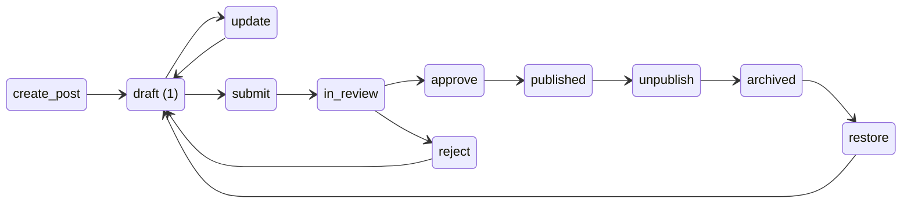
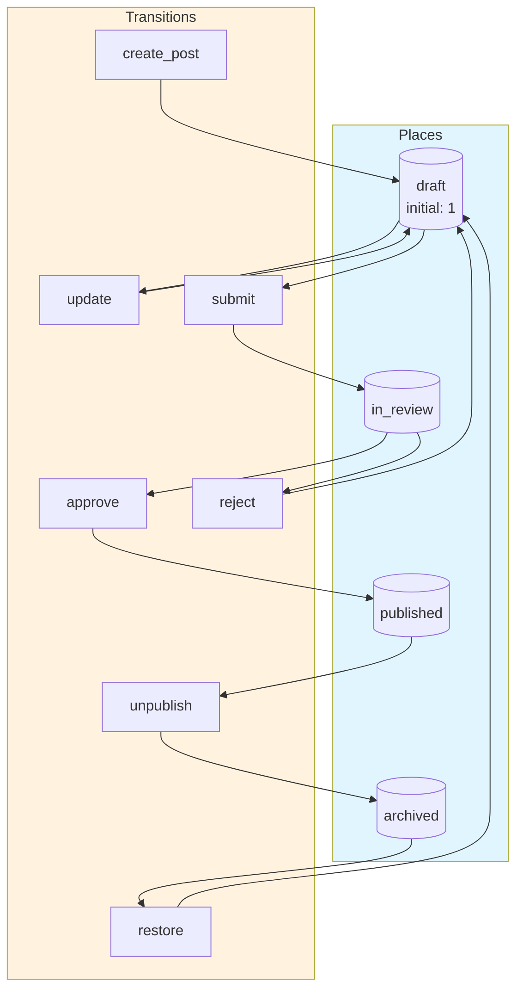
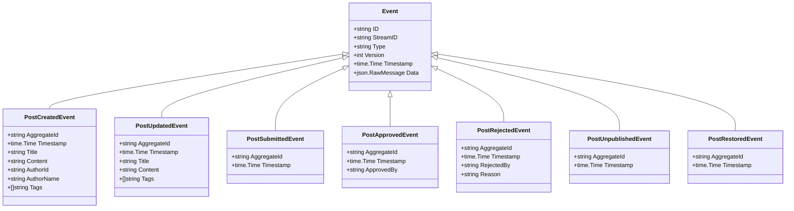
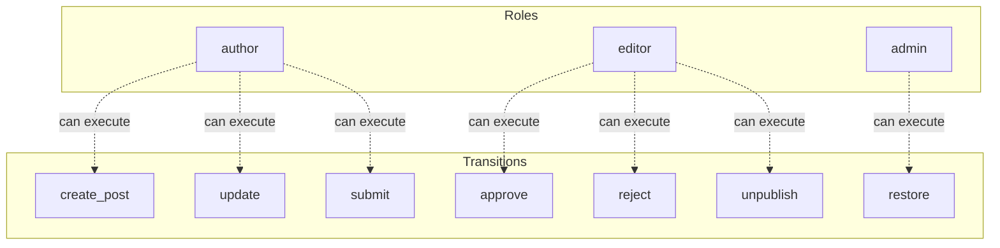

# blog-post

A blog post workflow with persistence and search

## Quick Start

```bash
# Build and run
go build -o server .
./server

# Server starts on http://localhost:8080
```

## Architecture

This application uses **event sourcing** with a **Petri net** state machine to model workflows. All state changes are captured as immutable events, enabling:

- Full audit trail of all transitions
- Time-travel debugging
- Event replay for recovery
- Deterministic state reconstruction

## State Machine

### Places (States)

| Place | Type | Initial | Description |
|-------|------|---------|-------------|
| `draft` | Token | 1 | Post is being written |
| `in_review` | Token | 0 | Post is awaiting editorial review |
| `published` | Token | 0 | Post is live on the site |
| `archived` | Token | 0 | Post has been taken down |


### Transitions (Actions)

| Transition | Event | Guard | Description |
|------------|-------|-------|-------------|
| `create_post` | `post_created` | - | Create a new blog post |
| `update` | `post_updated` | - | Update post content |
| `submit` | `post_submitted` | - | Submit draft for review |
| `approve` | `post_approved` | - | Approve and publish the post |
| `reject` | `post_rejected` | - | Reject and return to draft |
| `unpublish` | `post_unpublished` | - | Take down a published post |
| `restore` | `post_restored` | - | Restore archived post to draft |


### Petri Net Diagram



### Workflow Diagram




## Events

Events are immutable records of state transitions. Each event captures the transition that occurred and any associated data.

| Event Type | Transition | Fields |
|------------|------------|--------|
| `PostCreated` | `create_post` | `aggregate_id`, `timestamp`, `title`, `content`, `author_id`, `author_name`, `tags` |
| `PostUpdated` | `update` | `aggregate_id`, `timestamp`, `title`, `content`, `tags` |
| `PostSubmitted` | `submit` | `aggregate_id`, `timestamp` |
| `PostApproved` | `approve` | `aggregate_id`, `timestamp`, `approved_by` |
| `PostRejected` | `reject` | `aggregate_id`, `timestamp`, `rejected_by`, `reason` |
| `PostUnpublished` | `unpublish` | `aggregate_id`, `timestamp` |
| `PostRestored` | `restore` | `aggregate_id`, `timestamp` |





## Access Control

Role-based access control (RBAC) restricts which users can execute transitions.


### Roles

| Role | Description | Inherits |
|------|-------------|----------|
| `author` | Content creator who writes and submits posts | - |
| `editor` | Reviews and approves/rejects submitted posts | - |
| `admin` | Full access to all operations | `author`, `editor` |


### Permissions

| Transition | Required Roles | Guard |
|------------|----------------|-------|
| `create_post` | `author` | - |
| `update` | `author` | - |
| `submit` | `author` | - |
| `approve` | `editor` | - |
| `reject` | `editor` | - |
| `unpublish` | `editor` | - |
| `restore` | `admin` | - |





## API Endpoints

### Core Endpoints

| Method | Path | Description |
|--------|------|-------------|
| GET | `/health` | Health check |
| GET | `/ready` | Readiness check |
| POST | `/api/blog-post` | Create new instance |
| GET | `/api/blog-post/{id}` | Get instance state |
| GET | `/api/navigation` | Get navigation menu |
| GET | `/admin/stats` | Admin statistics |
| GET | `/admin/instances` | List all instances |
| GET | `/admin/instances/{id}` | Get instance detail |
| GET | `/admin/instances/{id}/events` | Get instance events |


### Transition Endpoints

| Method | Path | Transition | Description |
|--------|------|------------|-------------|
| POST | `/api/create_post` | `create_post` | Create a new blog post |
| POST | `/api/update` | `update` | Update post content |
| POST | `/api/submit` | `submit` | Submit draft for review |
| POST | `/api/approve` | `approve` | Approve and publish the post |
| POST | `/api/reject` | `reject` | Reject and return to draft |
| POST | `/api/unpublish` | `unpublish` | Take down a published post |
| POST | `/api/restore` | `restore` | Restore archived post to draft |


### Request/Response Format

#### Create Instance
```bash
curl -X POST http://localhost:8080/api/blog-post \
  -H "Content-Type: application/json" \
  -H "Authorization: Bearer <token>"
```

#### Execute Transition
```bash
curl -X POST http://localhost:8080/api/<transition> \
  -H "Content-Type: application/json" \
  -H "Authorization: Bearer <token>" \
  -d '{
    "aggregate_id": "<instance-id>",
    "data": { ... }
  }'
```

#### Response Format
```json
{
  "success": true,
  "aggregate_id": "uuid",
  "version": 1,
  "state": { "place1": 1, "place2": 0 },
  "enabled_transitions": ["transition1", "transition2"]
}
```


## Navigation

| Label | Path | Icon | Roles |
|-------|------|------|-------|
| Posts | `/` | 📝 | * |
| Admin | `/admin` | ⚙️ | `admin`, `editor` |


## Configuration

### Environment Variables

| Variable | Default | Description |
|----------|---------|-------------|
| `PORT` | `8080` | HTTP server port |
| `DB_PATH` | `./blog-post.db` | SQLite database path |
| `DEBUG` | `false` | Enable debug endpoints |


## Development

### Project Structure

```
.
├── main.go           # Application entry point
├── workflow.go       # Petri net definition
├── aggregate.go      # Event-sourced aggregate
├── events.go         # Event type definitions
├── api.go            # HTTP handlers
├── auth.go           # Authentication
├── middleware.go     # HTTP middleware
├── permissions.go    # Permission checks
├── navigation.go     # Navigation menu
├── admin.go          # Admin handlers
├── debug.go          # Debug handlers
├── frontend/         # Web UI (ES modules)
│   ├── index.html
│   └── src/
│       ├── main.js
│       ├── router.js
│       └── ...
└── go.mod
```

### Testing

```bash
# Run unit tests
go test ./...

# Run with test coverage
go test -cover ./...
```

---

Generated by [petri-pilot](https://github.com/pflow-xyz/petri-pilot)
