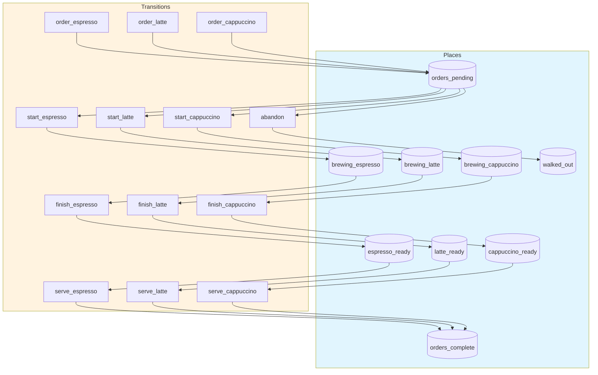

# counter

Front of house: orders are taken, drinks are brewed, drinks are served, and customers who wait too long leave. Knows nothing about ingredients or staffing.

Brewing is two firings, not one. `start_X` begins a drink and `finish_X` completes it, with a token sitting in `brewing_X` in between. That gap is the whole reason headcount matters: a barista seized and released within a single firing is never observably busy, so no amount of staffing could change the outcome. Splitting the transition is what turns 'add a barista' into a question with an answer.

## Quick Start

```bash
# Build and run
go build -o server .
./server

# Server starts on http://localhost:8080
```

## Architecture

This application uses **event sourcing** with a **Petri net** state machine to model workflows. All state changes are captured as immutable events, enabling:

- Full audit trail of all transitions
- Time-travel debugging
- Event replay for recovery
- Deterministic state reconstruction

## State Machine

### Places (States)

| Place | Type | Initial | Description |
|-------|------|---------|-------------|
| `orders_pending` | Token | 0 | - |
| `brewing_espresso` | Token | 0 | - |
| `brewing_latte` | Token | 0 | - |
| `brewing_cappuccino` | Token | 0 | - |
| `espresso_ready` | Token | 0 | - |
| `latte_ready` | Token | 0 | - |
| `cappuccino_ready` | Token | 0 | - |
| `orders_complete` | Token | 0 | - |
| `walked_out` | Token | 0 | - |


### Transitions (Actions)

| Transition | Event | Guard | Description |
|------------|-------|-------|-------------|
| `order_espresso` | `counter.order_espresso` | - | - |
| `order_latte` | `counter.order_latte` | - | - |
| `order_cappuccino` | `counter.order_cappuccino` | - | - |
| `start_espresso` | `counter.start_espresso` | - | - |
| `start_latte` | `counter.start_latte` | - | - |
| `start_cappuccino` | `counter.start_cappuccino` | - | - |
| `finish_espresso` | `counter.finish_espresso` | - | - |
| `finish_latte` | `counter.finish_latte` | - | - |
| `finish_cappuccino` | `counter.finish_cappuccino` | - | - |
| `serve_espresso` | `counter.serve_espresso` | - | - |
| `serve_latte` | `counter.serve_latte` | - | - |
| `serve_cappuccino` | `counter.serve_cappuccino` | - | - |
| `abandon` | `counter.abandon` | - | - |


### Petri Net Diagram

```mermaid
stateDiagram-v2
    direction LR

    state "orders_pending" as PlaceOrdersPending
    state "brewing_espresso" as PlaceBrewingEspresso
    state "brewing_latte" as PlaceBrewingLatte
    state "brewing_cappuccino" as PlaceBrewingCappuccino
    state "espresso_ready" as PlaceEspressoReady
    state "latte_ready" as PlaceLatteReady
    state "cappuccino_ready" as PlaceCappuccinoReady
    state "orders_complete" as PlaceOrdersComplete
    state "walked_out" as PlaceWalkedOut


    state "order_espresso" as t_TransitionOrderEspresso
    state "order_latte" as t_TransitionOrderLatte
    state "order_cappuccino" as t_TransitionOrderCappuccino
    state "start_espresso" as t_TransitionStartEspresso
    state "start_latte" as t_TransitionStartLatte
    state "start_cappuccino" as t_TransitionStartCappuccino
    state "finish_espresso" as t_TransitionFinishEspresso
    state "finish_latte" as t_TransitionFinishLatte
    state "finish_cappuccino" as t_TransitionFinishCappuccino
    state "serve_espresso" as t_TransitionServeEspresso
    state "serve_latte" as t_TransitionServeLatte
    state "serve_cappuccino" as t_TransitionServeCappuccino
    state "abandon" as t_TransitionAbandon


    t_TransitionOrderEspresso --> PlaceOrdersPending

    t_TransitionOrderLatte --> PlaceOrdersPending

    t_TransitionOrderCappuccino --> PlaceOrdersPending

    PlaceOrdersPending --> t_TransitionStartEspresso
    t_TransitionStartEspresso --> PlaceBrewingEspresso

    PlaceOrdersPending --> t_TransitionStartLatte
    t_TransitionStartLatte --> PlaceBrewingLatte

    PlaceOrdersPending --> t_TransitionStartCappuccino
    t_TransitionStartCappuccino --> PlaceBrewingCappuccino

    PlaceBrewingEspresso --> t_TransitionFinishEspresso
    t_TransitionFinishEspresso --> PlaceEspressoReady

    PlaceBrewingLatte --> t_TransitionFinishLatte
    t_TransitionFinishLatte --> PlaceLatteReady

    PlaceBrewingCappuccino --> t_TransitionFinishCappuccino
    t_TransitionFinishCappuccino --> PlaceCappuccinoReady

    PlaceEspressoReady --> t_TransitionServeEspresso
    t_TransitionServeEspresso --> PlaceOrdersComplete

    PlaceLatteReady --> t_TransitionServeLatte
    t_TransitionServeLatte --> PlaceOrdersComplete

    PlaceCappuccinoReady --> t_TransitionServeCappuccino
    t_TransitionServeCappuccino --> PlaceOrdersComplete

    PlaceOrdersPending --> t_TransitionAbandon
    t_TransitionAbandon --> PlaceWalkedOut

```



### Workflow Diagram




## Events

Events are immutable records of state transitions. Each event captures the transition that occurred and any associated data.

| Event Type | Transition | Fields |
|------------|------------|--------|
| `counter.order_espresso` | `order_espresso` | `aggregate_id`, `timestamp` |
| `counter.order_latte` | `order_latte` | `aggregate_id`, `timestamp` |
| `counter.order_cappuccino` | `order_cappuccino` | `aggregate_id`, `timestamp` |
| `counter.start_espresso` | `start_espresso` | `aggregate_id`, `timestamp` |
| `counter.start_latte` | `start_latte` | `aggregate_id`, `timestamp` |
| `counter.start_cappuccino` | `start_cappuccino` | `aggregate_id`, `timestamp` |
| `counter.finish_espresso` | `finish_espresso` | `aggregate_id`, `timestamp` |
| `counter.finish_latte` | `finish_latte` | `aggregate_id`, `timestamp` |
| `counter.finish_cappuccino` | `finish_cappuccino` | `aggregate_id`, `timestamp` |
| `counter.serve_espresso` | `serve_espresso` | `aggregate_id`, `timestamp` |
| `counter.serve_latte` | `serve_latte` | `aggregate_id`, `timestamp` |
| `counter.serve_cappuccino` | `serve_cappuccino` | `aggregate_id`, `timestamp` |
| `counter.abandon` | `abandon` | `aggregate_id`, `timestamp` |

```mermaid
classDiagram
    class Event {
        +string ID
        +string StreamID
        +string Type
        +int Version
        +time.Time Timestamp
        +json.RawMessage Data
    }


    class CounterOrderEspressoEvent {
        +string AggregateId
        +time.Time Timestamp
    }
    Event <|-- CounterOrderEspressoEvent

    class CounterOrderLatteEvent {
        +string AggregateId
        +time.Time Timestamp
    }
    Event <|-- CounterOrderLatteEvent

    class CounterOrderCappuccinoEvent {
        +string AggregateId
        +time.Time Timestamp
    }
    Event <|-- CounterOrderCappuccinoEvent

    class CounterStartEspressoEvent {
        +string AggregateId
        +time.Time Timestamp
    }
    Event <|-- CounterStartEspressoEvent

    class CounterStartLatteEvent {
        +string AggregateId
        +time.Time Timestamp
    }
    Event <|-- CounterStartLatteEvent

    class CounterStartCappuccinoEvent {
        +string AggregateId
        +time.Time Timestamp
    }
    Event <|-- CounterStartCappuccinoEvent

    class CounterFinishEspressoEvent {
        +string AggregateId
        +time.Time Timestamp
    }
    Event <|-- CounterFinishEspressoEvent

    class CounterFinishLatteEvent {
        +string AggregateId
        +time.Time Timestamp
    }
    Event <|-- CounterFinishLatteEvent

    class CounterFinishCappuccinoEvent {
        +string AggregateId
        +time.Time Timestamp
    }
    Event <|-- CounterFinishCappuccinoEvent

    class CounterServeEspressoEvent {
        +string AggregateId
        +time.Time Timestamp
    }
    Event <|-- CounterServeEspressoEvent

    class CounterServeLatteEvent {
        +string AggregateId
        +time.Time Timestamp
    }
    Event <|-- CounterServeLatteEvent

    class CounterServeCappuccinoEvent {
        +string AggregateId
        +time.Time Timestamp
    }
    Event <|-- CounterServeCappuccinoEvent

    class CounterAbandonEvent {
        +string AggregateId
        +time.Time Timestamp
    }
    Event <|-- CounterAbandonEvent

```





## API Endpoints

### Core Endpoints

| Method | Path | Description |
|--------|------|-------------|
| GET | `/health` | Health check |
| GET | `/ready` | Readiness check |
| POST | `/api/counter` | Create new instance |
| GET | `/api/counter/{id}` | Get instance state |


### Transition Endpoints

| Method | Path | Transition | Description |
|--------|------|------------|-------------|
| POST | `/api/order_espresso` | `order_espresso` | - |
| POST | `/api/order_latte` | `order_latte` | - |
| POST | `/api/order_cappuccino` | `order_cappuccino` | - |
| POST | `/api/start_espresso` | `start_espresso` | - |
| POST | `/api/start_latte` | `start_latte` | - |
| POST | `/api/start_cappuccino` | `start_cappuccino` | - |
| POST | `/api/finish_espresso` | `finish_espresso` | - |
| POST | `/api/finish_latte` | `finish_latte` | - |
| POST | `/api/finish_cappuccino` | `finish_cappuccino` | - |
| POST | `/api/serve_espresso` | `serve_espresso` | - |
| POST | `/api/serve_latte` | `serve_latte` | - |
| POST | `/api/serve_cappuccino` | `serve_cappuccino` | - |
| POST | `/api/abandon` | `abandon` | - |


### Request/Response Format

#### Create Instance
```bash
curl -X POST http://localhost:8080/api/counter \
  -H "Content-Type: application/json" \
  -H "Authorization: Bearer <token>"
```

#### Execute Transition
```bash
curl -X POST http://localhost:8080/api/<transition> \
  -H "Content-Type: application/json" \
  -H "Authorization: Bearer <token>" \
  -d '{
    "aggregate_id": "<instance-id>",
    "data": { ... }
  }'
```

#### Response Format
```json
{
  "success": true,
  "aggregate_id": "uuid",
  "version": 1,
  "state": { "place1": 1, "place2": 0 },
  "enabled_transitions": ["transition1", "transition2"]
}
```


## Configuration

### Environment Variables

| Variable | Default | Description |
|----------|---------|-------------|
| `PORT` | `8080` | HTTP server port |
| `DB_PATH` | `./counter.db` | SQLite database path |


## Development

### Project Structure

```
.
├── main.go           # Application entry point
├── workflow.go       # Petri net definition
├── aggregate.go      # Event-sourced aggregate
├── events.go         # Event type definitions
├── api.go            # HTTP handlers
├── frontend/         # Web UI (ES modules)
│   ├── index.html
│   └── src/
│       ├── main.js
│       ├── router.js
│       └── ...
└── go.mod
```

### Testing

```bash
# Run unit tests
go test ./...

# Run with test coverage
go test -cover ./...
```

---

Generated by [petri-pilot](https://github.com/pflow-xyz/petri-pilot)
