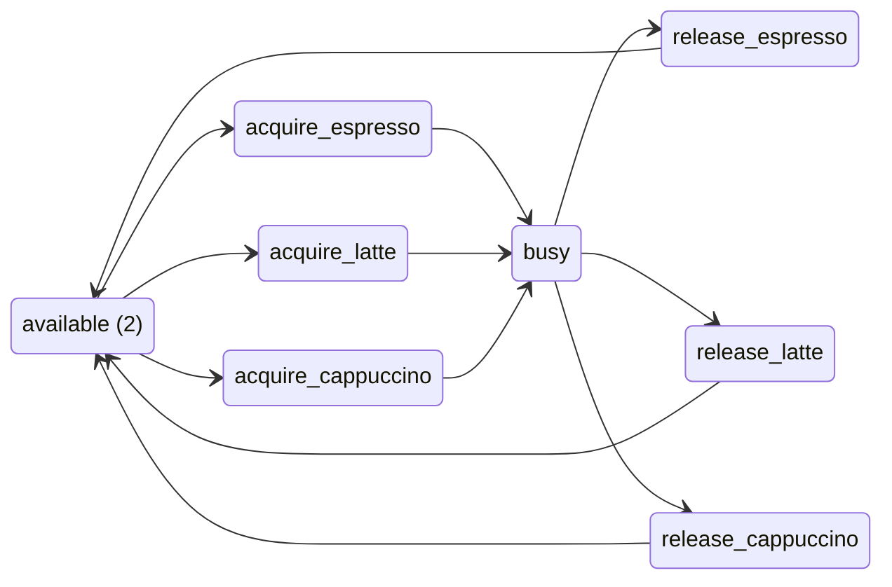
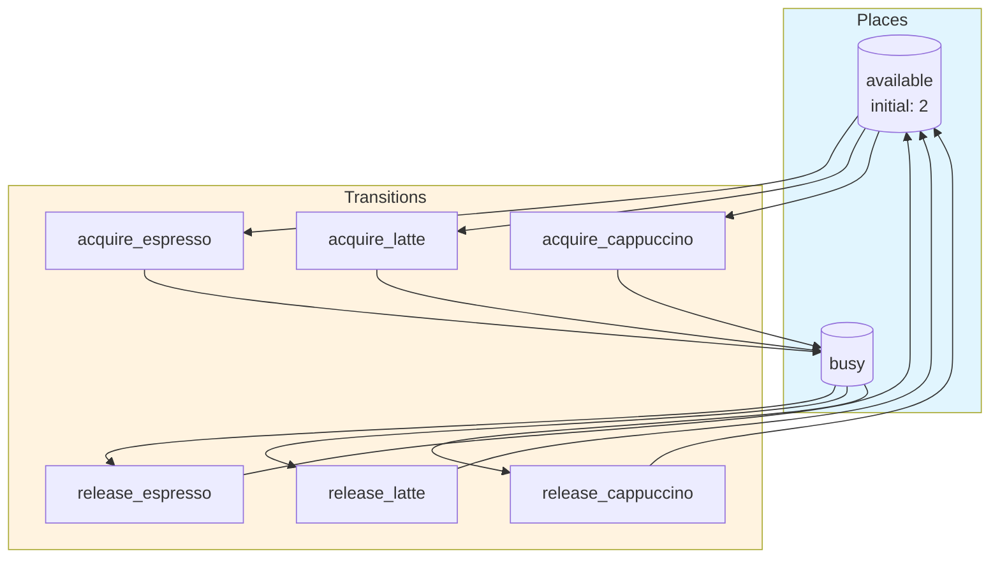
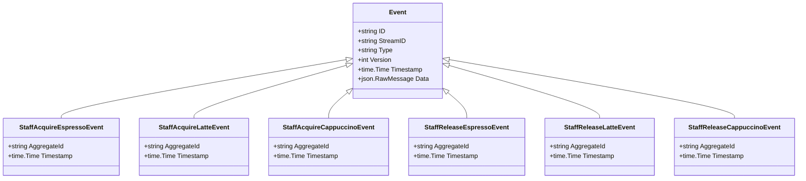

# staff

Baristas on duty. A pool of interchangeable people: a drink seizes one at the start of the brew and returns them at the end. Knows nothing about coffee — it only says how many hands there are. `initial` on `available` IS the headcount, so asking 'what if I put a third barista on?' is a change to one number.

Both pool arcs are `kinetic: false`, because a barista is a prerequisite, not an accelerant. Mass action multiplies every input into the firing rate, so with `busy` in the product two drinks in progress made each other finish twice as fast — per-drink brew time fell from 4.8 minutes at one barista to 2.2 at eight, which is a shop where hiring makes the espresso machine quicker. A non-kinetic arc still gates the firing and is still consumed by it: no free barista, no drink started. It just stops the count of people from setting the pace of the work.

## Quick Start

```bash
# Build and run
go build -o server .
./server

# Server starts on http://localhost:8080
```

## Architecture

This application uses **event sourcing** with a **Petri net** state machine to model workflows. All state changes are captured as immutable events, enabling:

- Full audit trail of all transitions
- Time-travel debugging
- Event replay for recovery
- Deterministic state reconstruction

## State Machine

### Places (States)

| Place | Type | Initial | Description |
|-------|------|---------|-------------|
| `available` | Token | 2 | - |
| `busy` | Token | 0 | - |


### Transitions (Actions)

| Transition | Event | Guard | Description |
|------------|-------|-------|-------------|
| `acquire_espresso` | `staff.acquire_espresso` | - | - |
| `acquire_latte` | `staff.acquire_latte` | - | - |
| `acquire_cappuccino` | `staff.acquire_cappuccino` | - | - |
| `release_espresso` | `staff.release_espresso` | - | - |
| `release_latte` | `staff.release_latte` | - | - |
| `release_cappuccino` | `staff.release_cappuccino` | - | - |


### Petri Net Diagram



### Workflow Diagram




## Events

Events are immutable records of state transitions. Each event captures the transition that occurred and any associated data.

| Event Type | Transition | Fields |
|------------|------------|--------|
| `staff.acquire_espresso` | `acquire_espresso` | `aggregate_id`, `timestamp` |
| `staff.acquire_latte` | `acquire_latte` | `aggregate_id`, `timestamp` |
| `staff.acquire_cappuccino` | `acquire_cappuccino` | `aggregate_id`, `timestamp` |
| `staff.release_espresso` | `release_espresso` | `aggregate_id`, `timestamp` |
| `staff.release_latte` | `release_latte` | `aggregate_id`, `timestamp` |
| `staff.release_cappuccino` | `release_cappuccino` | `aggregate_id`, `timestamp` |





## API Endpoints

### Core Endpoints

| Method | Path | Description |
|--------|------|-------------|
| GET | `/health` | Health check |
| GET | `/ready` | Readiness check |
| POST | `/api/staff` | Create new instance |
| GET | `/api/staff/{id}` | Get instance state |


### Transition Endpoints

| Method | Path | Transition | Description |
|--------|------|------------|-------------|
| POST | `/api/acquire_espresso` | `acquire_espresso` | - |
| POST | `/api/acquire_latte` | `acquire_latte` | - |
| POST | `/api/acquire_cappuccino` | `acquire_cappuccino` | - |
| POST | `/api/release_espresso` | `release_espresso` | - |
| POST | `/api/release_latte` | `release_latte` | - |
| POST | `/api/release_cappuccino` | `release_cappuccino` | - |


### Request/Response Format

#### Create Instance
```bash
curl -X POST http://localhost:8080/api/staff \
  -H "Content-Type: application/json" \
  -H "Authorization: Bearer <token>"
```

#### Execute Transition
```bash
curl -X POST http://localhost:8080/api/<transition> \
  -H "Content-Type: application/json" \
  -H "Authorization: Bearer <token>" \
  -d '{
    "aggregate_id": "<instance-id>",
    "data": { ... }
  }'
```

#### Response Format
```json
{
  "success": true,
  "aggregate_id": "uuid",
  "version": 1,
  "state": { "place1": 1, "place2": 0 },
  "enabled_transitions": ["transition1", "transition2"]
}
```


## Configuration

### Environment Variables

| Variable | Default | Description |
|----------|---------|-------------|
| `PORT` | `8080` | HTTP server port |
| `DB_PATH` | `./staff.db` | SQLite database path |


## Development

### Project Structure

```
.
├── main.go           # Application entry point
├── workflow.go       # Petri net definition
├── aggregate.go      # Event-sourced aggregate
├── events.go         # Event type definitions
├── api.go            # HTTP handlers
├── frontend/         # Web UI (ES modules)
│   ├── index.html
│   └── src/
│       ├── main.js
│       ├── router.js
│       └── ...
└── go.mod
```

### Testing

```bash
# Run unit tests
go test ./...

# Run with test coverage
go test -cover ./...
```

---

Generated by [petri-pilot](https://github.com/pflow-xyz/petri-pilot)
