# coffeeshop

Coffee shop inventory and order processing with resource prediction

## Quick Start

```bash
# Build and run
go build -o server .
./server

# Server starts on http://localhost:8080
```

## Architecture

This application uses **event sourcing** with a **Petri net** state machine to model workflows. All state changes are captured as immutable events, enabling:

- Full audit trail of all transitions
- Time-travel debugging
- Event replay for recovery
- Deterministic state reconstruction

## State Machine

### Places (States)

| Place | Type | Initial | Description |
|-------|------|---------|-------------|
| `coffee_beans` | Token | 1000 | Coffee beans inventory (grams) |
| `milk` | Token | 500 | Milk inventory (ml) |
| `cups` | Token | 200 | Cup inventory |
| `orders_pending` | Token | 0 | Orders waiting to be made |
| `espresso_ready` | Token | 0 | Espresso drinks ready |
| `latte_ready` | Token | 0 | Latte drinks ready |
| `cappuccino_ready` | Token | 0 | Cappuccino drinks ready |
| `orders_complete` | Token | 0 | Completed and served orders |


### Transitions (Actions)

| Transition | Event | Guard | Description |
|------------|-------|-------|-------------|
| `order_espresso` | `OrderEspressoed` | - | Customer orders espresso |
| `order_latte` | `OrderLatteed` | - | Customer orders latte |
| `order_cappuccino` | `OrderCappuccinoed` | - | Customer orders cappuccino |
| `make_espresso` | `MakeEspressoed` | - | Barista makes espresso |
| `make_latte` | `MakeLatteed` | - | Barista makes latte |
| `make_cappuccino` | `MakeCappuccinoed` | - | Barista makes cappuccino |
| `serve_espresso` | `ServeEspressoed` | - | Serve espresso to customer |
| `serve_latte` | `ServeLatteed` | - | Serve latte to customer |
| `serve_cappuccino` | `ServeCappuccinoed` | - | Serve cappuccino to customer |
| `restock_coffee_beans` | `RestockCoffeeBeansed` | - | Restock coffee beans inventory |
| `restock_milk` | `RestockMilked` | - | Restock milk inventory |
| `restock_cups` | `RestockCupsed` | - | Restock cup inventory |


### Petri Net Diagram


### Workflow Diagram


## Events

Events are immutable records of state transitions. Each event captures the transition that occurred and any associated data.

| Event Type | Transition | Fields |
|------------|------------|--------|
| `OrderEspressoed` | `order_espresso` | `aggregate_id`, `timestamp` |
| `OrderLatteed` | `order_latte` | `aggregate_id`, `timestamp` |
| `OrderCappuccinoed` | `order_cappuccino` | `aggregate_id`, `timestamp` |
| `MakeEspressoed` | `make_espresso` | `aggregate_id`, `timestamp` |
| `MakeLatteed` | `make_latte` | `aggregate_id`, `timestamp` |
| `MakeCappuccinoed` | `make_cappuccino` | `aggregate_id`, `timestamp` |
| `ServeEspressoed` | `serve_espresso` | `aggregate_id`, `timestamp` |
| `ServeLatteed` | `serve_latte` | `aggregate_id`, `timestamp` |
| `ServeCappuccinoed` | `serve_cappuccino` | `aggregate_id`, `timestamp` |
| `RestockCoffeeBeansed` | `restock_coffee_beans` | `aggregate_id`, `timestamp` |
| `RestockMilked` | `restock_milk` | `aggregate_id`, `timestamp` |
| `RestockCupsed` | `restock_cups` | `aggregate_id`, `timestamp` |

```mermaid
classDiagram
    class Event {
        +string ID
        +string StreamID
        +string Type
        +int Version
        +time.Time Timestamp
        +json.RawMessage Data
    }


    class OrderEspressoedEvent {
        +string AggregateId
        +time.Time Timestamp
    }
    Event <|-- OrderEspressoedEvent

    class OrderLatteedEvent {
        +string AggregateId
        +time.Time Timestamp
    }
    Event <|-- OrderLatteedEvent

    class OrderCappuccinoedEvent {
        +string AggregateId
        +time.Time Timestamp
    }
    Event <|-- OrderCappuccinoedEvent

    class MakeEspressoedEvent {
        +string AggregateId
        +time.Time Timestamp
    }
    Event <|-- MakeEspressoedEvent

    class MakeLatteedEvent {
        +string AggregateId
        +time.Time Timestamp
    }
    Event <|-- MakeLatteedEvent

    class MakeCappuccinoedEvent {
        +string AggregateId
        +time.Time Timestamp
    }
    Event <|-- MakeCappuccinoedEvent

    class ServeEspressoedEvent {
        +string AggregateId
        +time.Time Timestamp
    }
    Event <|-- ServeEspressoedEvent

    class ServeLatteedEvent {
        +string AggregateId
        +time.Time Timestamp
    }
    Event <|-- ServeLatteedEvent

    class ServeCappuccinoedEvent {
        +string AggregateId
        +time.Time Timestamp
    }
    Event <|-- ServeCappuccinoedEvent

    class RestockCoffeeBeansedEvent {
        +string AggregateId
        +time.Time Timestamp
    }
    Event <|-- RestockCoffeeBeansedEvent

    class RestockMilkedEvent {
        +string AggregateId
        +time.Time Timestamp
    }
    Event <|-- RestockMilkedEvent

    class RestockCupsedEvent {
        +string AggregateId
        +time.Time Timestamp
    }
    Event <|-- RestockCupsedEvent

```





## API Endpoints

### Core Endpoints

| Method | Path | Description |
|--------|------|-------------|
| GET | `/health` | Health check |
| GET | `/ready` | Readiness check |
| POST | `/api/coffeeshop` | Create new instance |
| GET | `/api/coffeeshop/{id}` | Get instance state |


### Transition Endpoints

| Method | Path | Transition | Description |
|--------|------|------------|-------------|
| POST | `/api/order_espresso` | `order_espresso` | Customer orders espresso |
| POST | `/api/order_latte` | `order_latte` | Customer orders latte |
| POST | `/api/order_cappuccino` | `order_cappuccino` | Customer orders cappuccino |
| POST | `/api/make_espresso` | `make_espresso` | Barista makes espresso |
| POST | `/api/make_latte` | `make_latte` | Barista makes latte |
| POST | `/api/make_cappuccino` | `make_cappuccino` | Barista makes cappuccino |
| POST | `/api/serve_espresso` | `serve_espresso` | Serve espresso to customer |
| POST | `/api/serve_latte` | `serve_latte` | Serve latte to customer |
| POST | `/api/serve_cappuccino` | `serve_cappuccino` | Serve cappuccino to customer |
| POST | `/api/restock_coffee_beans` | `restock_coffee_beans` | Restock coffee beans inventory |
| POST | `/api/restock_milk` | `restock_milk` | Restock milk inventory |
| POST | `/api/restock_cups` | `restock_cups` | Restock cup inventory |


### Request/Response Format

#### Create Instance
```bash
curl -X POST http://localhost:8080/api/coffeeshop \
  -H "Content-Type: application/json" \
  -H "Authorization: Bearer <token>"
```

#### Execute Transition
```bash
curl -X POST http://localhost:8080/api/<transition> \
  -H "Content-Type: application/json" \
  -H "Authorization: Bearer <token>" \
  -d '{
    "aggregate_id": "<instance-id>",
    "data": { ... }
  }'
```

#### Response Format
```json
{
  "success": true,
  "aggregate_id": "uuid",
  "version": 1,
  "state": { "place1": 1, "place2": 0 },
  "enabled_transitions": ["transition1", "transition2"]
}
```


## Configuration

### Environment Variables

| Variable | Default | Description |
|----------|---------|-------------|
| `PORT` | `8080` | HTTP server port |
| `DB_PATH` | `./coffeeshop.db` | SQLite database path |
| `DEBUG` | `false` | Enable debug endpoints |


## Development

### Project Structure

```
.
├── main.go           # Application entry point
├── workflow.go       # Petri net definition
├── aggregate.go      # Event-sourced aggregate
├── events.go         # Event type definitions
├── api.go            # HTTP handlers
├── debug.go          # Debug handlers
├── frontend/         # Web UI (ES modules)
│   ├── index.html
│   └── src/
│       ├── main.js
│       ├── router.js
│       └── ...
└── go.mod
```

### Testing

```bash
# Run unit tests
go test ./...

# Run with test coverage
go test -cover ./...
```

---

Generated by [petri-pilot](https://github.com/pflow-xyz/petri-pilot)
