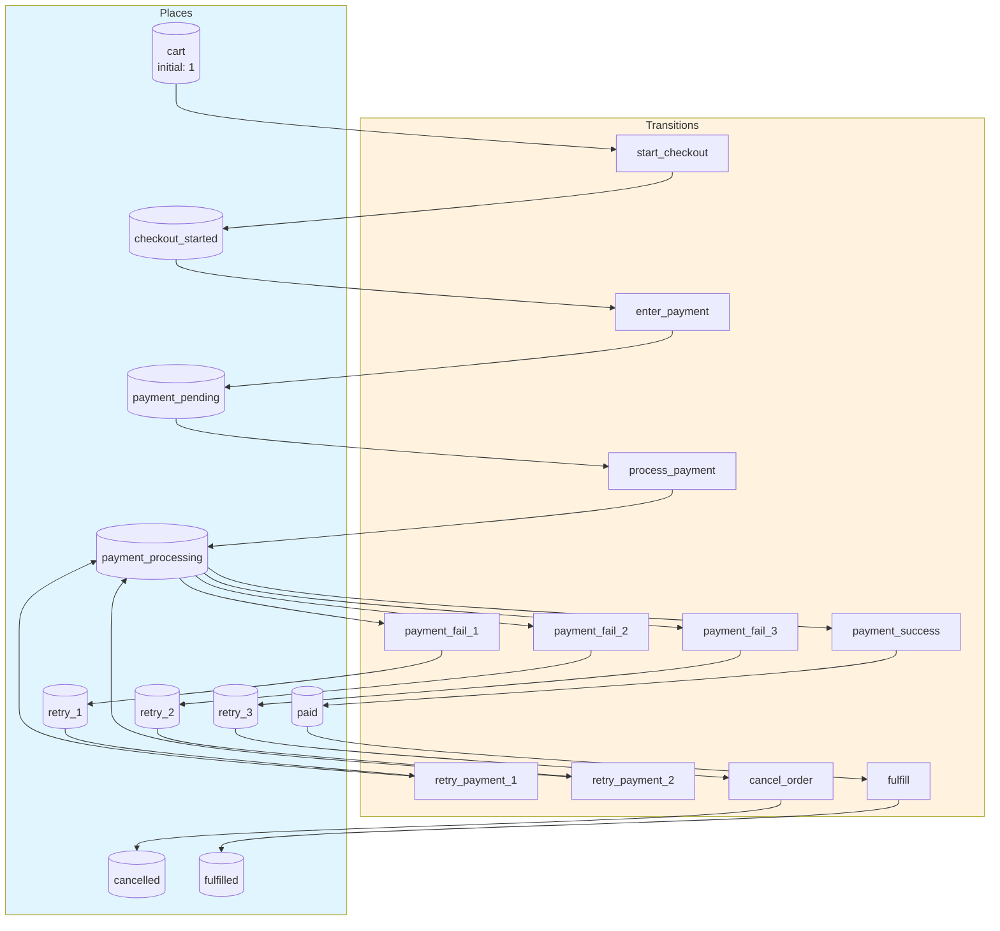

# ecommerce-checkout

An e-commerce checkout workflow: cart → payment processing → paid. Payment can fail and retry up to 3 times before cancellation.

## Quick Start

```bash
# Build and run
go build -o server .
./server

# Server starts on http://localhost:8080
```

## Architecture

This application uses **event sourcing** with a **Petri net** state machine to model workflows. All state changes are captured as immutable events, enabling:

- Full audit trail of all transitions
- Time-travel debugging
- Event replay for recovery
- Deterministic state reconstruction

## State Machine

### Places (States)

| Place | Type | Initial | Description |
|-------|------|---------|-------------|
| `cart` | Token | 1 | Items in shopping cart |
| `checkout_started` | Token | 0 | Checkout process initiated |
| `payment_pending` | Token | 0 | Awaiting payment processing |
| `payment_processing` | Token | 0 | Payment is being processed |
| `retry_1` | Token | 0 | First payment retry available |
| `retry_2` | Token | 0 | Second payment retry available |
| `retry_3` | Token | 0 | Final payment retry available |
| `paid` | Token | 0 | Payment successful |
| `cancelled` | Token | 0 | Order cancelled due to payment failure |
| `fulfilled` | Token | 0 | Order has been fulfilled |


### Transitions (Actions)

| Transition | Event | Guard | Description |
|------------|-------|-------|-------------|
| `start_checkout` | `StartCheckouted` | - | Begin checkout process |
| `enter_payment` | `EnterPaymented` | - | Enter payment details |
| `process_payment` | `ProcessPaymented` | - | Process the payment |
| `payment_success` | `PaymentSuccessed` | - | Payment processed successfully |
| `payment_fail_1` | `PaymentFail1ed` | - | First payment attempt failed |
| `retry_payment_1` | `RetryPayment1ed` | - | Retry payment (attempt 2) |
| `payment_fail_2` | `PaymentFail2ed` | - | Second payment attempt failed |
| `retry_payment_2` | `RetryPayment2ed` | - | Retry payment (attempt 3) |
| `payment_fail_3` | `PaymentFail3ed` | - | Third payment attempt failed |
| `cancel_order` | `CancelOrdered` | - | Cancel order after max retries |
| `fulfill` | `Fulfilled` | - | Fulfill the order |


### Petri Net Diagram

```mermaid
stateDiagram-v2
    direction LR

    state "cart (1)" as PlaceCart
    state "checkout_started" as PlaceCheckoutStarted
    state "payment_pending" as PlacePaymentPending
    state "payment_processing" as PlacePaymentProcessing
    state "retry_1" as PlaceRetry1
    state "retry_2" as PlaceRetry2
    state "retry_3" as PlaceRetry3
    state "paid" as PlacePaid
    state "cancelled" as PlaceCancelled
    state "fulfilled" as PlaceFulfilled


    state "start_checkout" as t_TransitionStartCheckout
    state "enter_payment" as t_TransitionEnterPayment
    state "process_payment" as t_TransitionProcessPayment
    state "payment_success" as t_TransitionPaymentSuccess
    state "payment_fail_1" as t_TransitionPaymentFail1
    state "retry_payment_1" as t_TransitionRetryPayment1
    state "payment_fail_2" as t_TransitionPaymentFail2
    state "retry_payment_2" as t_TransitionRetryPayment2
    state "payment_fail_3" as t_TransitionPaymentFail3
    state "cancel_order" as t_TransitionCancelOrder
    state "fulfill" as t_TransitionFulfill


    PlaceCart --> t_TransitionStartCheckout
    t_TransitionStartCheckout --> PlaceCheckoutStarted

    PlaceCheckoutStarted --> t_TransitionEnterPayment
    t_TransitionEnterPayment --> PlacePaymentPending

    PlacePaymentPending --> t_TransitionProcessPayment
    t_TransitionProcessPayment --> PlacePaymentProcessing

    PlacePaymentProcessing --> t_TransitionPaymentSuccess
    t_TransitionPaymentSuccess --> PlacePaid

    PlacePaymentProcessing --> t_TransitionPaymentFail1
    t_TransitionPaymentFail1 --> PlaceRetry1

    PlaceRetry1 --> t_TransitionRetryPayment1
    t_TransitionRetryPayment1 --> PlacePaymentProcessing

    PlacePaymentProcessing --> t_TransitionPaymentFail2
    t_TransitionPaymentFail2 --> PlaceRetry2

    PlaceRetry2 --> t_TransitionRetryPayment2
    t_TransitionRetryPayment2 --> PlacePaymentProcessing

    PlacePaymentProcessing --> t_TransitionPaymentFail3
    t_TransitionPaymentFail3 --> PlaceRetry3

    PlaceRetry3 --> t_TransitionCancelOrder
    t_TransitionCancelOrder --> PlaceCancelled

    PlacePaid --> t_TransitionFulfill
    t_TransitionFulfill --> PlaceFulfilled

```



### Workflow Diagram




## Events

Events are immutable records of state transitions. Each event captures the transition that occurred and any associated data.

| Event Type | Transition | Fields |
|------------|------------|--------|
| `StartCheckouted` | `start_checkout` | `aggregate_id`, `timestamp` |
| `EnterPaymented` | `enter_payment` | `aggregate_id`, `timestamp` |
| `ProcessPaymented` | `process_payment` | `aggregate_id`, `timestamp` |
| `PaymentSuccessed` | `payment_success` | `aggregate_id`, `timestamp` |
| `PaymentFail1ed` | `payment_fail_1` | `aggregate_id`, `timestamp` |
| `RetryPayment1ed` | `retry_payment_1` | `aggregate_id`, `timestamp` |
| `PaymentFail2ed` | `payment_fail_2` | `aggregate_id`, `timestamp` |
| `RetryPayment2ed` | `retry_payment_2` | `aggregate_id`, `timestamp` |
| `PaymentFail3ed` | `payment_fail_3` | `aggregate_id`, `timestamp` |
| `CancelOrdered` | `cancel_order` | `aggregate_id`, `timestamp` |
| `Fulfilled` | `fulfill` | `aggregate_id`, `timestamp` |

```mermaid
classDiagram
    class Event {
        +string ID
        +string StreamID
        +string Type
        +int Version
        +time.Time Timestamp
        +json.RawMessage Data
    }


    class StartCheckoutedEvent {
        +string AggregateId
        +time.Time Timestamp
    }
    Event <|-- StartCheckoutedEvent

    class EnterPaymentedEvent {
        +string AggregateId
        +time.Time Timestamp
    }
    Event <|-- EnterPaymentedEvent

    class ProcessPaymentedEvent {
        +string AggregateId
        +time.Time Timestamp
    }
    Event <|-- ProcessPaymentedEvent

    class PaymentSuccessedEvent {
        +string AggregateId
        +time.Time Timestamp
    }
    Event <|-- PaymentSuccessedEvent

    class PaymentFail1edEvent {
        +string AggregateId
        +time.Time Timestamp
    }
    Event <|-- PaymentFail1edEvent

    class RetryPayment1edEvent {
        +string AggregateId
        +time.Time Timestamp
    }
    Event <|-- RetryPayment1edEvent

    class PaymentFail2edEvent {
        +string AggregateId
        +time.Time Timestamp
    }
    Event <|-- PaymentFail2edEvent

    class RetryPayment2edEvent {
        +string AggregateId
        +time.Time Timestamp
    }
    Event <|-- RetryPayment2edEvent

    class PaymentFail3edEvent {
        +string AggregateId
        +time.Time Timestamp
    }
    Event <|-- PaymentFail3edEvent

    class CancelOrderedEvent {
        +string AggregateId
        +time.Time Timestamp
    }
    Event <|-- CancelOrderedEvent

    class FulfilledEvent {
        +string AggregateId
        +time.Time Timestamp
    }
    Event <|-- FulfilledEvent

```





## Access Control

Role-based access control (RBAC) restricts which users can execute transitions.


### Roles

| Role | Description | Inherits |
|------|-------------|----------|
| `customer` | End user making a purchase | - |
| `system` | Automated payment processing system | - |
| `fulfillment` | Warehouse staff who fulfill orders | - |
| `admin` | Full access to all operations | `customer`, `system`, `fulfillment` |


### Permissions

| Transition | Required Roles | Guard |
|------------|----------------|-------|
| `start_checkout` | `customer` | - |
| `enter_payment` | `customer` | - |
| `process_payment` | `system` | - |
| `payment_success` | `system` | - |
| `payment_fail_1` | `system` | - |
| `retry_payment_1` | `customer` | - |
| `payment_fail_2` | `system` | - |
| `retry_payment_2` | `customer` | - |
| `payment_fail_3` | `system` | - |
| `cancel_order` | `system` | - |
| `fulfill` | `fulfillment` | - |

```mermaid
graph TD
    subgraph Roles
        role_customer["customer"]
        role_system["system"]
        role_fulfillment["fulfillment"]
        role_admin["admin"]
    end

    subgraph Transitions
        t_start_checkout["start_checkout"]
        t_enter_payment["enter_payment"]
        t_process_payment["process_payment"]
        t_payment_success["payment_success"]
        t_payment_fail_1["payment_fail_1"]
        t_retry_payment_1["retry_payment_1"]
        t_payment_fail_2["payment_fail_2"]
        t_retry_payment_2["retry_payment_2"]
        t_payment_fail_3["payment_fail_3"]
        t_cancel_order["cancel_order"]
        t_fulfill["fulfill"]
    end


    role_customer -.->|can execute| t_start_checkout

    role_customer -.->|can execute| t_enter_payment

    role_system -.->|can execute| t_process_payment

    role_system -.->|can execute| t_payment_success

    role_system -.->|can execute| t_payment_fail_1

    role_customer -.->|can execute| t_retry_payment_1

    role_system -.->|can execute| t_payment_fail_2

    role_customer -.->|can execute| t_retry_payment_2

    role_system -.->|can execute| t_payment_fail_3

    role_system -.->|can execute| t_cancel_order

    role_fulfillment -.->|can execute| t_fulfill

```





## API Endpoints

### Core Endpoints

| Method | Path | Description |
|--------|------|-------------|
| GET | `/health` | Health check |
| GET | `/ready` | Readiness check |
| POST | `/api/ecommerce-checkout` | Create new instance |
| GET | `/api/ecommerce-checkout/{id}` | Get instance state |


### Transition Endpoints

| Method | Path | Transition | Description |
|--------|------|------------|-------------|
| POST | `/api/start_checkout` | `start_checkout` | Begin checkout process |
| POST | `/api/enter_payment` | `enter_payment` | Enter payment details |
| POST | `/api/process_payment` | `process_payment` | Process the payment |
| POST | `/api/payment_success` | `payment_success` | Payment processed successfully |
| POST | `/api/payment_fail_1` | `payment_fail_1` | First payment attempt failed |
| POST | `/api/retry_payment_1` | `retry_payment_1` | Retry payment (attempt 2) |
| POST | `/api/payment_fail_2` | `payment_fail_2` | Second payment attempt failed |
| POST | `/api/retry_payment_2` | `retry_payment_2` | Retry payment (attempt 3) |
| POST | `/api/payment_fail_3` | `payment_fail_3` | Third payment attempt failed |
| POST | `/api/cancel_order` | `cancel_order` | Cancel order after max retries |
| POST | `/api/fulfill` | `fulfill` | Fulfill the order |


### Request/Response Format

#### Create Instance
```bash
curl -X POST http://localhost:8080/api/ecommerce-checkout \
  -H "Content-Type: application/json" \
  -H "Authorization: Bearer <token>"
```

#### Execute Transition
```bash
curl -X POST http://localhost:8080/api/<transition> \
  -H "Content-Type: application/json" \
  -H "Authorization: Bearer <token>" \
  -d '{
    "aggregate_id": "<instance-id>",
    "data": { ... }
  }'
```

#### Response Format
```json
{
  "success": true,
  "aggregate_id": "uuid",
  "version": 1,
  "state": { "place1": 1, "place2": 0 },
  "enabled_transitions": ["transition1", "transition2"]
}
```


## Configuration

### Environment Variables

| Variable | Default | Description |
|----------|---------|-------------|
| `PORT` | `8080` | HTTP server port |
| `DB_PATH` | `./ecommerce-checkout.db` | SQLite database path |
| `DEBUG` | `false` | Enable debug endpoints |


## Development

### Project Structure

```
.
├── main.go           # Application entry point
├── workflow.go       # Petri net definition
├── aggregate.go      # Event-sourced aggregate
├── events.go         # Event type definitions
├── api.go            # HTTP handlers
├── auth.go           # Authentication
├── middleware.go     # HTTP middleware
├── permissions.go    # Permission checks
├── debug.go          # Debug handlers
├── frontend/         # Web UI (ES modules)
│   ├── index.html
│   └── src/
│       ├── main.js
│       ├── router.js
│       └── ...
└── go.mod
```

### Testing

```bash
# Run unit tests
go test ./...

# Run with test coverage
go test -cover ./...
```

---

Generated by [petri-pilot](https://github.com/pflow-xyz/petri-pilot)
