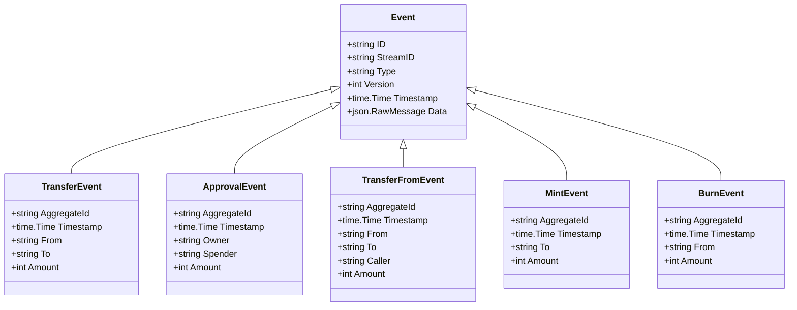
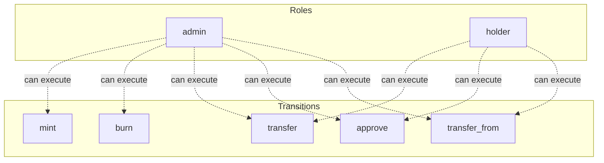

# erc20-token

ERC-20 fungible token implementation using Petri net semantics

## Quick Start

```bash
# Build and run
go build -o server .
./server

# Server starts on http://localhost:8080
```

## Architecture

This application uses **event sourcing** with a **Petri net** state machine to model workflows. All state changes are captured as immutable events, enabling:

- Full audit trail of all transitions
- Time-travel debugging
- Event replay for recovery
- Deterministic state reconstruction

## State Machine

### Places (States)

| Place | Type | Initial | Description |
|-------|------|---------|-------------|
| `total_supply` | Data | 0 | Total tokens in circulation |
| `balances` | Data | 0 | Token balance per address |
| `allowances` | Data | 0 | Spending allowances: owner -> spender -> amount (nested map) |


### Transitions (Actions)

| Transition | Event | Guard | Description |
|------------|-------|-------|-------------|
| `transfer` | `Transfered` | `balances[from] >= amount` | Transfer tokens from sender to recipient |
| `approve` | `Approveed` | - | Approve spender to transfer tokens on owner's behalf |
| `transfer_from` | `TransferFromed` | `balances[from] >= amount && allowances[from][caller] >= amount` | Transfer tokens using allowance (delegated transfer) |
| `mint` | `Minted` | - | Create new tokens and add to recipient balance |
| `burn` | `Burned` | `balances[from] >= amount` | Destroy tokens from holder's balance |


### Petri Net Diagram

```mermaid
stateDiagram-v2
    direction LR

    state "total_supply" as PlaceTotalSupply
    state "balances" as PlaceBalances
    state "allowances" as PlaceAllowances


    state "transfer" as t_TransitionTransfer <<choice>>
    state "approve" as t_TransitionApprove <<choice>>
    state "transfer_from" as t_TransitionTransferFrom <<choice>>
    state "mint" as t_TransitionMint <<choice>>
    state "burn" as t_TransitionBurn <<choice>>


    PlaceBalances --> t_TransitionTransfer: 
    t_TransitionTransfer --> PlaceBalances: 

    t_TransitionApprove --> PlaceAllowances: 

    PlaceBalances --> t_TransitionTransferFrom: 
    PlaceAllowances --> t_TransitionTransferFrom: 
    t_TransitionTransferFrom --> PlaceBalances: 

    t_TransitionMint --> PlaceBalances: 
    t_TransitionMint --> PlaceTotalSupply: 

    PlaceBalances --> t_TransitionBurn: 
    PlaceTotalSupply --> t_TransitionBurn: 

```

### Workflow Diagram

```mermaid
flowchart TD
    subgraph Places
        PlaceTotalSupply[("total_supply")]
        PlaceBalances[("balances")]
        PlaceAllowances[("allowances")]
    end

    subgraph Transitions
        t_TransitionTransfer["transfer"]
        t_TransitionApprove["approve"]
        t_TransitionTransferFrom["transfer_from"]
        t_TransitionMint["mint"]
        t_TransitionBurn["burn"]
    end


    PlaceBalances -->|| t_TransitionTransfer
    t_TransitionTransfer -->|| PlaceBalances

    t_TransitionApprove -->|| PlaceAllowances

    PlaceBalances -->|| t_TransitionTransferFrom
    PlaceAllowances -->|| t_TransitionTransferFrom
    t_TransitionTransferFrom -->|| PlaceBalances

    t_TransitionMint -->|| PlaceBalances
    t_TransitionMint -->|| PlaceTotalSupply

    PlaceBalances -->|| t_TransitionBurn
    PlaceTotalSupply -->|| t_TransitionBurn


    style Places fill:#e1f5fe
    style Transitions fill:#fff3e0
```


## Events

Events are immutable records of state transitions. Each event captures the transition that occurred and any associated data.

| Event Type | Transition | Fields |
|------------|------------|--------|
| `TransferEvent` | `transfer` | `aggregate_id`, `timestamp`, `from`, `to`, `amount` |
| `ApprovalEvent` | `approve` | `aggregate_id`, `timestamp`, `owner`, `spender`, `amount` |
| `TransferFromEvent` | `transfer_from` | `aggregate_id`, `timestamp`, `from`, `to`, `caller`, `amount` |
| `MintEvent` | `mint` | `aggregate_id`, `timestamp`, `to`, `amount` |
| `BurnEvent` | `burn` | `aggregate_id`, `timestamp`, `from`, `amount` |





## Access Control

Role-based access control (RBAC) restricts which users can execute transitions.


### Roles

| Role | Description | Inherits |
|------|-------------|----------|
| `admin` | Can mint and burn tokens | - |
| `holder` | Can transfer and approve tokens | - |


### Permissions

| Transition | Required Roles | Guard |
|------------|----------------|-------|
| `mint` | `admin` | - |
| `burn` | `admin` | - |
| `transfer` | `holder`, `admin` | - |
| `approve` | `holder`, `admin` | - |
| `transfer_from` | `holder`, `admin` | - |





## API Endpoints

### Core Endpoints

| Method | Path | Description |
|--------|------|-------------|
| GET | `/health` | Health check |
| GET | `/ready` | Readiness check |
| POST | `/api/erc20-token` | Create new instance |
| GET | `/api/erc20-token/{id}` | Get instance state |
| GET | `/api/navigation` | Get navigation menu |
| GET | `/admin/stats` | Admin statistics |
| GET | `/admin/instances` | List all instances |
| GET | `/admin/instances/{id}` | Get instance detail |
| GET | `/admin/instances/{id}/events` | Get instance events |


### Transition Endpoints

| Method | Path | Transition | Description |
|--------|------|------------|-------------|
| POST | `/api/transfer` | `transfer` | Transfer tokens from sender to recipient |
| POST | `/api/approve` | `approve` | Approve spender to transfer tokens on owner's behalf |
| POST | `/api/transfer_from` | `transfer_from` | Transfer tokens using allowance (delegated transfer) |
| POST | `/api/mint` | `mint` | Create new tokens and add to recipient balance |
| POST | `/api/burn` | `burn` | Destroy tokens from holder's balance |


### Request/Response Format

#### Create Instance
```bash
curl -X POST http://localhost:8080/api/erc20-token \
  -H "Content-Type: application/json" \
  -H "Authorization: Bearer <token>"
```

#### Execute Transition
```bash
curl -X POST http://localhost:8080/api/<transition> \
  -H "Content-Type: application/json" \
  -H "Authorization: Bearer <token>" \
  -d '{
    "aggregate_id": "<instance-id>",
    "data": { ... }
  }'
```

#### Response Format
```json
{
  "success": true,
  "aggregate_id": "uuid",
  "version": 1,
  "state": { "place1": 1, "place2": 0 },
  "enabled_transitions": ["transition1", "transition2"]
}
```


## Navigation

| Label | Path | Icon | Roles |
|-------|------|------|-------|
| Admin | `/admin` | ⚙️ | `admin` |


## Configuration

### Environment Variables

| Variable | Default | Description |
|----------|---------|-------------|
| `PORT` | `8080` | HTTP server port |
| `DB_PATH` | `./erc20-token.db` | SQLite database path |
| `DEBUG` | `false` | Enable debug endpoints |


## Development

### Project Structure

```
.
├── main.go           # Application entry point
├── workflow.go       # Petri net definition
├── aggregate.go      # Event-sourced aggregate
├── events.go         # Event type definitions
├── api.go            # HTTP handlers
├── auth.go           # Authentication
├── middleware.go     # HTTP middleware
├── permissions.go    # Permission checks
├── navigation.go     # Navigation menu
├── admin.go          # Admin handlers
├── debug.go          # Debug handlers
├── frontend/         # Web UI (ES modules)
│   ├── index.html
│   └── src/
│       ├── main.js
│       ├── router.js
│       └── ...
└── go.mod
```

### Testing

```bash
# Run unit tests
go test ./...

# Run with test coverage
go test -cover ./...
```

---

Generated by [petri-pilot](https://github.com/pflow-xyz/petri-pilot)
