# job-application

A job application workflow: applied → phone screen AND background check (parallel) → interview → offer → hired/rejected

## Quick Start

```bash
# Build and run
go build -o server .
./server

# Server starts on http://localhost:8080
```

## Architecture

This application uses **event sourcing** with a **Petri net** state machine to model workflows. All state changes are captured as immutable events, enabling:

- Full audit trail of all transitions
- Time-travel debugging
- Event replay for recovery
- Deterministic state reconstruction

## State Machine

### Places (States)

| Place | Type | Initial | Description |
|-------|------|---------|-------------|
| `applied` | Token | 1 | Application submitted |
| `screening` | Token | 0 | Initial screening in progress |
| `phone_screen_pending` | Token | 0 | Phone screen scheduled |
| `phone_screen_complete` | Token | 0 | Phone screen completed |
| `background_check_pending` | Token | 0 | Background check in progress |
| `background_check_complete` | Token | 0 | Background check completed |
| `ready_for_interview` | Token | 0 | Both screens passed, ready for interview |
| `interviewing` | Token | 0 | Interview process ongoing |
| `offer_extended` | Token | 0 | Job offer has been extended |
| `hired` | Token | 0 | Candidate has been hired |
| `rejected` | Token | 0 | Application rejected |


### Transitions (Actions)

| Transition | Event | Guard | Description |
|------------|-------|-------|-------------|
| `start_screening` | `StartScreeninged` | - | Begin candidate screening |
| `schedule_phone_screen` | `SchedulePhoneScreened` | - | Schedule phone screen |
| `start_background_check` | `StartBackgroundChecked` | - | Initiate background check |
| `complete_phone_screen` | `CompletePhoneScreened` | - | Complete phone screen |
| `complete_background_check` | `CompleteBackgroundChecked` | - | Complete background check |
| `advance_to_interview` | `AdvanceToInterviewed` | - | Both checks passed, advance to interview |
| `conduct_interview` | `ConductInterviewed` | - | Conduct interview |
| `extend_offer` | `ExtendOffered` | - | Extend job offer |
| `accept_offer` | `AcceptOffered` | - | Candidate accepts offer |
| `reject_after_screen` | `RejectAfterScreened` | - | Reject after screening |
| `reject_after_interview` | `RejectAfterInterviewed` | - | Reject after interview |
| `decline_offer` | `DeclineOffered` | - | Candidate declines offer |


### Petri Net Diagram


### Workflow Diagram


## Events

Events are immutable records of state transitions. Each event captures the transition that occurred and any associated data.

| Event Type | Transition | Fields |
|------------|------------|--------|
| `StartScreeninged` | `start_screening` | `aggregate_id`, `timestamp` |
| `SchedulePhoneScreened` | `schedule_phone_screen` | `aggregate_id`, `timestamp` |
| `StartBackgroundChecked` | `start_background_check` | `aggregate_id`, `timestamp` |
| `CompletePhoneScreened` | `complete_phone_screen` | `aggregate_id`, `timestamp` |
| `CompleteBackgroundChecked` | `complete_background_check` | `aggregate_id`, `timestamp` |
| `AdvanceToInterviewed` | `advance_to_interview` | `aggregate_id`, `timestamp` |
| `ConductInterviewed` | `conduct_interview` | `aggregate_id`, `timestamp` |
| `ExtendOffered` | `extend_offer` | `aggregate_id`, `timestamp` |
| `AcceptOffered` | `accept_offer` | `aggregate_id`, `timestamp` |
| `RejectAfterScreened` | `reject_after_screen` | `aggregate_id`, `timestamp` |
| `RejectAfterInterviewed` | `reject_after_interview` | `aggregate_id`, `timestamp` |
| `DeclineOffered` | `decline_offer` | `aggregate_id`, `timestamp` |

```mermaid
classDiagram
    class Event {
        +string ID
        +string StreamID
        +string Type
        +int Version
        +time.Time Timestamp
        +json.RawMessage Data
    }


    class StartScreeningedEvent {
        +string AggregateId
        +time.Time Timestamp
    }
    Event <|-- StartScreeningedEvent

    class SchedulePhoneScreenedEvent {
        +string AggregateId
        +time.Time Timestamp
    }
    Event <|-- SchedulePhoneScreenedEvent

    class StartBackgroundCheckedEvent {
        +string AggregateId
        +time.Time Timestamp
    }
    Event <|-- StartBackgroundCheckedEvent

    class CompletePhoneScreenedEvent {
        +string AggregateId
        +time.Time Timestamp
    }
    Event <|-- CompletePhoneScreenedEvent

    class CompleteBackgroundCheckedEvent {
        +string AggregateId
        +time.Time Timestamp
    }
    Event <|-- CompleteBackgroundCheckedEvent

    class AdvanceToInterviewedEvent {
        +string AggregateId
        +time.Time Timestamp
    }
    Event <|-- AdvanceToInterviewedEvent

    class ConductInterviewedEvent {
        +string AggregateId
        +time.Time Timestamp
    }
    Event <|-- ConductInterviewedEvent

    class ExtendOfferedEvent {
        +string AggregateId
        +time.Time Timestamp
    }
    Event <|-- ExtendOfferedEvent

    class AcceptOfferedEvent {
        +string AggregateId
        +time.Time Timestamp
    }
    Event <|-- AcceptOfferedEvent

    class RejectAfterScreenedEvent {
        +string AggregateId
        +time.Time Timestamp
    }
    Event <|-- RejectAfterScreenedEvent

    class RejectAfterInterviewedEvent {
        +string AggregateId
        +time.Time Timestamp
    }
    Event <|-- RejectAfterInterviewedEvent

    class DeclineOfferedEvent {
        +string AggregateId
        +time.Time Timestamp
    }
    Event <|-- DeclineOfferedEvent

```





## Access Control

Role-based access control (RBAC) restricts which users can execute transitions.


### Roles

| Role | Description | Inherits |
|------|-------------|----------|
| `candidate` | Job applicant | - |
| `recruiter` | HR recruiter who screens candidates | - |
| `hiring_manager` | Manager who conducts interviews and makes hiring decisions | - |
| `admin` | Full access to all operations | `recruiter`, `hiring_manager` |


### Permissions

| Transition | Required Roles | Guard |
|------------|----------------|-------|
| `start_screening` | `recruiter` | - |
| `schedule_phone_screen` | `recruiter` | - |
| `start_background_check` | `recruiter` | - |
| `complete_phone_screen` | `recruiter` | - |
| `complete_background_check` | `recruiter` | - |
| `advance_to_interview` | `recruiter` | - |
| `conduct_interview` | `hiring_manager` | - |
| `extend_offer` | `hiring_manager` | - |
| `accept_offer` | `candidate` | - |
| `reject_after_screen` | `recruiter` | - |
| `reject_after_interview` | `hiring_manager` | - |
| `decline_offer` | `candidate` | - |


## API Endpoints

### Core Endpoints

| Method | Path | Description |
|--------|------|-------------|
| GET | `/health` | Health check |
| GET | `/ready` | Readiness check |
| POST | `/api/job-application` | Create new instance |
| GET | `/api/job-application/{id}` | Get instance state |


### Transition Endpoints

| Method | Path | Transition | Description |
|--------|------|------------|-------------|
| POST | `/api/start_screening` | `start_screening` | Begin candidate screening |
| POST | `/api/schedule_phone_screen` | `schedule_phone_screen` | Schedule phone screen |
| POST | `/api/start_background_check` | `start_background_check` | Initiate background check |
| POST | `/api/complete_phone_screen` | `complete_phone_screen` | Complete phone screen |
| POST | `/api/complete_background_check` | `complete_background_check` | Complete background check |
| POST | `/api/advance_to_interview` | `advance_to_interview` | Both checks passed, advance to interview |
| POST | `/api/conduct_interview` | `conduct_interview` | Conduct interview |
| POST | `/api/extend_offer` | `extend_offer` | Extend job offer |
| POST | `/api/accept_offer` | `accept_offer` | Candidate accepts offer |
| POST | `/api/reject_after_screen` | `reject_after_screen` | Reject after screening |
| POST | `/api/reject_after_interview` | `reject_after_interview` | Reject after interview |
| POST | `/api/decline_offer` | `decline_offer` | Candidate declines offer |


### Request/Response Format

#### Create Instance
```bash
curl -X POST http://localhost:8080/api/job-application \
  -H "Content-Type: application/json" \
  -H "Authorization: Bearer <token>"
```

#### Execute Transition
```bash
curl -X POST http://localhost:8080/api/<transition> \
  -H "Content-Type: application/json" \
  -H "Authorization: Bearer <token>" \
  -d '{
    "aggregate_id": "<instance-id>",
    "data": { ... }
  }'
```

#### Response Format
```json
{
  "success": true,
  "aggregate_id": "uuid",
  "version": 1,
  "state": { "place1": 1, "place2": 0 },
  "enabled_transitions": ["transition1", "transition2"]
}
```


## Configuration

### Environment Variables

| Variable | Default | Description |
|----------|---------|-------------|
| `PORT` | `8080` | HTTP server port |
| `DB_PATH` | `./job-application.db` | SQLite database path |
| `DEBUG` | `false` | Enable debug endpoints |


## Development

### Project Structure

```
.
├── main.go           # Application entry point
├── workflow.go       # Petri net definition
├── aggregate.go      # Event-sourced aggregate
├── events.go         # Event type definitions
├── api.go            # HTTP handlers
├── auth.go           # Authentication
├── middleware.go     # HTTP middleware
├── permissions.go    # Permission checks
├── debug.go          # Debug handlers
├── frontend/         # Web UI (ES modules)
│   ├── index.html
│   └── src/
│       ├── main.js
│       ├── router.js
│       └── ...
└── go.mod
```

### Testing

```bash
# Run unit tests
go test ./...

# Run with test coverage
go test -cover ./...
```

---

Generated by [petri-pilot](https://github.com/pflow-xyz/petri-pilot)
