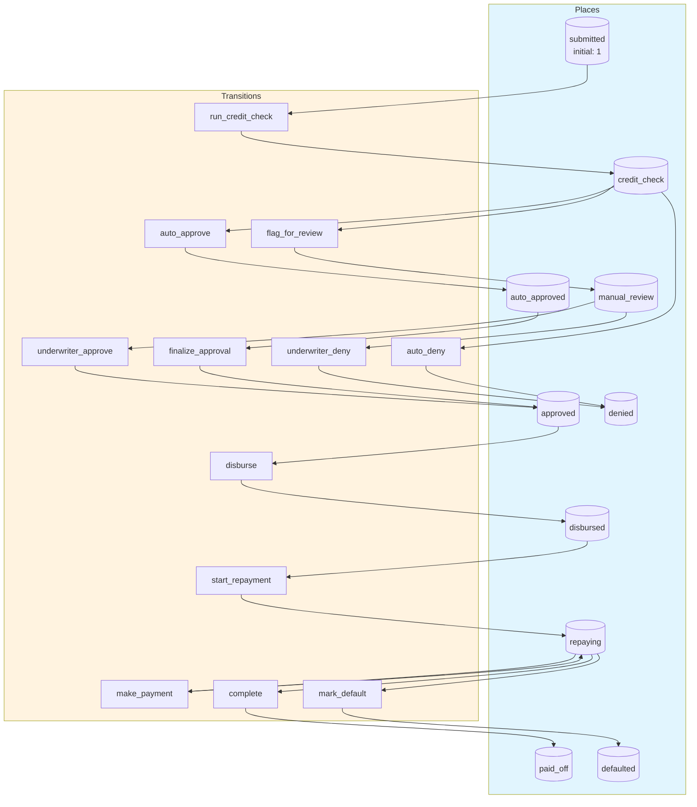

# loan-application

A loan application workflow: submit → credit check → manual review (if needed) → approve/deny → disbursement → repayment tracking → completion or default

## Quick Start

```bash
# Build and run
go build -o server .
./server

# Server starts on http://localhost:8080
```

## Architecture

This application uses **event sourcing** with a **Petri net** state machine to model workflows. All state changes are captured as immutable events, enabling:

- Full audit trail of all transitions
- Time-travel debugging
- Event replay for recovery
- Deterministic state reconstruction

## State Machine

### Places (States)

| Place | Type | Initial | Description |
|-------|------|---------|-------------|
| `submitted` | Token | 1 | Application submitted by customer |
| `credit_check` | Token | 0 | Automated credit check in progress |
| `auto_approved` | Token | 0 | Passed automatic approval criteria |
| `manual_review` | Token | 0 | Requires manual underwriter review |
| `approved` | Token | 0 | Loan has been approved |
| `denied` | Token | 0 | Loan application denied |
| `disbursed` | Token | 0 | Funds have been disbursed |
| `repaying` | Token | 0 | Loan is being repaid |
| `paid_off` | Token | 0 | Loan fully repaid |
| `defaulted` | Token | 0 | Loan has defaulted |


### Transitions (Actions)

| Transition | Event | Guard | Description |
|------------|-------|-------|-------------|
| `run_credit_check` | `RunCreditChecked` | - | Initiate automated credit check |
| `auto_approve` | `AutoApproveed` | - | Automatic approval based on credit score |
| `flag_for_review` | `FlagForReviewed` | - | Flag application for manual review |
| `underwriter_approve` | `UnderwriterApproveed` | - | Underwriter approves the application |
| `underwriter_deny` | `UnderwriterDenyed` | - | Underwriter denies the application |
| `auto_deny` | `AutoDenyed` | - | Automatic denial based on credit score |
| `finalize_approval` | `FinalizeApprovaled` | - | Finalize loan approval |
| `disburse` | `Disburseed` | - | Disburse loan funds to customer |
| `start_repayment` | `StartRepaymented` | - | Begin repayment period |
| `make_payment` | `MakePaymented` | - | Customer makes a payment |
| `complete` | `Completeed` | - | Final payment received, loan complete |
| `mark_default` | `MarkDefaulted` | - | Mark loan as defaulted |


### Petri Net Diagram

```mermaid
stateDiagram-v2
    direction LR

    state "submitted (1)" as PlaceSubmitted
    state "credit_check" as PlaceCreditCheck
    state "auto_approved" as PlaceAutoApproved
    state "manual_review" as PlaceManualReview
    state "approved" as PlaceApproved
    state "denied" as PlaceDenied
    state "disbursed" as PlaceDisbursed
    state "repaying" as PlaceRepaying
    state "paid_off" as PlacePaidOff
    state "defaulted" as PlaceDefaulted


    state "run_credit_check" as t_TransitionRunCreditCheck
    state "auto_approve" as t_TransitionAutoApprove
    state "flag_for_review" as t_TransitionFlagForReview
    state "underwriter_approve" as t_TransitionUnderwriterApprove
    state "underwriter_deny" as t_TransitionUnderwriterDeny
    state "auto_deny" as t_TransitionAutoDeny
    state "finalize_approval" as t_TransitionFinalizeApproval
    state "disburse" as t_TransitionDisburse
    state "start_repayment" as t_TransitionStartRepayment
    state "make_payment" as t_TransitionMakePayment
    state "complete" as t_TransitionComplete
    state "mark_default" as t_TransitionMarkDefault


    PlaceSubmitted --> t_TransitionRunCreditCheck
    t_TransitionRunCreditCheck --> PlaceCreditCheck

    PlaceCreditCheck --> t_TransitionAutoApprove
    t_TransitionAutoApprove --> PlaceAutoApproved

    PlaceCreditCheck --> t_TransitionFlagForReview
    t_TransitionFlagForReview --> PlaceManualReview

    PlaceManualReview --> t_TransitionUnderwriterApprove
    t_TransitionUnderwriterApprove --> PlaceApproved

    PlaceManualReview --> t_TransitionUnderwriterDeny
    t_TransitionUnderwriterDeny --> PlaceDenied

    PlaceCreditCheck --> t_TransitionAutoDeny
    t_TransitionAutoDeny --> PlaceDenied

    PlaceAutoApproved --> t_TransitionFinalizeApproval
    t_TransitionFinalizeApproval --> PlaceApproved

    PlaceApproved --> t_TransitionDisburse
    t_TransitionDisburse --> PlaceDisbursed

    PlaceDisbursed --> t_TransitionStartRepayment
    t_TransitionStartRepayment --> PlaceRepaying

    PlaceRepaying --> t_TransitionMakePayment
    t_TransitionMakePayment --> PlaceRepaying

    PlaceRepaying --> t_TransitionComplete
    t_TransitionComplete --> PlacePaidOff

    PlaceRepaying --> t_TransitionMarkDefault
    t_TransitionMarkDefault --> PlaceDefaulted

```



### Workflow Diagram




## Events

Events are immutable records of state transitions. Each event captures the transition that occurred and any associated data.

| Event Type | Transition | Fields |
|------------|------------|--------|
| `RunCreditChecked` | `run_credit_check` | `aggregate_id`, `timestamp` |
| `AutoApproveed` | `auto_approve` | `aggregate_id`, `timestamp` |
| `FlagForReviewed` | `flag_for_review` | `aggregate_id`, `timestamp` |
| `UnderwriterApproveed` | `underwriter_approve` | `aggregate_id`, `timestamp` |
| `UnderwriterDenyed` | `underwriter_deny` | `aggregate_id`, `timestamp` |
| `AutoDenyed` | `auto_deny` | `aggregate_id`, `timestamp` |
| `FinalizeApprovaled` | `finalize_approval` | `aggregate_id`, `timestamp` |
| `Disburseed` | `disburse` | `aggregate_id`, `timestamp` |
| `StartRepaymented` | `start_repayment` | `aggregate_id`, `timestamp` |
| `MakePaymented` | `make_payment` | `aggregate_id`, `timestamp` |
| `Completeed` | `complete` | `aggregate_id`, `timestamp` |
| `MarkDefaulted` | `mark_default` | `aggregate_id`, `timestamp` |

```mermaid
classDiagram
    class Event {
        +string ID
        +string StreamID
        +string Type
        +int Version
        +time.Time Timestamp
        +json.RawMessage Data
    }


    class RunCreditCheckedEvent {
        +string AggregateId
        +time.Time Timestamp
    }
    Event <|-- RunCreditCheckedEvent

    class AutoApproveedEvent {
        +string AggregateId
        +time.Time Timestamp
    }
    Event <|-- AutoApproveedEvent

    class FlagForReviewedEvent {
        +string AggregateId
        +time.Time Timestamp
    }
    Event <|-- FlagForReviewedEvent

    class UnderwriterApproveedEvent {
        +string AggregateId
        +time.Time Timestamp
    }
    Event <|-- UnderwriterApproveedEvent

    class UnderwriterDenyedEvent {
        +string AggregateId
        +time.Time Timestamp
    }
    Event <|-- UnderwriterDenyedEvent

    class AutoDenyedEvent {
        +string AggregateId
        +time.Time Timestamp
    }
    Event <|-- AutoDenyedEvent

    class FinalizeApprovaledEvent {
        +string AggregateId
        +time.Time Timestamp
    }
    Event <|-- FinalizeApprovaledEvent

    class DisburseedEvent {
        +string AggregateId
        +time.Time Timestamp
    }
    Event <|-- DisburseedEvent

    class StartRepaymentedEvent {
        +string AggregateId
        +time.Time Timestamp
    }
    Event <|-- StartRepaymentedEvent

    class MakePaymentedEvent {
        +string AggregateId
        +time.Time Timestamp
    }
    Event <|-- MakePaymentedEvent

    class CompleteedEvent {
        +string AggregateId
        +time.Time Timestamp
    }
    Event <|-- CompleteedEvent

    class MarkDefaultedEvent {
        +string AggregateId
        +time.Time Timestamp
    }
    Event <|-- MarkDefaultedEvent

```





## Access Control

Role-based access control (RBAC) restricts which users can execute transitions.


### Roles

| Role | Description | Inherits |
|------|-------------|----------|
| `applicant` | Customer applying for a loan | - |
| `system` | Automated credit check and processing system | - |
| `underwriter` | Loan underwriter who reviews applications | - |
| `admin` | Full access to all operations | `underwriter` |


### Permissions

| Transition | Required Roles | Guard |
|------------|----------------|-------|
| `run_credit_check` | `system` | - |
| `auto_approve` | `system` | - |
| `flag_for_review` | `system` | - |
| `auto_deny` | `system` | - |
| `underwriter_approve` | `underwriter` | - |
| `underwriter_deny` | `underwriter` | - |
| `finalize_approval` | `system` | - |
| `disburse` | `admin` | - |
| `start_repayment` | `system` | - |
| `make_payment` | `applicant` | - |
| `complete` | `system` | - |
| `mark_default` | `admin` | - |

```mermaid
graph TD
    subgraph Roles
        role_applicant["applicant"]
        role_system["system"]
        role_underwriter["underwriter"]
        role_admin["admin"]
    end

    subgraph Transitions
        t_run_credit_check["run_credit_check"]
        t_auto_approve["auto_approve"]
        t_flag_for_review["flag_for_review"]
        t_auto_deny["auto_deny"]
        t_underwriter_approve["underwriter_approve"]
        t_underwriter_deny["underwriter_deny"]
        t_finalize_approval["finalize_approval"]
        t_disburse["disburse"]
        t_start_repayment["start_repayment"]
        t_make_payment["make_payment"]
        t_complete["complete"]
        t_mark_default["mark_default"]
    end


    role_system -.->|can execute| t_run_credit_check

    role_system -.->|can execute| t_auto_approve

    role_system -.->|can execute| t_flag_for_review

    role_system -.->|can execute| t_auto_deny

    role_underwriter -.->|can execute| t_underwriter_approve

    role_underwriter -.->|can execute| t_underwriter_deny

    role_system -.->|can execute| t_finalize_approval

    role_admin -.->|can execute| t_disburse

    role_system -.->|can execute| t_start_repayment

    role_applicant -.->|can execute| t_make_payment

    role_system -.->|can execute| t_complete

    role_admin -.->|can execute| t_mark_default

```





## API Endpoints

### Core Endpoints

| Method | Path | Description |
|--------|------|-------------|
| GET | `/health` | Health check |
| GET | `/ready` | Readiness check |
| POST | `/api/loan-application` | Create new instance |
| GET | `/api/loan-application/{id}` | Get instance state |


### Transition Endpoints

| Method | Path | Transition | Description |
|--------|------|------------|-------------|
| POST | `/api/run_credit_check` | `run_credit_check` | Initiate automated credit check |
| POST | `/api/auto_approve` | `auto_approve` | Automatic approval based on credit score |
| POST | `/api/flag_for_review` | `flag_for_review` | Flag application for manual review |
| POST | `/api/underwriter_approve` | `underwriter_approve` | Underwriter approves the application |
| POST | `/api/underwriter_deny` | `underwriter_deny` | Underwriter denies the application |
| POST | `/api/auto_deny` | `auto_deny` | Automatic denial based on credit score |
| POST | `/api/finalize_approval` | `finalize_approval` | Finalize loan approval |
| POST | `/api/disburse` | `disburse` | Disburse loan funds to customer |
| POST | `/api/start_repayment` | `start_repayment` | Begin repayment period |
| POST | `/api/make_payment` | `make_payment` | Customer makes a payment |
| POST | `/api/complete` | `complete` | Final payment received, loan complete |
| POST | `/api/mark_default` | `mark_default` | Mark loan as defaulted |


### Request/Response Format

#### Create Instance
```bash
curl -X POST http://localhost:8080/api/loan-application \
  -H "Content-Type: application/json" \
  -H "Authorization: Bearer <token>"
```

#### Execute Transition
```bash
curl -X POST http://localhost:8080/api/<transition> \
  -H "Content-Type: application/json" \
  -H "Authorization: Bearer <token>" \
  -d '{
    "aggregate_id": "<instance-id>",
    "data": { ... }
  }'
```

#### Response Format
```json
{
  "success": true,
  "aggregate_id": "uuid",
  "version": 1,
  "state": { "place1": 1, "place2": 0 },
  "enabled_transitions": ["transition1", "transition2"]
}
```


## Configuration

### Environment Variables

| Variable | Default | Description |
|----------|---------|-------------|
| `PORT` | `8080` | HTTP server port |
| `DB_PATH` | `./loan-application.db` | SQLite database path |
| `DEBUG` | `false` | Enable debug endpoints |


## Development

### Project Structure

```
.
├── main.go           # Application entry point
├── workflow.go       # Petri net definition
├── aggregate.go      # Event-sourced aggregate
├── events.go         # Event type definitions
├── api.go            # HTTP handlers
├── auth.go           # Authentication
├── middleware.go     # HTTP middleware
├── permissions.go    # Permission checks
├── debug.go          # Debug handlers
├── frontend/         # Web UI (ES modules)
│   ├── index.html
│   └── src/
│       ├── main.js
│       ├── router.js
│       └── ...
└── go.mod
```

### Testing

```bash
# Run unit tests
go test ./...

# Run with test coverage
go test -cover ./...
```

---

Generated by [petri-pilot](https://github.com/pflow-xyz/petri-pilot)
