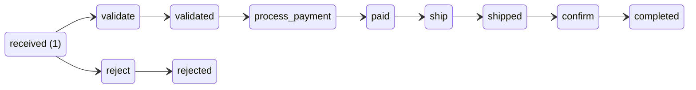
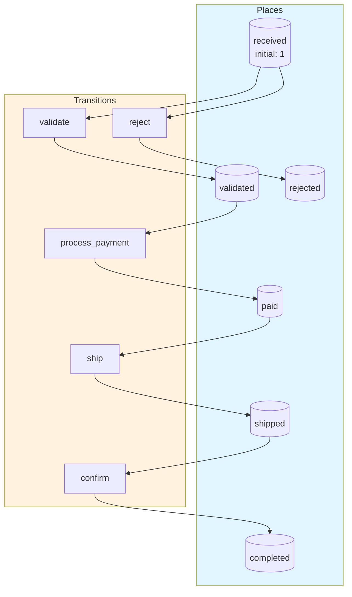
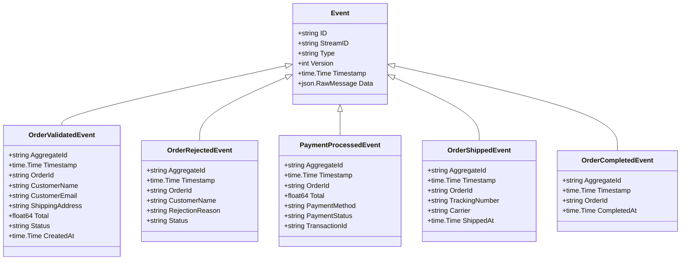
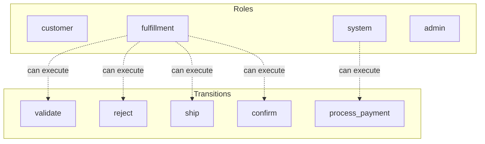

# order-processing

Simple order processing workflow with validation and shipping

## Quick Start

```bash
# Build and run
go build -o server .
./server

# Server starts on http://localhost:8080
```

## Architecture

This application uses **event sourcing** with a **Petri net** state machine to model workflows. All state changes are captured as immutable events, enabling:

- Full audit trail of all transitions
- Time-travel debugging
- Event replay for recovery
- Deterministic state reconstruction

## State Machine

### Places (States)

| Place | Type | Initial | Description |
|-------|------|---------|-------------|
| `received` | Token | 1 | Order received and awaiting processing |
| `validated` | Token | 0 | Order passed validation |
| `rejected` | Token | 0 | Order failed validation |
| `paid` | Token | 0 | Payment completed |
| `shipped` | Token | 0 | Order shipped to customer |
| `completed` | Token | 0 | Order fulfilled |


### Transitions (Actions)

| Transition | Event | Guard | Description |
|------------|-------|-------|-------------|
| `validate` | `order_validated` | - | Check order validity |
| `reject` | `order_rejected` | - | Mark order as invalid |
| `process_payment` | `payment_processed` | - | Charge customer payment |
| `ship` | `order_shipped` | - | Send order to shipping |
| `confirm` | `order_completed` | - | Mark order as complete |


### Petri Net Diagram



### Workflow Diagram




## Events

Events are immutable records of state transitions. Each event captures the transition that occurred and any associated data.

| Event Type | Transition | Fields |
|------------|------------|--------|
| `OrderValidated` | `validate` | `aggregate_id`, `timestamp`, `order_id`, `customer_name`, `customer_email`, `shipping_address`, `total`, `status`, `created_at` |
| `OrderRejected` | `reject` | `aggregate_id`, `timestamp`, `order_id`, `customer_name`, `rejection_reason`, `status` |
| `PaymentProcessed` | `process_payment` | `aggregate_id`, `timestamp`, `order_id`, `total`, `payment_method`, `payment_status`, `transaction_id` |
| `OrderShipped` | `ship` | `aggregate_id`, `timestamp`, `order_id`, `tracking_number`, `carrier`, `shipped_at` |
| `OrderCompleted` | `confirm` | `aggregate_id`, `timestamp`, `order_id`, `completed_at` |





## Access Control

Role-based access control (RBAC) restricts which users can execute transitions.


### Roles

| Role | Description | Inherits |
|------|-------------|----------|
| `customer` | End user placing orders | - |
| `fulfillment` | Warehouse staff who validate and ship orders | - |
| `system` | Automated payment processing | - |
| `admin` | Full access to all operations | `fulfillment` |


### Permissions

| Transition | Required Roles | Guard |
|------------|----------------|-------|
| `validate` | `fulfillment` | - |
| `reject` | `fulfillment` | - |
| `process_payment` | `system` | - |
| `ship` | `fulfillment` | - |
| `confirm` | `fulfillment` | - |





## API Endpoints

### Core Endpoints

| Method | Path | Description |
|--------|------|-------------|
| GET | `/health` | Health check |
| GET | `/ready` | Readiness check |
| POST | `/api/order-processing` | Create new instance |
| GET | `/api/order-processing/{id}` | Get instance state |
| GET | `/api/navigation` | Get navigation menu |
| GET | `/admin/stats` | Admin statistics |
| GET | `/admin/instances` | List all instances |
| GET | `/admin/instances/{id}` | Get instance detail |
| GET | `/admin/instances/{id}/events` | Get instance events |


### Transition Endpoints

| Method | Path | Transition | Description |
|--------|------|------------|-------------|
| POST | `/api/validate` | `validate` | Check order validity |
| POST | `/api/reject` | `reject` | Mark order as invalid |
| POST | `/api/process_payment` | `process_payment` | Charge customer payment |
| POST | `/api/ship` | `ship` | Send order to shipping |
| POST | `/api/confirm` | `confirm` | Mark order as complete |


### Request/Response Format

#### Create Instance
```bash
curl -X POST http://localhost:8080/api/order-processing \
  -H "Content-Type: application/json" \
  -H "Authorization: Bearer <token>"
```

#### Execute Transition
```bash
curl -X POST http://localhost:8080/api/<transition> \
  -H "Content-Type: application/json" \
  -H "Authorization: Bearer <token>" \
  -d '{
    "aggregate_id": "<instance-id>",
    "data": { ... }
  }'
```

#### Response Format
```json
{
  "success": true,
  "aggregate_id": "uuid",
  "version": 1,
  "state": { "place1": 1, "place2": 0 },
  "enabled_transitions": ["transition1", "transition2"]
}
```


## Navigation

| Label | Path | Icon | Roles |
|-------|------|------|-------|
| Orders | `/orders` | 📋 | * |
| New Order | `/orders/new` | ➕ | * |
| Admin | `/admin` | ⚙️ | `admin` |


## Configuration

### Environment Variables

| Variable | Default | Description |
|----------|---------|-------------|
| `PORT` | `8080` | HTTP server port |
| `DB_PATH` | `./order-processing.db` | SQLite database path |
| `DEBUG` | `false` | Enable debug endpoints |


## Development

### Project Structure

```
.
├── main.go           # Application entry point
├── workflow.go       # Petri net definition
├── aggregate.go      # Event-sourced aggregate
├── events.go         # Event type definitions
├── api.go            # HTTP handlers
├── auth.go           # Authentication
├── middleware.go     # HTTP middleware
├── permissions.go    # Permission checks
├── navigation.go     # Navigation menu
├── admin.go          # Admin handlers
├── debug.go          # Debug handlers
├── frontend/         # Web UI (ES modules)
│   ├── index.html
│   └── src/
│       ├── main.js
│       ├── router.js
│       └── ...
└── go.mod
```

### Testing

```bash
# Run unit tests
go test ./...

# Run with test coverage
go test -cover ./...
```

---

Generated by [petri-pilot](https://github.com/pflow-xyz/petri-pilot)
