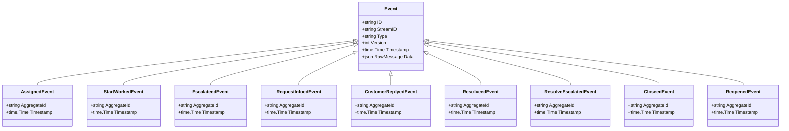
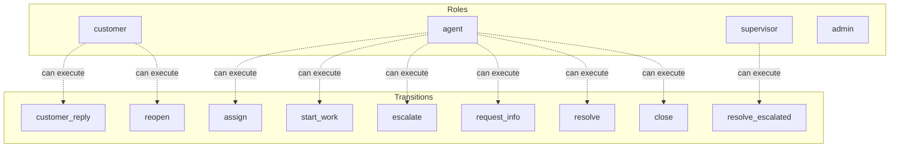

# support-ticket

A support ticket system: new tickets can be assigned, worked on, escalated, resolved, or closed. Customers can reopen closed tickets.

## Quick Start

```bash
# Build and run
go build -o server .
./server

# Server starts on http://localhost:8080
```

## Architecture

This application uses **event sourcing** with a **Petri net** state machine to model workflows. All state changes are captured as immutable events, enabling:

- Full audit trail of all transitions
- Time-travel debugging
- Event replay for recovery
- Deterministic state reconstruction

## State Machine

### Places (States)

| Place | Type | Initial | Description |
|-------|------|---------|-------------|
| `new` | Token | 1 | Ticket just created, awaiting triage |
| `assigned` | Token | 0 | Ticket assigned to an agent |
| `in_progress` | Token | 0 | Agent is actively working on ticket |
| `escalated` | Token | 0 | Ticket escalated to senior support |
| `pending_customer` | Token | 0 | Waiting for customer response |
| `resolved` | Token | 0 | Issue has been resolved |
| `closed` | Token | 0 | Ticket is closed |


### Transitions (Actions)

| Transition | Event | Guard | Description |
|------------|-------|-------|-------------|
| `assign` | `Assigned` | - | Assign ticket to an agent |
| `start_work` | `StartWorked` | - | Begin working on the ticket |
| `escalate` | `Escalateed` | - | Escalate to senior support |
| `request_info` | `RequestInfoed` | - | Request more information from customer |
| `customer_reply` | `CustomerReplyed` | - | Customer provides requested information |
| `resolve` | `Resolveed` | - | Mark issue as resolved from in_progress |
| `resolve_escalated` | `ResolveEscalated` | - | Mark escalated issue as resolved |
| `close` | `Closeed` | - | Close the ticket |
| `reopen` | `Reopened` | - | Customer reopens a closed ticket |


### Petri Net Diagram

```mermaid
stateDiagram-v2
    direction LR

    state "new (1)" as PlaceNew
    state "assigned" as PlaceAssigned
    state "in_progress" as PlaceInProgress
    state "escalated" as PlaceEscalated
    state "pending_customer" as PlacePendingCustomer
    state "resolved" as PlaceResolved
    state "closed" as PlaceClosed


    state "assign" as t_TransitionAssign <<choice>>
    state "start_work" as t_TransitionStartWork <<choice>>
    state "escalate" as t_TransitionEscalate <<choice>>
    state "request_info" as t_TransitionRequestInfo <<choice>>
    state "customer_reply" as t_TransitionCustomerReply <<choice>>
    state "resolve" as t_TransitionResolve <<choice>>
    state "resolve_escalated" as t_TransitionResolveEscalated <<choice>>
    state "close" as t_TransitionClose <<choice>>
    state "reopen" as t_TransitionReopen <<choice>>


    PlaceNew --> t_TransitionAssign: 
    t_TransitionAssign --> PlaceAssigned: 

    PlaceAssigned --> t_TransitionStartWork: 
    t_TransitionStartWork --> PlaceInProgress: 

    PlaceInProgress --> t_TransitionEscalate: 
    t_TransitionEscalate --> PlaceEscalated: 

    PlaceInProgress --> t_TransitionRequestInfo: 
    t_TransitionRequestInfo --> PlacePendingCustomer: 

    PlacePendingCustomer --> t_TransitionCustomerReply: 
    t_TransitionCustomerReply --> PlaceInProgress: 

    PlaceInProgress --> t_TransitionResolve: 
    t_TransitionResolve --> PlaceResolved: 

    PlaceEscalated --> t_TransitionResolveEscalated: 
    t_TransitionResolveEscalated --> PlaceResolved: 

    PlaceResolved --> t_TransitionClose: 
    t_TransitionClose --> PlaceClosed: 

    PlaceClosed --> t_TransitionReopen: 
    t_TransitionReopen --> PlaceNew: 

```

### Workflow Diagram

```mermaid
flowchart TD
    subgraph Places
        PlaceNew[("new<br/>initial: 1")]
        PlaceAssigned[("assigned")]
        PlaceInProgress[("in_progress")]
        PlaceEscalated[("escalated")]
        PlacePendingCustomer[("pending_customer")]
        PlaceResolved[("resolved")]
        PlaceClosed[("closed")]
    end

    subgraph Transitions
        t_TransitionAssign["assign"]
        t_TransitionStartWork["start_work"]
        t_TransitionEscalate["escalate"]
        t_TransitionRequestInfo["request_info"]
        t_TransitionCustomerReply["customer_reply"]
        t_TransitionResolve["resolve"]
        t_TransitionResolveEscalated["resolve_escalated"]
        t_TransitionClose["close"]
        t_TransitionReopen["reopen"]
    end


    PlaceNew -->|| t_TransitionAssign
    t_TransitionAssign -->|| PlaceAssigned

    PlaceAssigned -->|| t_TransitionStartWork
    t_TransitionStartWork -->|| PlaceInProgress

    PlaceInProgress -->|| t_TransitionEscalate
    t_TransitionEscalate -->|| PlaceEscalated

    PlaceInProgress -->|| t_TransitionRequestInfo
    t_TransitionRequestInfo -->|| PlacePendingCustomer

    PlacePendingCustomer -->|| t_TransitionCustomerReply
    t_TransitionCustomerReply -->|| PlaceInProgress

    PlaceInProgress -->|| t_TransitionResolve
    t_TransitionResolve -->|| PlaceResolved

    PlaceEscalated -->|| t_TransitionResolveEscalated
    t_TransitionResolveEscalated -->|| PlaceResolved

    PlaceResolved -->|| t_TransitionClose
    t_TransitionClose -->|| PlaceClosed

    PlaceClosed -->|| t_TransitionReopen
    t_TransitionReopen -->|| PlaceNew


    style Places fill:#e1f5fe
    style Transitions fill:#fff3e0
```


## Events

Events are immutable records of state transitions. Each event captures the transition that occurred and any associated data.

| Event Type | Transition | Fields |
|------------|------------|--------|
| `Assigned` | `assign` | `aggregate_id`, `timestamp` |
| `StartWorked` | `start_work` | `aggregate_id`, `timestamp` |
| `Escalateed` | `escalate` | `aggregate_id`, `timestamp` |
| `RequestInfoed` | `request_info` | `aggregate_id`, `timestamp` |
| `CustomerReplyed` | `customer_reply` | `aggregate_id`, `timestamp` |
| `Resolveed` | `resolve` | `aggregate_id`, `timestamp` |
| `ResolveEscalated` | `resolve_escalated` | `aggregate_id`, `timestamp` |
| `Closeed` | `close` | `aggregate_id`, `timestamp` |
| `Reopened` | `reopen` | `aggregate_id`, `timestamp` |





## Access Control

Role-based access control (RBAC) restricts which users can execute transitions.


### Roles

| Role | Description | Inherits |
|------|-------------|----------|
| `customer` | End user who submits support tickets | - |
| `agent` | First-line support agent who handles tickets | - |
| `supervisor` | Senior support who handles escalations | `agent` |
| `admin` | Full access to all operations | `supervisor` |


### Permissions

| Transition | Required Roles | Guard |
|------------|----------------|-------|
| `assign` | `agent` | - |
| `start_work` | `agent` | - |
| `escalate` | `agent` | - |
| `request_info` | `agent` | - |
| `customer_reply` | `customer` | - |
| `resolve` | `agent` | - |
| `resolve_escalated` | `supervisor` | - |
| `close` | `agent` | - |
| `reopen` | `customer` | - |





## API Endpoints

### Core Endpoints

| Method | Path | Description |
|--------|------|-------------|
| GET | `/health` | Health check |
| GET | `/ready` | Readiness check |
| POST | `/api/support-ticket` | Create new instance |
| GET | `/api/support-ticket/{id}` | Get instance state |


### Transition Endpoints

| Method | Path | Transition | Description |
|--------|------|------------|-------------|
| POST | `/api/assign` | `assign` | Assign ticket to an agent |
| POST | `/api/start_work` | `start_work` | Begin working on the ticket |
| POST | `/api/escalate` | `escalate` | Escalate to senior support |
| POST | `/api/request_info` | `request_info` | Request more information from customer |
| POST | `/api/customer_reply` | `customer_reply` | Customer provides requested information |
| POST | `/api/resolve` | `resolve` | Mark issue as resolved from in_progress |
| POST | `/api/resolve_escalated` | `resolve_escalated` | Mark escalated issue as resolved |
| POST | `/api/close` | `close` | Close the ticket |
| POST | `/api/reopen` | `reopen` | Customer reopens a closed ticket |


### Request/Response Format

#### Create Instance
```bash
curl -X POST http://localhost:8080/api/support-ticket \
  -H "Content-Type: application/json" \
  -H "Authorization: Bearer <token>"
```

#### Execute Transition
```bash
curl -X POST http://localhost:8080/api/<transition> \
  -H "Content-Type: application/json" \
  -H "Authorization: Bearer <token>" \
  -d '{
    "aggregate_id": "<instance-id>",
    "data": { ... }
  }'
```

#### Response Format
```json
{
  "success": true,
  "aggregate_id": "uuid",
  "version": 1,
  "state": { "place1": 1, "place2": 0 },
  "enabled_transitions": ["transition1", "transition2"]
}
```


## Configuration

### Environment Variables

| Variable | Default | Description |
|----------|---------|-------------|
| `PORT` | `8080` | HTTP server port |
| `DB_PATH` | `./support-ticket.db` | SQLite database path |
| `DEBUG` | `false` | Enable debug endpoints |


## Development

### Project Structure

```
.
├── main.go           # Application entry point
├── workflow.go       # Petri net definition
├── aggregate.go      # Event-sourced aggregate
├── events.go         # Event type definitions
├── api.go            # HTTP handlers
├── auth.go           # Authentication
├── middleware.go     # HTTP middleware
├── permissions.go    # Permission checks
├── debug.go          # Debug handlers
├── frontend/         # Web UI (ES modules)
│   ├── index.html
│   └── src/
│       ├── main.js
│       ├── router.js
│       └── ...
└── go.mod
```

### Testing

```bash
# Run unit tests
go test ./...

# Run with test coverage
go test -cover ./...
```

---

Generated by [petri-pilot](https://github.com/pflow-xyz/petri-pilot)
