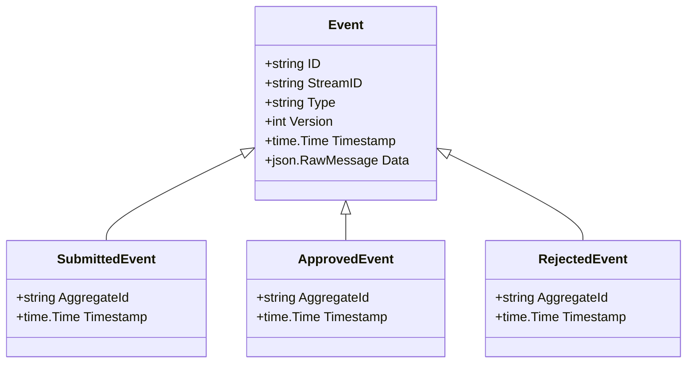
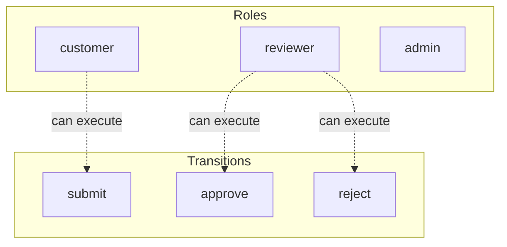

# access-test

Test model for access control code generation

## Quick Start

```bash
# Build and run
go build -o server .
./server

# Server starts on http://localhost:8080
```

## Architecture

This application uses **event sourcing** with a **Petri net** state machine to model workflows. All state changes are captured as immutable events, enabling:

- Full audit trail of all transitions
- Time-travel debugging
- Event replay for recovery
- Deterministic state reconstruction

## State Machine

### Places (States)

| Place | Type | Initial | Description |
|-------|------|---------|-------------|
| `draft` | Token | 1 | Initial state |
| `submitted` | Token | 0 | Submitted for review |
| `approved` | Token | 0 | Approved by admin |
| `rejected` | Token | 0 | Rejected |


### Transitions (Actions)

| Transition | Event | Guard | Description |
|------------|-------|-------|-------------|
| `submit` | `Submitted` | - | Submit for review |
| `approve` | `Approved` | - | Approve the submission |
| `reject` | `Rejected` | - | Reject the submission |


### Petri Net Diagram

```mermaid
stateDiagram-v2
    direction LR

    state "draft (1)" as PlaceDraft
    state "submitted" as PlaceSubmitted
    state "approved" as PlaceApproved
    state "rejected" as PlaceRejected


    state "submit" as t_TransitionSubmit <<choice>>
    state "approve" as t_TransitionApprove <<choice>>
    state "reject" as t_TransitionReject <<choice>>


    PlaceDraft --> t_TransitionSubmit: 
    t_TransitionSubmit --> PlaceSubmitted: 

    PlaceSubmitted --> t_TransitionApprove: 
    t_TransitionApprove --> PlaceApproved: 

    PlaceSubmitted --> t_TransitionReject: 
    t_TransitionReject --> PlaceRejected: 

```

### Workflow Diagram

```mermaid
flowchart TD
    subgraph Places
        PlaceDraft[("draft<br/>initial: 1")]
        PlaceSubmitted[("submitted")]
        PlaceApproved[("approved")]
        PlaceRejected[("rejected")]
    end

    subgraph Transitions
        t_TransitionSubmit["submit"]
        t_TransitionApprove["approve"]
        t_TransitionReject["reject"]
    end


    PlaceDraft -->|| t_TransitionSubmit
    t_TransitionSubmit -->|| PlaceSubmitted

    PlaceSubmitted -->|| t_TransitionApprove
    t_TransitionApprove -->|| PlaceApproved

    PlaceSubmitted -->|| t_TransitionReject
    t_TransitionReject -->|| PlaceRejected


    style Places fill:#e1f5fe
    style Transitions fill:#fff3e0
```


## Events

Events are immutable records of state transitions. Each event captures the transition that occurred and any associated data.

| Event Type | Transition | Fields |
|------------|------------|--------|
| `Submitted` | `submit` | `aggregate_id`, `timestamp` |
| `Approved` | `approve` | `aggregate_id`, `timestamp` |
| `Rejected` | `reject` | `aggregate_id`, `timestamp` |





## Access Control

Role-based access control (RBAC) restricts which users can execute transitions.


### Roles

| Role | Description | Inherits |
|------|-------------|----------|
| `customer` | Regular customer who can submit items | - |
| `reviewer` | Can review and approve/reject submissions | - |
| `admin` | Full access to all operations | `customer`, `reviewer` |


### Permissions

| Transition | Required Roles | Guard |
|------------|----------------|-------|
| `submit` | `customer` | - |
| `approve` | `reviewer` | - |
| `reject` | `reviewer` | - |





## API Endpoints

### Core Endpoints

| Method | Path | Description |
|--------|------|-------------|
| GET | `/health` | Health check |
| GET | `/ready` | Readiness check |
| POST | `/api/access-test` | Create new instance |
| GET | `/api/access-test/{id}` | Get instance state |


### Transition Endpoints

| Method | Path | Transition | Description |
|--------|------|------------|-------------|
| POST | `/api/submit` | `submit` | Submit for review |
| POST | `/api/approve` | `approve` | Approve the submission |
| POST | `/api/reject` | `reject` | Reject the submission |


### Request/Response Format

#### Create Instance
```bash
curl -X POST http://localhost:8080/api/access-test \
  -H "Content-Type: application/json" \
  -H "Authorization: Bearer <token>"
```

#### Execute Transition
```bash
curl -X POST http://localhost:8080/api/<transition> \
  -H "Content-Type: application/json" \
  -H "Authorization: Bearer <token>" \
  -d '{
    "aggregate_id": "<instance-id>",
    "data": { ... }
  }'
```

#### Response Format
```json
{
  "success": true,
  "aggregate_id": "uuid",
  "version": 1,
  "state": { "place1": 1, "place2": 0 },
  "enabled_transitions": ["transition1", "transition2"]
}
```


## Configuration

### Environment Variables

| Variable | Default | Description |
|----------|---------|-------------|
| `PORT` | `8080` | HTTP server port |
| `DB_PATH` | `./access-test.db` | SQLite database path |
| `DEBUG` | `false` | Enable debug endpoints |


## Development

### Project Structure

```
.
├── main.go           # Application entry point
├── workflow.go       # Petri net definition
├── aggregate.go      # Event-sourced aggregate
├── events.go         # Event type definitions
├── api.go            # HTTP handlers
├── auth.go           # Authentication
├── middleware.go     # HTTP middleware
├── permissions.go    # Permission checks
├── debug.go          # Debug handlers
├── frontend/         # Web UI (ES modules)
│   ├── index.html
│   └── src/
│       ├── main.js
│       ├── router.js
│       └── ...
└── go.mod
```

### Testing

```bash
# Run unit tests
go test ./...

# Run with test coverage
go test -cover ./...
```

---

Generated by [petri-pilot](https://github.com/pflow-xyz/petri-pilot)
