# texas-holdem

Texas Hold'em Poker (5-player table)

## Quick Start

```bash
# Build and run
go build -o server .
./server

# Server starts on http://localhost:8080
```

## Architecture

This application uses **event sourcing** with a **Petri net** state machine to model workflows. All state changes are captured as immutable events, enabling:

- Full audit trail of all transitions
- Time-travel debugging
- Event replay for recovery
- Deterministic state reconstruction

## State Machine

### Places (States)

| Place | Type | Initial | Description |
|-------|------|---------|-------------|
| `waiting` | Token | 1 | Waiting for hand to start |
| `preflop` | Token | 0 | Pre-flop betting round |
| `flop` | Token | 0 | Flop betting round |
| `turn_round` | Token | 0 | Turn betting round |
| `river` | Token | 0 | River betting round |
| `showdown` | Token | 0 | Showdown - compare hands |
| `complete` | Token | 0 | Hand complete |
| `dealer_action` | Token | 0 | Dealer can deal cards |
| `p0_turn` | Token | 0 | Player 0's turn to act |
| `p1_turn` | Token | 0 | Player 1's turn to act |
| `p2_turn` | Token | 0 | Player 2's turn to act |
| `p3_turn` | Token | 0 | Player 3's turn to act |
| `p4_turn` | Token | 0 | Player 4's turn to act |
| `p0_active` | Token | 1 | Player 0 is in the hand |
| `p1_active` | Token | 1 | Player 1 is in the hand |
| `p2_active` | Token | 1 | Player 2 is in the hand |
| `p3_active` | Token | 1 | Player 3 is in the hand |
| `p4_active` | Token | 1 | Player 4 is in the hand |
| `p0_folded` | Token | 0 | Player 0 has folded |
| `p1_folded` | Token | 0 | Player 1 has folded |
| `p2_folded` | Token | 0 | Player 2 has folded |
| `p3_folded` | Token | 0 | Player 3 has folded |
| `p4_folded` | Token | 0 | Player 4 has folded |
| `p0_acted` | Token | 0 | Player 0 has acted this round |
| `p1_acted` | Token | 0 | Player 1 has acted this round |
| `p2_acted` | Token | 0 | Player 2 has acted this round |
| `p3_acted` | Token | 0 | Player 3 has acted this round |
| `p4_acted` | Token | 0 | Player 4 has acted this round |
| `round_open` | Token | 0 | Betting round is open |


### Transitions (Actions)

| Transition | Event | Guard | Description |
|------------|-------|-------|-------------|
| `start_hand` | `hand_started` | - | Start a new hand |
| `deal_preflop` | `preflop_dealt` | - | Deal hole cards to all players |
| `deal_flop` | `flop_dealt` | - | Deal the flop (3 community cards) |
| `deal_turn` | `turn_dealt` | - | Deal the turn (1 community card) |
| `deal_river` | `river_dealt` | - | Deal the river (1 community card) |
| `go_showdown` | `showdown_reached` | - | Proceed to showdown |
| `determine_winner` | `winner_determined` | - | Determine the winner |
| `end_hand` | `hand_ended` | - | End the hand |
| `advance_to_p1` | `AdvanceToP1ed` | - | Pass turn to player 1 |
| `advance_to_p2` | `AdvanceToP2ed` | - | Pass turn to player 2 |
| `advance_to_p3` | `AdvanceToP3ed` | - | Pass turn to player 3 |
| `advance_to_p4` | `AdvanceToP4ed` | - | Pass turn to player 4 |
| `advance_to_p0` | `AdvanceToP0ed` | - | Pass turn to player 0 |
| `end_betting_round` | `EndBettingRounded` | - | End the betting round |
| `p0_fold` | `player_folded` | - | Player 0 folds |
| `p0_check` | `player_checked` | - | Player 0 checks |
| `p0_call` | `player_called` | - | Player 0 calls |
| `p0_raise` | `player_raised` | - | Player 0 raises |
| `p1_fold` | `player_folded` | - | Player 1 folds |
| `p1_check` | `player_checked` | - | Player 1 checks |
| `p1_call` | `player_called` | - | Player 1 calls |
| `p1_raise` | `player_raised` | - | Player 1 raises |
| `p2_fold` | `player_folded` | - | Player 2 folds |
| `p2_check` | `player_checked` | - | Player 2 checks |
| `p2_call` | `player_called` | - | Player 2 calls |
| `p2_raise` | `player_raised` | - | Player 2 raises |
| `p3_fold` | `player_folded` | - | Player 3 folds |
| `p3_check` | `player_checked` | - | Player 3 checks |
| `p3_call` | `player_called` | - | Player 3 calls |
| `p3_raise` | `player_raised` | - | Player 3 raises |
| `p4_fold` | `player_folded` | - | Player 4 folds |
| `p4_check` | `player_checked` | - | Player 4 checks |
| `p4_call` | `player_called` | - | Player 4 calls |
| `p4_raise` | `player_raised` | - | Player 4 raises |


### Petri Net Diagram

```mermaid
stateDiagram-v2
    direction LR

    state "waiting (1)" as PlaceWaiting
    state "preflop" as PlacePreflop
    state "flop" as PlaceFlop
    state "turn_round" as PlaceTurnRound
    state "river" as PlaceRiver
    state "showdown" as PlaceShowdown
    state "complete" as PlaceComplete
    state "dealer_action" as PlaceDealerAction
    state "p0_turn" as PlaceP0Turn
    state "p1_turn" as PlaceP1Turn
    state "p2_turn" as PlaceP2Turn
    state "p3_turn" as PlaceP3Turn
    state "p4_turn" as PlaceP4Turn
    state "p0_active (1)" as PlaceP0Active
    state "p1_active (1)" as PlaceP1Active
    state "p2_active (1)" as PlaceP2Active
    state "p3_active (1)" as PlaceP3Active
    state "p4_active (1)" as PlaceP4Active
    state "p0_folded" as PlaceP0Folded
    state "p1_folded" as PlaceP1Folded
    state "p2_folded" as PlaceP2Folded
    state "p3_folded" as PlaceP3Folded
    state "p4_folded" as PlaceP4Folded
    state "p0_acted" as PlaceP0Acted
    state "p1_acted" as PlaceP1Acted
    state "p2_acted" as PlaceP2Acted
    state "p3_acted" as PlaceP3Acted
    state "p4_acted" as PlaceP4Acted
    state "round_open" as PlaceRoundOpen


    state "start_hand" as t_TransitionStartHand
    state "deal_preflop" as t_TransitionDealPreflop
    state "deal_flop" as t_TransitionDealFlop
    state "deal_turn" as t_TransitionDealTurn
    state "deal_river" as t_TransitionDealRiver
    state "go_showdown" as t_TransitionGoShowdown
    state "determine_winner" as t_TransitionDetermineWinner
    state "end_hand" as t_TransitionEndHand
    state "advance_to_p1" as t_TransitionAdvanceToP1
    state "advance_to_p2" as t_TransitionAdvanceToP2
    state "advance_to_p3" as t_TransitionAdvanceToP3
    state "advance_to_p4" as t_TransitionAdvanceToP4
    state "advance_to_p0" as t_TransitionAdvanceToP0
    state "end_betting_round" as t_TransitionEndBettingRound
    state "p0_fold" as t_TransitionP0Fold
    state "p0_check" as t_TransitionP0Check
    state "p0_call" as t_TransitionP0Call
    state "p0_raise" as t_TransitionP0Raise
    state "p1_fold" as t_TransitionP1Fold
    state "p1_check" as t_TransitionP1Check
    state "p1_call" as t_TransitionP1Call
    state "p1_raise" as t_TransitionP1Raise
    state "p2_fold" as t_TransitionP2Fold
    state "p2_check" as t_TransitionP2Check
    state "p2_call" as t_TransitionP2Call
    state "p2_raise" as t_TransitionP2Raise
    state "p3_fold" as t_TransitionP3Fold
    state "p3_check" as t_TransitionP3Check
    state "p3_call" as t_TransitionP3Call
    state "p3_raise" as t_TransitionP3Raise
    state "p4_fold" as t_TransitionP4Fold
    state "p4_check" as t_TransitionP4Check
    state "p4_call" as t_TransitionP4Call
    state "p4_raise" as t_TransitionP4Raise


    PlaceWaiting --> t_TransitionStartHand
    t_TransitionStartHand --> PlaceDealerAction

    PlaceDealerAction --> t_TransitionDealPreflop
    t_TransitionDealPreflop --> PlacePreflop
    t_TransitionDealPreflop --> PlaceP0Turn
    t_TransitionDealPreflop --> PlaceRoundOpen

    PlacePreflop --> t_TransitionDealFlop
    PlaceDealerAction --> t_TransitionDealFlop
    t_TransitionDealFlop --> PlaceFlop
    t_TransitionDealFlop --> PlaceP0Turn
    t_TransitionDealFlop --> PlaceRoundOpen

    PlaceFlop --> t_TransitionDealTurn
    PlaceDealerAction --> t_TransitionDealTurn
    t_TransitionDealTurn --> PlaceTurnRound
    t_TransitionDealTurn --> PlaceP0Turn
    t_TransitionDealTurn --> PlaceRoundOpen

    PlaceTurnRound --> t_TransitionDealRiver
    PlaceDealerAction --> t_TransitionDealRiver
    t_TransitionDealRiver --> PlaceRiver
    t_TransitionDealRiver --> PlaceP0Turn
    t_TransitionDealRiver --> PlaceRoundOpen

    PlaceRiver --> t_TransitionGoShowdown
    PlaceDealerAction --> t_TransitionGoShowdown
    t_TransitionGoShowdown --> PlaceShowdown

    PlaceShowdown --> t_TransitionDetermineWinner
    t_TransitionDetermineWinner --> PlaceComplete

    PlaceComplete --> t_TransitionEndHand
    t_TransitionEndHand --> PlaceWaiting

    PlaceP0Acted --> t_TransitionAdvanceToP1
    PlaceP1Active --> t_TransitionAdvanceToP1
    t_TransitionAdvanceToP1 --> PlaceP1Turn
    t_TransitionAdvanceToP1 --> PlaceP1Active

    PlaceP1Acted --> t_TransitionAdvanceToP2
    PlaceP2Active --> t_TransitionAdvanceToP2
    t_TransitionAdvanceToP2 --> PlaceP2Turn
    t_TransitionAdvanceToP2 --> PlaceP2Active

    PlaceP2Acted --> t_TransitionAdvanceToP3
    PlaceP3Active --> t_TransitionAdvanceToP3
    t_TransitionAdvanceToP3 --> PlaceP3Turn
    t_TransitionAdvanceToP3 --> PlaceP3Active

    PlaceP3Acted --> t_TransitionAdvanceToP4
    PlaceP4Active --> t_TransitionAdvanceToP4
    t_TransitionAdvanceToP4 --> PlaceP4Turn
    t_TransitionAdvanceToP4 --> PlaceP4Active

    PlaceP4Acted --> t_TransitionAdvanceToP0
    PlaceP0Active --> t_TransitionAdvanceToP0
    t_TransitionAdvanceToP0 --> PlaceP0Turn
    t_TransitionAdvanceToP0 --> PlaceP0Active

    PlaceRoundOpen --> t_TransitionEndBettingRound
    PlaceP0Acted --> t_TransitionEndBettingRound
    PlaceP1Acted --> t_TransitionEndBettingRound
    PlaceP2Acted --> t_TransitionEndBettingRound
    PlaceP3Acted --> t_TransitionEndBettingRound
    PlaceP4Acted --> t_TransitionEndBettingRound
    t_TransitionEndBettingRound --> PlaceDealerAction

    PlaceP0Turn --> t_TransitionP0Fold
    PlaceP0Active --> t_TransitionP0Fold
    t_TransitionP0Fold --> PlaceP0Folded
    t_TransitionP0Fold --> PlaceP0Acted

    PlaceP0Turn --> t_TransitionP0Check
    PlaceP0Active --> t_TransitionP0Check
    t_TransitionP0Check --> PlaceP0Active
    t_TransitionP0Check --> PlaceP0Acted

    PlaceP0Turn --> t_TransitionP0Call
    PlaceP0Active --> t_TransitionP0Call
    t_TransitionP0Call --> PlaceP0Active
    t_TransitionP0Call --> PlaceP0Acted

    PlaceP0Turn --> t_TransitionP0Raise
    PlaceP0Active --> t_TransitionP0Raise
    t_TransitionP0Raise --> PlaceP0Active
    t_TransitionP0Raise --> PlaceP0Acted

    PlaceP1Turn --> t_TransitionP1Fold
    PlaceP1Active --> t_TransitionP1Fold
    t_TransitionP1Fold --> PlaceP1Folded
    t_TransitionP1Fold --> PlaceP1Acted

    PlaceP1Turn --> t_TransitionP1Check
    PlaceP1Active --> t_TransitionP1Check
    t_TransitionP1Check --> PlaceP1Active
    t_TransitionP1Check --> PlaceP1Acted

    PlaceP1Turn --> t_TransitionP1Call
    PlaceP1Active --> t_TransitionP1Call
    t_TransitionP1Call --> PlaceP1Active
    t_TransitionP1Call --> PlaceP1Acted

    PlaceP1Turn --> t_TransitionP1Raise
    PlaceP1Active --> t_TransitionP1Raise
    t_TransitionP1Raise --> PlaceP1Active
    t_TransitionP1Raise --> PlaceP1Acted

    PlaceP2Turn --> t_TransitionP2Fold
    PlaceP2Active --> t_TransitionP2Fold
    t_TransitionP2Fold --> PlaceP2Folded
    t_TransitionP2Fold --> PlaceP2Acted

    PlaceP2Turn --> t_TransitionP2Check
    PlaceP2Active --> t_TransitionP2Check
    t_TransitionP2Check --> PlaceP2Active
    t_TransitionP2Check --> PlaceP2Acted

    PlaceP2Turn --> t_TransitionP2Call
    PlaceP2Active --> t_TransitionP2Call
    t_TransitionP2Call --> PlaceP2Active
    t_TransitionP2Call --> PlaceP2Acted

    PlaceP2Turn --> t_TransitionP2Raise
    PlaceP2Active --> t_TransitionP2Raise
    t_TransitionP2Raise --> PlaceP2Active
    t_TransitionP2Raise --> PlaceP2Acted

    PlaceP3Turn --> t_TransitionP3Fold
    PlaceP3Active --> t_TransitionP3Fold
    t_TransitionP3Fold --> PlaceP3Folded
    t_TransitionP3Fold --> PlaceP3Acted

    PlaceP3Turn --> t_TransitionP3Check
    PlaceP3Active --> t_TransitionP3Check
    t_TransitionP3Check --> PlaceP3Active
    t_TransitionP3Check --> PlaceP3Acted

    PlaceP3Turn --> t_TransitionP3Call
    PlaceP3Active --> t_TransitionP3Call
    t_TransitionP3Call --> PlaceP3Active
    t_TransitionP3Call --> PlaceP3Acted

    PlaceP3Turn --> t_TransitionP3Raise
    PlaceP3Active --> t_TransitionP3Raise
    t_TransitionP3Raise --> PlaceP3Active
    t_TransitionP3Raise --> PlaceP3Acted

    PlaceP4Turn --> t_TransitionP4Fold
    PlaceP4Active --> t_TransitionP4Fold
    t_TransitionP4Fold --> PlaceP4Folded
    t_TransitionP4Fold --> PlaceP4Acted

    PlaceP4Turn --> t_TransitionP4Check
    PlaceP4Active --> t_TransitionP4Check
    t_TransitionP4Check --> PlaceP4Active
    t_TransitionP4Check --> PlaceP4Acted

    PlaceP4Turn --> t_TransitionP4Call
    PlaceP4Active --> t_TransitionP4Call
    t_TransitionP4Call --> PlaceP4Active
    t_TransitionP4Call --> PlaceP4Acted

    PlaceP4Turn --> t_TransitionP4Raise
    PlaceP4Active --> t_TransitionP4Raise
    t_TransitionP4Raise --> PlaceP4Active
    t_TransitionP4Raise --> PlaceP4Acted

```



### Workflow Diagram

```mermaid
flowchart TD
    subgraph Places
        PlaceWaiting[("waiting<br/>initial: 1")]
        PlacePreflop[("preflop")]
        PlaceFlop[("flop")]
        PlaceTurnRound[("turn_round")]
        PlaceRiver[("river")]
        PlaceShowdown[("showdown")]
        PlaceComplete[("complete")]
        PlaceDealerAction[("dealer_action")]
        PlaceP0Turn[("p0_turn")]
        PlaceP1Turn[("p1_turn")]
        PlaceP2Turn[("p2_turn")]
        PlaceP3Turn[("p3_turn")]
        PlaceP4Turn[("p4_turn")]
        PlaceP0Active[("p0_active<br/>initial: 1")]
        PlaceP1Active[("p1_active<br/>initial: 1")]
        PlaceP2Active[("p2_active<br/>initial: 1")]
        PlaceP3Active[("p3_active<br/>initial: 1")]
        PlaceP4Active[("p4_active<br/>initial: 1")]
        PlaceP0Folded[("p0_folded")]
        PlaceP1Folded[("p1_folded")]
        PlaceP2Folded[("p2_folded")]
        PlaceP3Folded[("p3_folded")]
        PlaceP4Folded[("p4_folded")]
        PlaceP0Acted[("p0_acted")]
        PlaceP1Acted[("p1_acted")]
        PlaceP2Acted[("p2_acted")]
        PlaceP3Acted[("p3_acted")]
        PlaceP4Acted[("p4_acted")]
        PlaceRoundOpen[("round_open")]
    end

    subgraph Transitions
        t_TransitionStartHand["start_hand"]
        t_TransitionDealPreflop["deal_preflop"]
        t_TransitionDealFlop["deal_flop"]
        t_TransitionDealTurn["deal_turn"]
        t_TransitionDealRiver["deal_river"]
        t_TransitionGoShowdown["go_showdown"]
        t_TransitionDetermineWinner["determine_winner"]
        t_TransitionEndHand["end_hand"]
        t_TransitionAdvanceToP1["advance_to_p1"]
        t_TransitionAdvanceToP2["advance_to_p2"]
        t_TransitionAdvanceToP3["advance_to_p3"]
        t_TransitionAdvanceToP4["advance_to_p4"]
        t_TransitionAdvanceToP0["advance_to_p0"]
        t_TransitionEndBettingRound["end_betting_round"]
        t_TransitionP0Fold["p0_fold"]
        t_TransitionP0Check["p0_check"]
        t_TransitionP0Call["p0_call"]
        t_TransitionP0Raise["p0_raise"]
        t_TransitionP1Fold["p1_fold"]
        t_TransitionP1Check["p1_check"]
        t_TransitionP1Call["p1_call"]
        t_TransitionP1Raise["p1_raise"]
        t_TransitionP2Fold["p2_fold"]
        t_TransitionP2Check["p2_check"]
        t_TransitionP2Call["p2_call"]
        t_TransitionP2Raise["p2_raise"]
        t_TransitionP3Fold["p3_fold"]
        t_TransitionP3Check["p3_check"]
        t_TransitionP3Call["p3_call"]
        t_TransitionP3Raise["p3_raise"]
        t_TransitionP4Fold["p4_fold"]
        t_TransitionP4Check["p4_check"]
        t_TransitionP4Call["p4_call"]
        t_TransitionP4Raise["p4_raise"]
    end


    PlaceWaiting --> t_TransitionStartHand
    t_TransitionStartHand --> PlaceDealerAction

    PlaceDealerAction --> t_TransitionDealPreflop
    t_TransitionDealPreflop --> PlacePreflop
    t_TransitionDealPreflop --> PlaceP0Turn
    t_TransitionDealPreflop --> PlaceRoundOpen

    PlacePreflop --> t_TransitionDealFlop
    PlaceDealerAction --> t_TransitionDealFlop
    t_TransitionDealFlop --> PlaceFlop
    t_TransitionDealFlop --> PlaceP0Turn
    t_TransitionDealFlop --> PlaceRoundOpen

    PlaceFlop --> t_TransitionDealTurn
    PlaceDealerAction --> t_TransitionDealTurn
    t_TransitionDealTurn --> PlaceTurnRound
    t_TransitionDealTurn --> PlaceP0Turn
    t_TransitionDealTurn --> PlaceRoundOpen

    PlaceTurnRound --> t_TransitionDealRiver
    PlaceDealerAction --> t_TransitionDealRiver
    t_TransitionDealRiver --> PlaceRiver
    t_TransitionDealRiver --> PlaceP0Turn
    t_TransitionDealRiver --> PlaceRoundOpen

    PlaceRiver --> t_TransitionGoShowdown
    PlaceDealerAction --> t_TransitionGoShowdown
    t_TransitionGoShowdown --> PlaceShowdown

    PlaceShowdown --> t_TransitionDetermineWinner
    t_TransitionDetermineWinner --> PlaceComplete

    PlaceComplete --> t_TransitionEndHand
    t_TransitionEndHand --> PlaceWaiting

    PlaceP0Acted --> t_TransitionAdvanceToP1
    PlaceP1Active --> t_TransitionAdvanceToP1
    t_TransitionAdvanceToP1 --> PlaceP1Turn
    t_TransitionAdvanceToP1 --> PlaceP1Active

    PlaceP1Acted --> t_TransitionAdvanceToP2
    PlaceP2Active --> t_TransitionAdvanceToP2
    t_TransitionAdvanceToP2 --> PlaceP2Turn
    t_TransitionAdvanceToP2 --> PlaceP2Active

    PlaceP2Acted --> t_TransitionAdvanceToP3
    PlaceP3Active --> t_TransitionAdvanceToP3
    t_TransitionAdvanceToP3 --> PlaceP3Turn
    t_TransitionAdvanceToP3 --> PlaceP3Active

    PlaceP3Acted --> t_TransitionAdvanceToP4
    PlaceP4Active --> t_TransitionAdvanceToP4
    t_TransitionAdvanceToP4 --> PlaceP4Turn
    t_TransitionAdvanceToP4 --> PlaceP4Active

    PlaceP4Acted --> t_TransitionAdvanceToP0
    PlaceP0Active --> t_TransitionAdvanceToP0
    t_TransitionAdvanceToP0 --> PlaceP0Turn
    t_TransitionAdvanceToP0 --> PlaceP0Active

    PlaceRoundOpen --> t_TransitionEndBettingRound
    PlaceP0Acted --> t_TransitionEndBettingRound
    PlaceP1Acted --> t_TransitionEndBettingRound
    PlaceP2Acted --> t_TransitionEndBettingRound
    PlaceP3Acted --> t_TransitionEndBettingRound
    PlaceP4Acted --> t_TransitionEndBettingRound
    t_TransitionEndBettingRound --> PlaceDealerAction

    PlaceP0Turn --> t_TransitionP0Fold
    PlaceP0Active --> t_TransitionP0Fold
    t_TransitionP0Fold --> PlaceP0Folded
    t_TransitionP0Fold --> PlaceP0Acted

    PlaceP0Turn --> t_TransitionP0Check
    PlaceP0Active --> t_TransitionP0Check
    t_TransitionP0Check --> PlaceP0Active
    t_TransitionP0Check --> PlaceP0Acted

    PlaceP0Turn --> t_TransitionP0Call
    PlaceP0Active --> t_TransitionP0Call
    t_TransitionP0Call --> PlaceP0Active
    t_TransitionP0Call --> PlaceP0Acted

    PlaceP0Turn --> t_TransitionP0Raise
    PlaceP0Active --> t_TransitionP0Raise
    t_TransitionP0Raise --> PlaceP0Active
    t_TransitionP0Raise --> PlaceP0Acted

    PlaceP1Turn --> t_TransitionP1Fold
    PlaceP1Active --> t_TransitionP1Fold
    t_TransitionP1Fold --> PlaceP1Folded
    t_TransitionP1Fold --> PlaceP1Acted

    PlaceP1Turn --> t_TransitionP1Check
    PlaceP1Active --> t_TransitionP1Check
    t_TransitionP1Check --> PlaceP1Active
    t_TransitionP1Check --> PlaceP1Acted

    PlaceP1Turn --> t_TransitionP1Call
    PlaceP1Active --> t_TransitionP1Call
    t_TransitionP1Call --> PlaceP1Active
    t_TransitionP1Call --> PlaceP1Acted

    PlaceP1Turn --> t_TransitionP1Raise
    PlaceP1Active --> t_TransitionP1Raise
    t_TransitionP1Raise --> PlaceP1Active
    t_TransitionP1Raise --> PlaceP1Acted

    PlaceP2Turn --> t_TransitionP2Fold
    PlaceP2Active --> t_TransitionP2Fold
    t_TransitionP2Fold --> PlaceP2Folded
    t_TransitionP2Fold --> PlaceP2Acted

    PlaceP2Turn --> t_TransitionP2Check
    PlaceP2Active --> t_TransitionP2Check
    t_TransitionP2Check --> PlaceP2Active
    t_TransitionP2Check --> PlaceP2Acted

    PlaceP2Turn --> t_TransitionP2Call
    PlaceP2Active --> t_TransitionP2Call
    t_TransitionP2Call --> PlaceP2Active
    t_TransitionP2Call --> PlaceP2Acted

    PlaceP2Turn --> t_TransitionP2Raise
    PlaceP2Active --> t_TransitionP2Raise
    t_TransitionP2Raise --> PlaceP2Active
    t_TransitionP2Raise --> PlaceP2Acted

    PlaceP3Turn --> t_TransitionP3Fold
    PlaceP3Active --> t_TransitionP3Fold
    t_TransitionP3Fold --> PlaceP3Folded
    t_TransitionP3Fold --> PlaceP3Acted

    PlaceP3Turn --> t_TransitionP3Check
    PlaceP3Active --> t_TransitionP3Check
    t_TransitionP3Check --> PlaceP3Active
    t_TransitionP3Check --> PlaceP3Acted

    PlaceP3Turn --> t_TransitionP3Call
    PlaceP3Active --> t_TransitionP3Call
    t_TransitionP3Call --> PlaceP3Active
    t_TransitionP3Call --> PlaceP3Acted

    PlaceP3Turn --> t_TransitionP3Raise
    PlaceP3Active --> t_TransitionP3Raise
    t_TransitionP3Raise --> PlaceP3Active
    t_TransitionP3Raise --> PlaceP3Acted

    PlaceP4Turn --> t_TransitionP4Fold
    PlaceP4Active --> t_TransitionP4Fold
    t_TransitionP4Fold --> PlaceP4Folded
    t_TransitionP4Fold --> PlaceP4Acted

    PlaceP4Turn --> t_TransitionP4Check
    PlaceP4Active --> t_TransitionP4Check
    t_TransitionP4Check --> PlaceP4Active
    t_TransitionP4Check --> PlaceP4Acted

    PlaceP4Turn --> t_TransitionP4Call
    PlaceP4Active --> t_TransitionP4Call
    t_TransitionP4Call --> PlaceP4Active
    t_TransitionP4Call --> PlaceP4Acted

    PlaceP4Turn --> t_TransitionP4Raise
    PlaceP4Active --> t_TransitionP4Raise
    t_TransitionP4Raise --> PlaceP4Active
    t_TransitionP4Raise --> PlaceP4Acted


    style Places fill:#e1f5fe
    style Transitions fill:#fff3e0
```




## Events

Events are immutable records of state transitions. Each event captures the transition that occurred and any associated data.

| Event Type | Transition | Fields |
|------------|------------|--------|
| `HandStarted` | `start_hand` | `aggregate_id`, `timestamp`, `hand_number`, `dealer_position`, `small_blind`, `big_blind` |
| `PreflopDealt` | `deal_preflop` | `aggregate_id`, `timestamp`, `hands` |
| `FlopDealt` | `deal_flop` | `aggregate_id`, `timestamp`, `cards` |
| `TurnDealt` | `deal_turn` | `aggregate_id`, `timestamp`, `card` |
| `RiverDealt` | `deal_river` | `aggregate_id`, `timestamp`, `card` |
| `ShowdownReached` | `go_showdown` | `aggregate_id`, `timestamp` |
| `WinnerDetermined` | `determine_winner` | `aggregate_id`, `timestamp`, `winner`, `winning_hand`, `pot_amount` |
| `HandEnded` | `end_hand` | `aggregate_id`, `timestamp`, `hand_number` |
| `AdvanceToP1ed` | `advance_to_p1` | `aggregate_id`, `timestamp` |
| `AdvanceToP2ed` | `advance_to_p2` | `aggregate_id`, `timestamp` |
| `AdvanceToP3ed` | `advance_to_p3` | `aggregate_id`, `timestamp` |
| `AdvanceToP4ed` | `advance_to_p4` | `aggregate_id`, `timestamp` |
| `AdvanceToP0ed` | `advance_to_p0` | `aggregate_id`, `timestamp` |
| `EndBettingRounded` | `end_betting_round` | `aggregate_id`, `timestamp` |
| `PlayerFolded` | `p0_fold` | `aggregate_id`, `timestamp`, `player`, `seat` |
| `PlayerChecked` | `p0_check` | `aggregate_id`, `timestamp`, `player`, `seat` |
| `PlayerCalled` | `p0_call` | `aggregate_id`, `timestamp`, `player`, `seat`, `amount` |
| `PlayerRaised` | `p0_raise` | `aggregate_id`, `timestamp`, `player`, `seat`, `amount`, `total_bet` |

```mermaid
classDiagram
    class Event {
        +string ID
        +string StreamID
        +string Type
        +int Version
        +time.Time Timestamp
        +json.RawMessage Data
    }


    class HandStartedEvent {
        +string AggregateId
        +time.Time Timestamp
        +int64 HandNumber
        +int64 DealerPosition
        +int64 SmallBlind
        +int64 BigBlind
    }
    Event <|-- HandStartedEvent

    class PreflopDealtEvent {
        +string AggregateId
        +time.Time Timestamp
        +string Hands
    }
    Event <|-- PreflopDealtEvent

    class FlopDealtEvent {
        +string AggregateId
        +time.Time Timestamp
        +string Cards
    }
    Event <|-- FlopDealtEvent

    class TurnDealtEvent {
        +string AggregateId
        +time.Time Timestamp
        +string Card
    }
    Event <|-- TurnDealtEvent

    class RiverDealtEvent {
        +string AggregateId
        +time.Time Timestamp
        +string Card
    }
    Event <|-- RiverDealtEvent

    class ShowdownReachedEvent {
        +string AggregateId
        +time.Time Timestamp
    }
    Event <|-- ShowdownReachedEvent

    class WinnerDeterminedEvent {
        +string AggregateId
        +time.Time Timestamp
        +int64 Winner
        +string WinningHand
        +int64 PotAmount
    }
    Event <|-- WinnerDeterminedEvent

    class HandEndedEvent {
        +string AggregateId
        +time.Time Timestamp
        +int64 HandNumber
    }
    Event <|-- HandEndedEvent

    class AdvanceToP1edEvent {
        +string AggregateId
        +time.Time Timestamp
    }
    Event <|-- AdvanceToP1edEvent

    class AdvanceToP2edEvent {
        +string AggregateId
        +time.Time Timestamp
    }
    Event <|-- AdvanceToP2edEvent

    class AdvanceToP3edEvent {
        +string AggregateId
        +time.Time Timestamp
    }
    Event <|-- AdvanceToP3edEvent

    class AdvanceToP4edEvent {
        +string AggregateId
        +time.Time Timestamp
    }
    Event <|-- AdvanceToP4edEvent

    class AdvanceToP0edEvent {
        +string AggregateId
        +time.Time Timestamp
    }
    Event <|-- AdvanceToP0edEvent

    class EndBettingRoundedEvent {
        +string AggregateId
        +time.Time Timestamp
    }
    Event <|-- EndBettingRoundedEvent

    class PlayerFoldedEvent {
        +string AggregateId
        +time.Time Timestamp
        +int64 Player
        +string Seat
    }
    Event <|-- PlayerFoldedEvent

    class PlayerCheckedEvent {
        +string AggregateId
        +time.Time Timestamp
        +int64 Player
        +string Seat
    }
    Event <|-- PlayerCheckedEvent

    class PlayerCalledEvent {
        +string AggregateId
        +time.Time Timestamp
        +int64 Player
        +string Seat
        +int64 Amount
    }
    Event <|-- PlayerCalledEvent

    class PlayerRaisedEvent {
        +string AggregateId
        +time.Time Timestamp
        +int64 Player
        +string Seat
        +int64 Amount
        +int64 TotalBet
    }
    Event <|-- PlayerRaisedEvent

```





## API Endpoints

### Core Endpoints

| Method | Path | Description |
|--------|------|-------------|
| GET | `/health` | Health check |
| GET | `/ready` | Readiness check |
| POST | `/api/texas-holdem` | Create new instance |
| GET | `/api/texas-holdem/{id}` | Get instance state |


### Transition Endpoints

| Method | Path | Transition | Description |
|--------|------|------------|-------------|
| POST | `/api/start_hand` | `start_hand` | Start a new hand |
| POST | `/api/deal_preflop` | `deal_preflop` | Deal hole cards to all players |
| POST | `/api/deal_flop` | `deal_flop` | Deal the flop (3 community cards) |
| POST | `/api/deal_turn` | `deal_turn` | Deal the turn (1 community card) |
| POST | `/api/deal_river` | `deal_river` | Deal the river (1 community card) |
| POST | `/api/go_showdown` | `go_showdown` | Proceed to showdown |
| POST | `/api/determine_winner` | `determine_winner` | Determine the winner |
| POST | `/api/end_hand` | `end_hand` | End the hand |
| POST | `/api/advance_to_p1` | `advance_to_p1` | Pass turn to player 1 |
| POST | `/api/advance_to_p2` | `advance_to_p2` | Pass turn to player 2 |
| POST | `/api/advance_to_p3` | `advance_to_p3` | Pass turn to player 3 |
| POST | `/api/advance_to_p4` | `advance_to_p4` | Pass turn to player 4 |
| POST | `/api/advance_to_p0` | `advance_to_p0` | Pass turn to player 0 |
| POST | `/api/end_betting_round` | `end_betting_round` | End the betting round |
| POST | `/api/p0_fold` | `p0_fold` | Player 0 folds |
| POST | `/api/p0_check` | `p0_check` | Player 0 checks |
| POST | `/api/p0_call` | `p0_call` | Player 0 calls |
| POST | `/api/p0_raise` | `p0_raise` | Player 0 raises |
| POST | `/api/p1_fold` | `p1_fold` | Player 1 folds |
| POST | `/api/p1_check` | `p1_check` | Player 1 checks |
| POST | `/api/p1_call` | `p1_call` | Player 1 calls |
| POST | `/api/p1_raise` | `p1_raise` | Player 1 raises |
| POST | `/api/p2_fold` | `p2_fold` | Player 2 folds |
| POST | `/api/p2_check` | `p2_check` | Player 2 checks |
| POST | `/api/p2_call` | `p2_call` | Player 2 calls |
| POST | `/api/p2_raise` | `p2_raise` | Player 2 raises |
| POST | `/api/p3_fold` | `p3_fold` | Player 3 folds |
| POST | `/api/p3_check` | `p3_check` | Player 3 checks |
| POST | `/api/p3_call` | `p3_call` | Player 3 calls |
| POST | `/api/p3_raise` | `p3_raise` | Player 3 raises |
| POST | `/api/p4_fold` | `p4_fold` | Player 4 folds |
| POST | `/api/p4_check` | `p4_check` | Player 4 checks |
| POST | `/api/p4_call` | `p4_call` | Player 4 calls |
| POST | `/api/p4_raise` | `p4_raise` | Player 4 raises |


### Request/Response Format

#### Create Instance
```bash
curl -X POST http://localhost:8080/api/texas-holdem \
  -H "Content-Type: application/json" \
  -H "Authorization: Bearer <token>"
```

#### Execute Transition
```bash
curl -X POST http://localhost:8080/api/<transition> \
  -H "Content-Type: application/json" \
  -H "Authorization: Bearer <token>" \
  -d '{
    "aggregate_id": "<instance-id>",
    "data": { ... }
  }'
```

#### Response Format
```json
{
  "success": true,
  "aggregate_id": "uuid",
  "version": 1,
  "state": { "place1": 1, "place2": 0 },
  "enabled_transitions": ["transition1", "transition2"]
}
```


## Configuration

### Environment Variables

| Variable | Default | Description |
|----------|---------|-------------|
| `PORT` | `8080` | HTTP server port |
| `DB_PATH` | `./texas-holdem.db` | SQLite database path |


## Development

### Project Structure

```
.
├── main.go           # Application entry point
├── workflow.go       # Petri net definition
├── aggregate.go      # Event-sourced aggregate
├── events.go         # Event type definitions
├── api.go            # HTTP handlers
├── frontend/         # Web UI (ES modules)
│   ├── index.html
│   └── src/
│       ├── main.js
│       ├── router.js
│       └── ...
└── go.mod
```

### Testing

```bash
# Run unit tests
go test ./...

# Run with test coverage
go test -cover ./...
```

---

Generated by [petri-pilot](https://github.com/pflow-xyz/petri-pilot)
