# texas-holdem

Texas Hold'em Poker - Simplified 5-player table

## Quick Start

```bash
# Build and run
go build -o server .
./server

# Server starts on http://localhost:8080
```

## Architecture

This application uses **event sourcing** with a **Petri net** state machine to model workflows. All state changes are captured as immutable events, enabling:

- Full audit trail of all transitions
- Time-travel debugging
- Event replay for recovery
- Deterministic state reconstruction

## State Machine

### Places (States)

| Place | Type | Initial | Description |
|-------|------|---------|-------------|
| `waiting` | Token | 1 | Waiting for hand to start |
| `preflop` | Token | 0 | Pre-flop betting round |
| `flop` | Token | 0 | Flop betting round |
| `turn_round` | Token | 0 | Turn betting round |
| `river` | Token | 0 | River betting round |
| `showdown` | Token | 0 | Showdown - compare hands |
| `complete` | Token | 0 | Hand complete |
| `p0_turn` | Token | 0 | Player 0's turn to act |
| `p1_turn` | Token | 0 | Player 1's turn to act |
| `p2_turn` | Token | 0 | Player 2's turn to act |
| `p3_turn` | Token | 0 | Player 3's turn to act |
| `p4_turn` | Token | 0 | Player 4's turn to act |
| `p0_active` | Token | 1 | Player 0 is in the hand |
| `p1_active` | Token | 1 | Player 1 is in the hand |
| `p2_active` | Token | 1 | Player 2 is in the hand |
| `p3_active` | Token | 1 | Player 3 is in the hand |
| `p4_active` | Token | 1 | Player 4 is in the hand |
| `betting_done` | Token | 0 | Current betting round is complete |


### Transitions (Actions)

| Transition | Event | Guard | Description |
|------------|-------|-------|-------------|
| `start_hand` | `hand_started` | - | Start a new hand |
| `deal_flop` | `flop_dealt` | - | Deal the flop |
| `deal_turn` | `turn_dealt` | - | Deal the turn |
| `deal_river` | `river_dealt` | - | Deal the river |
| `go_showdown` | `showdown_reached` | - | Go to showdown |
| `determine_winner` | `winner_determined` | - | Determine winner |
| `end_hand` | `hand_ended` | - | End the hand |
| `p0_fold` | `p0_folded` | - | Player 0 folds |
| `p0_check` | `p0_checked` | - | Player 0 checks |
| `p0_call` | `p0_called` | - | Player 0 calls |
| `p0_raise` | `p0_raised` | - | Player 0 raises |
| `p1_fold` | `p1_folded` | - | Player 1 folds |
| `p1_check` | `p1_checked` | - | Player 1 checks |
| `p1_call` | `p1_called` | - | Player 1 calls |
| `p1_raise` | `p1_raised` | - | Player 1 raises |
| `p2_fold` | `p2_folded` | - | Player 2 folds |
| `p2_check` | `p2_checked` | - | Player 2 checks |
| `p2_call` | `p2_called` | - | Player 2 calls |
| `p2_raise` | `p2_raised` | - | Player 2 raises |
| `p3_fold` | `p3_folded` | - | Player 3 folds |
| `p3_check` | `p3_checked` | - | Player 3 checks |
| `p3_call` | `p3_called` | - | Player 3 calls |
| `p3_raise` | `p3_raised` | - | Player 3 raises |
| `p4_fold` | `p4_folded` | - | Player 4 folds |
| `p4_check` | `p4_checked` | - | Player 4 checks |
| `p4_call` | `p4_called` | - | Player 4 calls |
| `p4_raise` | `p4_raised` | - | Player 4 raises |
| `p0_skip` | `p0_skipped` | - | Skip player 0 (all-in/eliminated) |
| `p1_skip` | `p1_skipped` | - | Skip player 1 (all-in/eliminated) |
| `p2_skip` | `p2_skipped` | - | Skip player 2 (all-in/eliminated) |
| `p3_skip` | `p3_skipped` | - | Skip player 3 (all-in/eliminated) |
| `p4_skip` | `p4_skipped` | - | Skip player 4 (all-in/eliminated) |


### Petri Net Diagram


### Workflow Diagram


## Events

Events are immutable records of state transitions. Each event captures the transition that occurred and any associated data.

| Event Type | Transition | Fields |
|------------|------------|--------|
| `hand_started` | `start_hand` | `aggregate_id`, `timestamp` |
| `flop_dealt` | `deal_flop` | `aggregate_id`, `timestamp` |
| `turn_dealt` | `deal_turn` | `aggregate_id`, `timestamp` |
| `river_dealt` | `deal_river` | `aggregate_id`, `timestamp` |
| `showdown_reached` | `go_showdown` | `aggregate_id`, `timestamp` |
| `winner_determined` | `determine_winner` | `aggregate_id`, `timestamp` |
| `hand_ended` | `end_hand` | `aggregate_id`, `timestamp` |
| `p0_folded` | `p0_fold` | `aggregate_id`, `timestamp` |
| `p0_checked` | `p0_check` | `aggregate_id`, `timestamp` |
| `p0_called` | `p0_call` | `aggregate_id`, `timestamp` |
| `p0_raised` | `p0_raise` | `aggregate_id`, `timestamp` |
| `p1_folded` | `p1_fold` | `aggregate_id`, `timestamp` |
| `p1_checked` | `p1_check` | `aggregate_id`, `timestamp` |
| `p1_called` | `p1_call` | `aggregate_id`, `timestamp` |
| `p1_raised` | `p1_raise` | `aggregate_id`, `timestamp` |
| `p2_folded` | `p2_fold` | `aggregate_id`, `timestamp` |
| `p2_checked` | `p2_check` | `aggregate_id`, `timestamp` |
| `p2_called` | `p2_call` | `aggregate_id`, `timestamp` |
| `p2_raised` | `p2_raise` | `aggregate_id`, `timestamp` |
| `p3_folded` | `p3_fold` | `aggregate_id`, `timestamp` |
| `p3_checked` | `p3_check` | `aggregate_id`, `timestamp` |
| `p3_called` | `p3_call` | `aggregate_id`, `timestamp` |
| `p3_raised` | `p3_raise` | `aggregate_id`, `timestamp` |
| `p4_folded` | `p4_fold` | `aggregate_id`, `timestamp` |
| `p4_checked` | `p4_check` | `aggregate_id`, `timestamp` |
| `p4_called` | `p4_call` | `aggregate_id`, `timestamp` |
| `p4_raised` | `p4_raise` | `aggregate_id`, `timestamp` |
| `p0_skipped` | `p0_skip` | `aggregate_id`, `timestamp` |
| `p1_skipped` | `p1_skip` | `aggregate_id`, `timestamp` |
| `p2_skipped` | `p2_skip` | `aggregate_id`, `timestamp` |
| `p3_skipped` | `p3_skip` | `aggregate_id`, `timestamp` |
| `p4_skipped` | `p4_skip` | `aggregate_id`, `timestamp` |

```mermaid
classDiagram
    class Event {
        +string ID
        +string StreamID
        +string Type
        +int Version
        +time.Time Timestamp
        +json.RawMessage Data
    }


    class hand_startedEvent {
        +string AggregateId
        +time.Time Timestamp
    }
    Event <|-- hand_startedEvent

    class flop_dealtEvent {
        +string AggregateId
        +time.Time Timestamp
    }
    Event <|-- flop_dealtEvent

    class turn_dealtEvent {
        +string AggregateId
        +time.Time Timestamp
    }
    Event <|-- turn_dealtEvent

    class river_dealtEvent {
        +string AggregateId
        +time.Time Timestamp
    }
    Event <|-- river_dealtEvent

    class showdown_reachedEvent {
        +string AggregateId
        +time.Time Timestamp
    }
    Event <|-- showdown_reachedEvent

    class winner_determinedEvent {
        +string AggregateId
        +time.Time Timestamp
    }
    Event <|-- winner_determinedEvent

    class hand_endedEvent {
        +string AggregateId
        +time.Time Timestamp
    }
    Event <|-- hand_endedEvent

    class p0_foldedEvent {
        +string AggregateId
        +time.Time Timestamp
    }
    Event <|-- p0_foldedEvent

    class p0_checkedEvent {
        +string AggregateId
        +time.Time Timestamp
    }
    Event <|-- p0_checkedEvent

    class p0_calledEvent {
        +string AggregateId
        +time.Time Timestamp
    }
    Event <|-- p0_calledEvent

    class p0_raisedEvent {
        +string AggregateId
        +time.Time Timestamp
    }
    Event <|-- p0_raisedEvent

    class p1_foldedEvent {
        +string AggregateId
        +time.Time Timestamp
    }
    Event <|-- p1_foldedEvent

    class p1_checkedEvent {
        +string AggregateId
        +time.Time Timestamp
    }
    Event <|-- p1_checkedEvent

    class p1_calledEvent {
        +string AggregateId
        +time.Time Timestamp
    }
    Event <|-- p1_calledEvent

    class p1_raisedEvent {
        +string AggregateId
        +time.Time Timestamp
    }
    Event <|-- p1_raisedEvent

    class p2_foldedEvent {
        +string AggregateId
        +time.Time Timestamp
    }
    Event <|-- p2_foldedEvent

    class p2_checkedEvent {
        +string AggregateId
        +time.Time Timestamp
    }
    Event <|-- p2_checkedEvent

    class p2_calledEvent {
        +string AggregateId
        +time.Time Timestamp
    }
    Event <|-- p2_calledEvent

    class p2_raisedEvent {
        +string AggregateId
        +time.Time Timestamp
    }
    Event <|-- p2_raisedEvent

    class p3_foldedEvent {
        +string AggregateId
        +time.Time Timestamp
    }
    Event <|-- p3_foldedEvent

    class p3_checkedEvent {
        +string AggregateId
        +time.Time Timestamp
    }
    Event <|-- p3_checkedEvent

    class p3_calledEvent {
        +string AggregateId
        +time.Time Timestamp
    }
    Event <|-- p3_calledEvent

    class p3_raisedEvent {
        +string AggregateId
        +time.Time Timestamp
    }
    Event <|-- p3_raisedEvent

    class p4_foldedEvent {
        +string AggregateId
        +time.Time Timestamp
    }
    Event <|-- p4_foldedEvent

    class p4_checkedEvent {
        +string AggregateId
        +time.Time Timestamp
    }
    Event <|-- p4_checkedEvent

    class p4_calledEvent {
        +string AggregateId
        +time.Time Timestamp
    }
    Event <|-- p4_calledEvent

    class p4_raisedEvent {
        +string AggregateId
        +time.Time Timestamp
    }
    Event <|-- p4_raisedEvent

    class p0_skippedEvent {
        +string AggregateId
        +time.Time Timestamp
    }
    Event <|-- p0_skippedEvent

    class p1_skippedEvent {
        +string AggregateId
        +time.Time Timestamp
    }
    Event <|-- p1_skippedEvent

    class p2_skippedEvent {
        +string AggregateId
        +time.Time Timestamp
    }
    Event <|-- p2_skippedEvent

    class p3_skippedEvent {
        +string AggregateId
        +time.Time Timestamp
    }
    Event <|-- p3_skippedEvent

    class p4_skippedEvent {
        +string AggregateId
        +time.Time Timestamp
    }
    Event <|-- p4_skippedEvent

```





## API Endpoints

### Core Endpoints

| Method | Path | Description |
|--------|------|-------------|
| GET | `/health` | Health check |
| GET | `/ready` | Readiness check |
| POST | `/api/texas-holdem` | Create new instance |
| GET | `/api/texas-holdem/{id}` | Get instance state |


### Transition Endpoints

| Method | Path | Transition | Description |
|--------|------|------------|-------------|
| POST | `/api/start_hand` | `start_hand` | Start a new hand |
| POST | `/api/deal_flop` | `deal_flop` | Deal the flop |
| POST | `/api/deal_turn` | `deal_turn` | Deal the turn |
| POST | `/api/deal_river` | `deal_river` | Deal the river |
| POST | `/api/go_showdown` | `go_showdown` | Go to showdown |
| POST | `/api/determine_winner` | `determine_winner` | Determine winner |
| POST | `/api/end_hand` | `end_hand` | End the hand |
| POST | `/api/p0_fold` | `p0_fold` | Player 0 folds |
| POST | `/api/p0_check` | `p0_check` | Player 0 checks |
| POST | `/api/p0_call` | `p0_call` | Player 0 calls |
| POST | `/api/p0_raise` | `p0_raise` | Player 0 raises |
| POST | `/api/p1_fold` | `p1_fold` | Player 1 folds |
| POST | `/api/p1_check` | `p1_check` | Player 1 checks |
| POST | `/api/p1_call` | `p1_call` | Player 1 calls |
| POST | `/api/p1_raise` | `p1_raise` | Player 1 raises |
| POST | `/api/p2_fold` | `p2_fold` | Player 2 folds |
| POST | `/api/p2_check` | `p2_check` | Player 2 checks |
| POST | `/api/p2_call` | `p2_call` | Player 2 calls |
| POST | `/api/p2_raise` | `p2_raise` | Player 2 raises |
| POST | `/api/p3_fold` | `p3_fold` | Player 3 folds |
| POST | `/api/p3_check` | `p3_check` | Player 3 checks |
| POST | `/api/p3_call` | `p3_call` | Player 3 calls |
| POST | `/api/p3_raise` | `p3_raise` | Player 3 raises |
| POST | `/api/p4_fold` | `p4_fold` | Player 4 folds |
| POST | `/api/p4_check` | `p4_check` | Player 4 checks |
| POST | `/api/p4_call` | `p4_call` | Player 4 calls |
| POST | `/api/p4_raise` | `p4_raise` | Player 4 raises |
| POST | `/api/p0_skip` | `p0_skip` | Skip player 0 (all-in/eliminated) |
| POST | `/api/p1_skip` | `p1_skip` | Skip player 1 (all-in/eliminated) |
| POST | `/api/p2_skip` | `p2_skip` | Skip player 2 (all-in/eliminated) |
| POST | `/api/p3_skip` | `p3_skip` | Skip player 3 (all-in/eliminated) |
| POST | `/api/p4_skip` | `p4_skip` | Skip player 4 (all-in/eliminated) |


### Request/Response Format

#### Create Instance
```bash
curl -X POST http://localhost:8080/api/texas-holdem \
  -H "Content-Type: application/json" \
  -H "Authorization: Bearer <token>"
```

#### Execute Transition
```bash
curl -X POST http://localhost:8080/api/<transition> \
  -H "Content-Type: application/json" \
  -H "Authorization: Bearer <token>" \
  -d '{
    "aggregate_id": "<instance-id>",
    "data": { ... }
  }'
```

#### Response Format
```json
{
  "success": true,
  "aggregate_id": "uuid",
  "version": 1,
  "state": { "place1": 1, "place2": 0 },
  "enabled_transitions": ["transition1", "transition2"]
}
```


## Configuration

### Environment Variables

| Variable | Default | Description |
|----------|---------|-------------|
| `PORT` | `8080` | HTTP server port |
| `DB_PATH` | `./texas-holdem.db` | SQLite database path |


## Development

### Project Structure

```
.
├── main.go           # Application entry point
├── workflow.go       # Petri net definition
├── aggregate.go      # Event-sourced aggregate
├── events.go         # Event type definitions
├── api.go            # HTTP handlers
├── frontend/         # Web UI (ES modules)
│   ├── index.html
│   └── src/
│       ├── main.js
│       ├── router.js
│       └── ...
└── go.mod
```

### Testing

```bash
# Run unit tests
go test ./...

# Run with test coverage
go test -cover ./...
```

---

Generated by [petri-pilot](https://github.com/pflow-xyz/petri-pilot)
