# tic-tac-toe

Tic-tac-toe game modeled as a Petri net with win patterns as transitions for ODE-based strategic analysis

## Quick Start

```bash
# Build and run
go build -o server .
./server

# Server starts on http://localhost:8080
```

## Architecture

This application uses **event sourcing** with a **Petri net** state machine to model workflows. All state changes are captured as immutable events, enabling:

- Full audit trail of all transitions
- Time-travel debugging
- Event replay for recovery
- Deterministic state reconstruction

## State Machine

### Places (States)

| Place | Type | Initial | Description |
|-------|------|---------|-------------|
| `p00` | Token | 1 | Cell (0,0) empty |
| `p01` | Token | 1 | Cell (0,1) empty |
| `p02` | Token | 1 | Cell (0,2) empty |
| `p10` | Token | 1 | Cell (1,0) empty |
| `p11` | Token | 1 | Cell (1,1) empty - center |
| `p12` | Token | 1 | Cell (1,2) empty |
| `p20` | Token | 1 | Cell (2,0) empty |
| `p21` | Token | 1 | Cell (2,1) empty |
| `p22` | Token | 1 | Cell (2,2) empty |
| `x00` | Token | 0 | X piece at (0,0) |
| `x01` | Token | 0 | X piece at (0,1) |
| `x02` | Token | 0 | X piece at (0,2) |
| `x10` | Token | 0 | X piece at (1,0) |
| `x11` | Token | 0 | X piece at (1,1) |
| `x12` | Token | 0 | X piece at (1,2) |
| `x20` | Token | 0 | X piece at (2,0) |
| `x21` | Token | 0 | X piece at (2,1) |
| `x22` | Token | 0 | X piece at (2,2) |
| `o00` | Token | 0 | O piece at (0,0) |
| `o01` | Token | 0 | O piece at (0,1) |
| `o02` | Token | 0 | O piece at (0,2) |
| `o10` | Token | 0 | O piece at (1,0) |
| `o11` | Token | 0 | O piece at (1,1) |
| `o12` | Token | 0 | O piece at (1,2) |
| `o20` | Token | 0 | O piece at (2,0) |
| `o21` | Token | 0 | O piece at (2,1) |
| `o22` | Token | 0 | O piece at (2,2) |
| `x_turn` | Token | 1 | X's turn to play |
| `o_turn` | Token | 0 | O's turn to play |
| `win_x` | Token | 0 | X has won |
| `win_o` | Token | 0 | O has won |
| `can_reset` | Token | 1 | Token enabling reset action |


### Transitions (Actions)

| Transition | Event | Guard | Description |
|------------|-------|-------|-------------|
| `x_play_00` | `XPlayed00` | - | X plays at (0,0) |
| `x_play_01` | `XPlayed01` | - | X plays at (0,1) |
| `x_play_02` | `XPlayed02` | - | X plays at (0,2) |
| `x_play_10` | `XPlayed10` | - | X plays at (1,0) |
| `x_play_11` | `XPlayed11` | - | X plays at (1,1) - center |
| `x_play_12` | `XPlayed12` | - | X plays at (1,2) |
| `x_play_20` | `XPlayed20` | - | X plays at (2,0) |
| `x_play_21` | `XPlayed21` | - | X plays at (2,1) |
| `x_play_22` | `XPlayed22` | - | X plays at (2,2) |
| `o_play_00` | `OPlayed00` | - | O plays at (0,0) |
| `o_play_01` | `OPlayed01` | - | O plays at (0,1) |
| `o_play_02` | `OPlayed02` | - | O plays at (0,2) |
| `o_play_10` | `OPlayed10` | - | O plays at (1,0) |
| `o_play_11` | `OPlayed11` | - | O plays at (1,1) - center |
| `o_play_12` | `OPlayed12` | - | O plays at (1,2) |
| `o_play_20` | `OPlayed20` | - | O plays at (2,0) |
| `o_play_21` | `OPlayed21` | - | O plays at (2,1) |
| `o_play_22` | `OPlayed22` | - | O plays at (2,2) |
| `reset` | `GameReset` | - | Reset game to initial state |
| `x_win_row0` | `XWinRow0ed` | - | X wins top row (0,0)-(0,1)-(0,2) |
| `x_win_row1` | `XWinRow1ed` | - | X wins middle row (1,0)-(1,1)-(1,2) |
| `x_win_row2` | `XWinRow2ed` | - | X wins bottom row (2,0)-(2,1)-(2,2) |
| `x_win_col0` | `XWinCol0ed` | - | X wins left column (0,0)-(1,0)-(2,0) |
| `x_win_col1` | `XWinCol1ed` | - | X wins center column (0,1)-(1,1)-(2,1) |
| `x_win_col2` | `XWinCol2ed` | - | X wins right column (0,2)-(1,2)-(2,2) |
| `x_win_diag` | `XWinDiaged` | - | X wins main diagonal (0,0)-(1,1)-(2,2) |
| `x_win_anti` | `XWinAntied` | - | X wins anti-diagonal (0,2)-(1,1)-(2,0) |
| `o_win_row0` | `OWinRow0ed` | - | O wins top row (0,0)-(0,1)-(0,2) |
| `o_win_row1` | `OWinRow1ed` | - | O wins middle row (1,0)-(1,1)-(1,2) |
| `o_win_row2` | `OWinRow2ed` | - | O wins bottom row (2,0)-(2,1)-(2,2) |
| `o_win_col0` | `OWinCol0ed` | - | O wins left column (0,0)-(1,0)-(2,0) |
| `o_win_col1` | `OWinCol1ed` | - | O wins center column (0,1)-(1,1)-(2,1) |
| `o_win_col2` | `OWinCol2ed` | - | O wins right column (0,2)-(1,2)-(2,2) |
| `o_win_diag` | `OWinDiaged` | - | O wins main diagonal (0,0)-(1,1)-(2,2) |
| `o_win_anti` | `OWinAntied` | - | O wins anti-diagonal (0,2)-(1,1)-(2,0) |


### Petri Net Diagram

```mermaid
stateDiagram-v2
    direction LR

    state "p00 (1)" as PlaceP00
    state "p01 (1)" as PlaceP01
    state "p02 (1)" as PlaceP02
    state "p10 (1)" as PlaceP10
    state "p11 (1)" as PlaceP11
    state "p12 (1)" as PlaceP12
    state "p20 (1)" as PlaceP20
    state "p21 (1)" as PlaceP21
    state "p22 (1)" as PlaceP22
    state "x00" as PlaceX00
    state "x01" as PlaceX01
    state "x02" as PlaceX02
    state "x10" as PlaceX10
    state "x11" as PlaceX11
    state "x12" as PlaceX12
    state "x20" as PlaceX20
    state "x21" as PlaceX21
    state "x22" as PlaceX22
    state "o00" as PlaceO00
    state "o01" as PlaceO01
    state "o02" as PlaceO02
    state "o10" as PlaceO10
    state "o11" as PlaceO11
    state "o12" as PlaceO12
    state "o20" as PlaceO20
    state "o21" as PlaceO21
    state "o22" as PlaceO22
    state "x_turn (1)" as PlaceXTurn
    state "o_turn" as PlaceOTurn
    state "win_x" as PlaceWinX
    state "win_o" as PlaceWinO
    state "can_reset (1)" as PlaceCanReset


    state "x_play_00" as t_TransitionXPlay00
    state "x_play_01" as t_TransitionXPlay01
    state "x_play_02" as t_TransitionXPlay02
    state "x_play_10" as t_TransitionXPlay10
    state "x_play_11" as t_TransitionXPlay11
    state "x_play_12" as t_TransitionXPlay12
    state "x_play_20" as t_TransitionXPlay20
    state "x_play_21" as t_TransitionXPlay21
    state "x_play_22" as t_TransitionXPlay22
    state "o_play_00" as t_TransitionOPlay00
    state "o_play_01" as t_TransitionOPlay01
    state "o_play_02" as t_TransitionOPlay02
    state "o_play_10" as t_TransitionOPlay10
    state "o_play_11" as t_TransitionOPlay11
    state "o_play_12" as t_TransitionOPlay12
    state "o_play_20" as t_TransitionOPlay20
    state "o_play_21" as t_TransitionOPlay21
    state "o_play_22" as t_TransitionOPlay22
    state "reset" as t_TransitionReset
    state "x_win_row0" as t_TransitionXWinRow0
    state "x_win_row1" as t_TransitionXWinRow1
    state "x_win_row2" as t_TransitionXWinRow2
    state "x_win_col0" as t_TransitionXWinCol0
    state "x_win_col1" as t_TransitionXWinCol1
    state "x_win_col2" as t_TransitionXWinCol2
    state "x_win_diag" as t_TransitionXWinDiag
    state "x_win_anti" as t_TransitionXWinAnti
    state "o_win_row0" as t_TransitionOWinRow0
    state "o_win_row1" as t_TransitionOWinRow1
    state "o_win_row2" as t_TransitionOWinRow2
    state "o_win_col0" as t_TransitionOWinCol0
    state "o_win_col1" as t_TransitionOWinCol1
    state "o_win_col2" as t_TransitionOWinCol2
    state "o_win_diag" as t_TransitionOWinDiag
    state "o_win_anti" as t_TransitionOWinAnti


    PlaceP00 --> t_TransitionXPlay00
    PlaceXTurn --> t_TransitionXPlay00
    t_TransitionXPlay00 --> PlaceX00
    t_TransitionXPlay00 --> PlaceOTurn

    PlaceP01 --> t_TransitionXPlay01
    PlaceXTurn --> t_TransitionXPlay01
    t_TransitionXPlay01 --> PlaceX01
    t_TransitionXPlay01 --> PlaceOTurn

    PlaceP02 --> t_TransitionXPlay02
    PlaceXTurn --> t_TransitionXPlay02
    t_TransitionXPlay02 --> PlaceX02
    t_TransitionXPlay02 --> PlaceOTurn

    PlaceP10 --> t_TransitionXPlay10
    PlaceXTurn --> t_TransitionXPlay10
    t_TransitionXPlay10 --> PlaceX10
    t_TransitionXPlay10 --> PlaceOTurn

    PlaceP11 --> t_TransitionXPlay11
    PlaceXTurn --> t_TransitionXPlay11
    t_TransitionXPlay11 --> PlaceX11
    t_TransitionXPlay11 --> PlaceOTurn

    PlaceP12 --> t_TransitionXPlay12
    PlaceXTurn --> t_TransitionXPlay12
    t_TransitionXPlay12 --> PlaceX12
    t_TransitionXPlay12 --> PlaceOTurn

    PlaceP20 --> t_TransitionXPlay20
    PlaceXTurn --> t_TransitionXPlay20
    t_TransitionXPlay20 --> PlaceX20
    t_TransitionXPlay20 --> PlaceOTurn

    PlaceP21 --> t_TransitionXPlay21
    PlaceXTurn --> t_TransitionXPlay21
    t_TransitionXPlay21 --> PlaceX21
    t_TransitionXPlay21 --> PlaceOTurn

    PlaceP22 --> t_TransitionXPlay22
    PlaceXTurn --> t_TransitionXPlay22
    t_TransitionXPlay22 --> PlaceX22
    t_TransitionXPlay22 --> PlaceOTurn

    PlaceP00 --> t_TransitionOPlay00
    PlaceOTurn --> t_TransitionOPlay00
    t_TransitionOPlay00 --> PlaceO00
    t_TransitionOPlay00 --> PlaceXTurn

    PlaceP01 --> t_TransitionOPlay01
    PlaceOTurn --> t_TransitionOPlay01
    t_TransitionOPlay01 --> PlaceO01
    t_TransitionOPlay01 --> PlaceXTurn

    PlaceP02 --> t_TransitionOPlay02
    PlaceOTurn --> t_TransitionOPlay02
    t_TransitionOPlay02 --> PlaceO02
    t_TransitionOPlay02 --> PlaceXTurn

    PlaceP10 --> t_TransitionOPlay10
    PlaceOTurn --> t_TransitionOPlay10
    t_TransitionOPlay10 --> PlaceO10
    t_TransitionOPlay10 --> PlaceXTurn

    PlaceP11 --> t_TransitionOPlay11
    PlaceOTurn --> t_TransitionOPlay11
    t_TransitionOPlay11 --> PlaceO11
    t_TransitionOPlay11 --> PlaceXTurn

    PlaceP12 --> t_TransitionOPlay12
    PlaceOTurn --> t_TransitionOPlay12
    t_TransitionOPlay12 --> PlaceO12
    t_TransitionOPlay12 --> PlaceXTurn

    PlaceP20 --> t_TransitionOPlay20
    PlaceOTurn --> t_TransitionOPlay20
    t_TransitionOPlay20 --> PlaceO20
    t_TransitionOPlay20 --> PlaceXTurn

    PlaceP21 --> t_TransitionOPlay21
    PlaceOTurn --> t_TransitionOPlay21
    t_TransitionOPlay21 --> PlaceO21
    t_TransitionOPlay21 --> PlaceXTurn

    PlaceP22 --> t_TransitionOPlay22
    PlaceOTurn --> t_TransitionOPlay22
    t_TransitionOPlay22 --> PlaceO22
    t_TransitionOPlay22 --> PlaceXTurn

    PlaceCanReset --> t_TransitionReset
    t_TransitionReset --> PlaceCanReset

    PlaceX00 --> t_TransitionXWinRow0
    PlaceX01 --> t_TransitionXWinRow0
    PlaceX02 --> t_TransitionXWinRow0
    t_TransitionXWinRow0 --> PlaceWinX

    PlaceX10 --> t_TransitionXWinRow1
    PlaceX11 --> t_TransitionXWinRow1
    PlaceX12 --> t_TransitionXWinRow1
    t_TransitionXWinRow1 --> PlaceWinX

    PlaceX20 --> t_TransitionXWinRow2
    PlaceX21 --> t_TransitionXWinRow2
    PlaceX22 --> t_TransitionXWinRow2
    t_TransitionXWinRow2 --> PlaceWinX

    PlaceX00 --> t_TransitionXWinCol0
    PlaceX10 --> t_TransitionXWinCol0
    PlaceX20 --> t_TransitionXWinCol0
    t_TransitionXWinCol0 --> PlaceWinX

    PlaceX01 --> t_TransitionXWinCol1
    PlaceX11 --> t_TransitionXWinCol1
    PlaceX21 --> t_TransitionXWinCol1
    t_TransitionXWinCol1 --> PlaceWinX

    PlaceX02 --> t_TransitionXWinCol2
    PlaceX12 --> t_TransitionXWinCol2
    PlaceX22 --> t_TransitionXWinCol2
    t_TransitionXWinCol2 --> PlaceWinX

    PlaceX00 --> t_TransitionXWinDiag
    PlaceX11 --> t_TransitionXWinDiag
    PlaceX22 --> t_TransitionXWinDiag
    t_TransitionXWinDiag --> PlaceWinX

    PlaceX02 --> t_TransitionXWinAnti
    PlaceX11 --> t_TransitionXWinAnti
    PlaceX20 --> t_TransitionXWinAnti
    t_TransitionXWinAnti --> PlaceWinX

    PlaceO00 --> t_TransitionOWinRow0
    PlaceO01 --> t_TransitionOWinRow0
    PlaceO02 --> t_TransitionOWinRow0
    t_TransitionOWinRow0 --> PlaceWinO

    PlaceO10 --> t_TransitionOWinRow1
    PlaceO11 --> t_TransitionOWinRow1
    PlaceO12 --> t_TransitionOWinRow1
    t_TransitionOWinRow1 --> PlaceWinO

    PlaceO20 --> t_TransitionOWinRow2
    PlaceO21 --> t_TransitionOWinRow2
    PlaceO22 --> t_TransitionOWinRow2
    t_TransitionOWinRow2 --> PlaceWinO

    PlaceO00 --> t_TransitionOWinCol0
    PlaceO10 --> t_TransitionOWinCol0
    PlaceO20 --> t_TransitionOWinCol0
    t_TransitionOWinCol0 --> PlaceWinO

    PlaceO01 --> t_TransitionOWinCol1
    PlaceO11 --> t_TransitionOWinCol1
    PlaceO21 --> t_TransitionOWinCol1
    t_TransitionOWinCol1 --> PlaceWinO

    PlaceO02 --> t_TransitionOWinCol2
    PlaceO12 --> t_TransitionOWinCol2
    PlaceO22 --> t_TransitionOWinCol2
    t_TransitionOWinCol2 --> PlaceWinO

    PlaceO00 --> t_TransitionOWinDiag
    PlaceO11 --> t_TransitionOWinDiag
    PlaceO22 --> t_TransitionOWinDiag
    t_TransitionOWinDiag --> PlaceWinO

    PlaceO02 --> t_TransitionOWinAnti
    PlaceO11 --> t_TransitionOWinAnti
    PlaceO20 --> t_TransitionOWinAnti
    t_TransitionOWinAnti --> PlaceWinO

```



### Workflow Diagram

```mermaid
flowchart TD
    subgraph Places
        PlaceP00[("p00<br/>initial: 1")]
        PlaceP01[("p01<br/>initial: 1")]
        PlaceP02[("p02<br/>initial: 1")]
        PlaceP10[("p10<br/>initial: 1")]
        PlaceP11[("p11<br/>initial: 1")]
        PlaceP12[("p12<br/>initial: 1")]
        PlaceP20[("p20<br/>initial: 1")]
        PlaceP21[("p21<br/>initial: 1")]
        PlaceP22[("p22<br/>initial: 1")]
        PlaceX00[("x00")]
        PlaceX01[("x01")]
        PlaceX02[("x02")]
        PlaceX10[("x10")]
        PlaceX11[("x11")]
        PlaceX12[("x12")]
        PlaceX20[("x20")]
        PlaceX21[("x21")]
        PlaceX22[("x22")]
        PlaceO00[("o00")]
        PlaceO01[("o01")]
        PlaceO02[("o02")]
        PlaceO10[("o10")]
        PlaceO11[("o11")]
        PlaceO12[("o12")]
        PlaceO20[("o20")]
        PlaceO21[("o21")]
        PlaceO22[("o22")]
        PlaceXTurn[("x_turn<br/>initial: 1")]
        PlaceOTurn[("o_turn")]
        PlaceWinX[("win_x")]
        PlaceWinO[("win_o")]
        PlaceCanReset[("can_reset<br/>initial: 1")]
    end

    subgraph Transitions
        t_TransitionXPlay00["x_play_00"]
        t_TransitionXPlay01["x_play_01"]
        t_TransitionXPlay02["x_play_02"]
        t_TransitionXPlay10["x_play_10"]
        t_TransitionXPlay11["x_play_11"]
        t_TransitionXPlay12["x_play_12"]
        t_TransitionXPlay20["x_play_20"]
        t_TransitionXPlay21["x_play_21"]
        t_TransitionXPlay22["x_play_22"]
        t_TransitionOPlay00["o_play_00"]
        t_TransitionOPlay01["o_play_01"]
        t_TransitionOPlay02["o_play_02"]
        t_TransitionOPlay10["o_play_10"]
        t_TransitionOPlay11["o_play_11"]
        t_TransitionOPlay12["o_play_12"]
        t_TransitionOPlay20["o_play_20"]
        t_TransitionOPlay21["o_play_21"]
        t_TransitionOPlay22["o_play_22"]
        t_TransitionReset["reset"]
        t_TransitionXWinRow0["x_win_row0"]
        t_TransitionXWinRow1["x_win_row1"]
        t_TransitionXWinRow2["x_win_row2"]
        t_TransitionXWinCol0["x_win_col0"]
        t_TransitionXWinCol1["x_win_col1"]
        t_TransitionXWinCol2["x_win_col2"]
        t_TransitionXWinDiag["x_win_diag"]
        t_TransitionXWinAnti["x_win_anti"]
        t_TransitionOWinRow0["o_win_row0"]
        t_TransitionOWinRow1["o_win_row1"]
        t_TransitionOWinRow2["o_win_row2"]
        t_TransitionOWinCol0["o_win_col0"]
        t_TransitionOWinCol1["o_win_col1"]
        t_TransitionOWinCol2["o_win_col2"]
        t_TransitionOWinDiag["o_win_diag"]
        t_TransitionOWinAnti["o_win_anti"]
    end


    PlaceP00 --> t_TransitionXPlay00
    PlaceXTurn --> t_TransitionXPlay00
    t_TransitionXPlay00 --> PlaceX00
    t_TransitionXPlay00 --> PlaceOTurn

    PlaceP01 --> t_TransitionXPlay01
    PlaceXTurn --> t_TransitionXPlay01
    t_TransitionXPlay01 --> PlaceX01
    t_TransitionXPlay01 --> PlaceOTurn

    PlaceP02 --> t_TransitionXPlay02
    PlaceXTurn --> t_TransitionXPlay02
    t_TransitionXPlay02 --> PlaceX02
    t_TransitionXPlay02 --> PlaceOTurn

    PlaceP10 --> t_TransitionXPlay10
    PlaceXTurn --> t_TransitionXPlay10
    t_TransitionXPlay10 --> PlaceX10
    t_TransitionXPlay10 --> PlaceOTurn

    PlaceP11 --> t_TransitionXPlay11
    PlaceXTurn --> t_TransitionXPlay11
    t_TransitionXPlay11 --> PlaceX11
    t_TransitionXPlay11 --> PlaceOTurn

    PlaceP12 --> t_TransitionXPlay12
    PlaceXTurn --> t_TransitionXPlay12
    t_TransitionXPlay12 --> PlaceX12
    t_TransitionXPlay12 --> PlaceOTurn

    PlaceP20 --> t_TransitionXPlay20
    PlaceXTurn --> t_TransitionXPlay20
    t_TransitionXPlay20 --> PlaceX20
    t_TransitionXPlay20 --> PlaceOTurn

    PlaceP21 --> t_TransitionXPlay21
    PlaceXTurn --> t_TransitionXPlay21
    t_TransitionXPlay21 --> PlaceX21
    t_TransitionXPlay21 --> PlaceOTurn

    PlaceP22 --> t_TransitionXPlay22
    PlaceXTurn --> t_TransitionXPlay22
    t_TransitionXPlay22 --> PlaceX22
    t_TransitionXPlay22 --> PlaceOTurn

    PlaceP00 --> t_TransitionOPlay00
    PlaceOTurn --> t_TransitionOPlay00
    t_TransitionOPlay00 --> PlaceO00
    t_TransitionOPlay00 --> PlaceXTurn

    PlaceP01 --> t_TransitionOPlay01
    PlaceOTurn --> t_TransitionOPlay01
    t_TransitionOPlay01 --> PlaceO01
    t_TransitionOPlay01 --> PlaceXTurn

    PlaceP02 --> t_TransitionOPlay02
    PlaceOTurn --> t_TransitionOPlay02
    t_TransitionOPlay02 --> PlaceO02
    t_TransitionOPlay02 --> PlaceXTurn

    PlaceP10 --> t_TransitionOPlay10
    PlaceOTurn --> t_TransitionOPlay10
    t_TransitionOPlay10 --> PlaceO10
    t_TransitionOPlay10 --> PlaceXTurn

    PlaceP11 --> t_TransitionOPlay11
    PlaceOTurn --> t_TransitionOPlay11
    t_TransitionOPlay11 --> PlaceO11
    t_TransitionOPlay11 --> PlaceXTurn

    PlaceP12 --> t_TransitionOPlay12
    PlaceOTurn --> t_TransitionOPlay12
    t_TransitionOPlay12 --> PlaceO12
    t_TransitionOPlay12 --> PlaceXTurn

    PlaceP20 --> t_TransitionOPlay20
    PlaceOTurn --> t_TransitionOPlay20
    t_TransitionOPlay20 --> PlaceO20
    t_TransitionOPlay20 --> PlaceXTurn

    PlaceP21 --> t_TransitionOPlay21
    PlaceOTurn --> t_TransitionOPlay21
    t_TransitionOPlay21 --> PlaceO21
    t_TransitionOPlay21 --> PlaceXTurn

    PlaceP22 --> t_TransitionOPlay22
    PlaceOTurn --> t_TransitionOPlay22
    t_TransitionOPlay22 --> PlaceO22
    t_TransitionOPlay22 --> PlaceXTurn

    PlaceCanReset --> t_TransitionReset
    t_TransitionReset --> PlaceCanReset

    PlaceX00 --> t_TransitionXWinRow0
    PlaceX01 --> t_TransitionXWinRow0
    PlaceX02 --> t_TransitionXWinRow0
    t_TransitionXWinRow0 --> PlaceWinX

    PlaceX10 --> t_TransitionXWinRow1
    PlaceX11 --> t_TransitionXWinRow1
    PlaceX12 --> t_TransitionXWinRow1
    t_TransitionXWinRow1 --> PlaceWinX

    PlaceX20 --> t_TransitionXWinRow2
    PlaceX21 --> t_TransitionXWinRow2
    PlaceX22 --> t_TransitionXWinRow2
    t_TransitionXWinRow2 --> PlaceWinX

    PlaceX00 --> t_TransitionXWinCol0
    PlaceX10 --> t_TransitionXWinCol0
    PlaceX20 --> t_TransitionXWinCol0
    t_TransitionXWinCol0 --> PlaceWinX

    PlaceX01 --> t_TransitionXWinCol1
    PlaceX11 --> t_TransitionXWinCol1
    PlaceX21 --> t_TransitionXWinCol1
    t_TransitionXWinCol1 --> PlaceWinX

    PlaceX02 --> t_TransitionXWinCol2
    PlaceX12 --> t_TransitionXWinCol2
    PlaceX22 --> t_TransitionXWinCol2
    t_TransitionXWinCol2 --> PlaceWinX

    PlaceX00 --> t_TransitionXWinDiag
    PlaceX11 --> t_TransitionXWinDiag
    PlaceX22 --> t_TransitionXWinDiag
    t_TransitionXWinDiag --> PlaceWinX

    PlaceX02 --> t_TransitionXWinAnti
    PlaceX11 --> t_TransitionXWinAnti
    PlaceX20 --> t_TransitionXWinAnti
    t_TransitionXWinAnti --> PlaceWinX

    PlaceO00 --> t_TransitionOWinRow0
    PlaceO01 --> t_TransitionOWinRow0
    PlaceO02 --> t_TransitionOWinRow0
    t_TransitionOWinRow0 --> PlaceWinO

    PlaceO10 --> t_TransitionOWinRow1
    PlaceO11 --> t_TransitionOWinRow1
    PlaceO12 --> t_TransitionOWinRow1
    t_TransitionOWinRow1 --> PlaceWinO

    PlaceO20 --> t_TransitionOWinRow2
    PlaceO21 --> t_TransitionOWinRow2
    PlaceO22 --> t_TransitionOWinRow2
    t_TransitionOWinRow2 --> PlaceWinO

    PlaceO00 --> t_TransitionOWinCol0
    PlaceO10 --> t_TransitionOWinCol0
    PlaceO20 --> t_TransitionOWinCol0
    t_TransitionOWinCol0 --> PlaceWinO

    PlaceO01 --> t_TransitionOWinCol1
    PlaceO11 --> t_TransitionOWinCol1
    PlaceO21 --> t_TransitionOWinCol1
    t_TransitionOWinCol1 --> PlaceWinO

    PlaceO02 --> t_TransitionOWinCol2
    PlaceO12 --> t_TransitionOWinCol2
    PlaceO22 --> t_TransitionOWinCol2
    t_TransitionOWinCol2 --> PlaceWinO

    PlaceO00 --> t_TransitionOWinDiag
    PlaceO11 --> t_TransitionOWinDiag
    PlaceO22 --> t_TransitionOWinDiag
    t_TransitionOWinDiag --> PlaceWinO

    PlaceO02 --> t_TransitionOWinAnti
    PlaceO11 --> t_TransitionOWinAnti
    PlaceO20 --> t_TransitionOWinAnti
    t_TransitionOWinAnti --> PlaceWinO


    style Places fill:#e1f5fe
    style Transitions fill:#fff3e0
```




## Events

Events are immutable records of state transitions. Each event captures the transition that occurred and any associated data.

| Event Type | Transition | Fields |
|------------|------------|--------|
| `XPlayed` | `x_play_00` | `aggregate_id`, `timestamp`, `row`, `col` |
| `OPlayed` | `o_play_00` | `aggregate_id`, `timestamp`, `row`, `col` |
| `GameReset` | `reset` | `aggregate_id`, `timestamp` |
| `XWinRow0ed` | `x_win_row0` | `aggregate_id`, `timestamp` |
| `XWinRow1ed` | `x_win_row1` | `aggregate_id`, `timestamp` |
| `XWinRow2ed` | `x_win_row2` | `aggregate_id`, `timestamp` |
| `XWinCol0ed` | `x_win_col0` | `aggregate_id`, `timestamp` |
| `XWinCol1ed` | `x_win_col1` | `aggregate_id`, `timestamp` |
| `XWinCol2ed` | `x_win_col2` | `aggregate_id`, `timestamp` |
| `XWinDiaged` | `x_win_diag` | `aggregate_id`, `timestamp` |
| `XWinAntied` | `x_win_anti` | `aggregate_id`, `timestamp` |
| `OWinRow0ed` | `o_win_row0` | `aggregate_id`, `timestamp` |
| `OWinRow1ed` | `o_win_row1` | `aggregate_id`, `timestamp` |
| `OWinRow2ed` | `o_win_row2` | `aggregate_id`, `timestamp` |
| `OWinCol0ed` | `o_win_col0` | `aggregate_id`, `timestamp` |
| `OWinCol1ed` | `o_win_col1` | `aggregate_id`, `timestamp` |
| `OWinCol2ed` | `o_win_col2` | `aggregate_id`, `timestamp` |
| `OWinDiaged` | `o_win_diag` | `aggregate_id`, `timestamp` |
| `OWinAntied` | `o_win_anti` | `aggregate_id`, `timestamp` |

```mermaid
classDiagram
    class Event {
        +string ID
        +string StreamID
        +string Type
        +int Version
        +time.Time Timestamp
        +json.RawMessage Data
    }


    class XPlayedEvent {
        +string AggregateId
        +time.Time Timestamp
        +int Row
        +int Col
    }
    Event <|-- XPlayedEvent

    class OPlayedEvent {
        +string AggregateId
        +time.Time Timestamp
        +int Row
        +int Col
    }
    Event <|-- OPlayedEvent

    class GameResetEvent {
        +string AggregateId
        +time.Time Timestamp
    }
    Event <|-- GameResetEvent

    class XWinRow0edEvent {
        +string AggregateId
        +time.Time Timestamp
    }
    Event <|-- XWinRow0edEvent

    class XWinRow1edEvent {
        +string AggregateId
        +time.Time Timestamp
    }
    Event <|-- XWinRow1edEvent

    class XWinRow2edEvent {
        +string AggregateId
        +time.Time Timestamp
    }
    Event <|-- XWinRow2edEvent

    class XWinCol0edEvent {
        +string AggregateId
        +time.Time Timestamp
    }
    Event <|-- XWinCol0edEvent

    class XWinCol1edEvent {
        +string AggregateId
        +time.Time Timestamp
    }
    Event <|-- XWinCol1edEvent

    class XWinCol2edEvent {
        +string AggregateId
        +time.Time Timestamp
    }
    Event <|-- XWinCol2edEvent

    class XWinDiagedEvent {
        +string AggregateId
        +time.Time Timestamp
    }
    Event <|-- XWinDiagedEvent

    class XWinAntiedEvent {
        +string AggregateId
        +time.Time Timestamp
    }
    Event <|-- XWinAntiedEvent

    class OWinRow0edEvent {
        +string AggregateId
        +time.Time Timestamp
    }
    Event <|-- OWinRow0edEvent

    class OWinRow1edEvent {
        +string AggregateId
        +time.Time Timestamp
    }
    Event <|-- OWinRow1edEvent

    class OWinRow2edEvent {
        +string AggregateId
        +time.Time Timestamp
    }
    Event <|-- OWinRow2edEvent

    class OWinCol0edEvent {
        +string AggregateId
        +time.Time Timestamp
    }
    Event <|-- OWinCol0edEvent

    class OWinCol1edEvent {
        +string AggregateId
        +time.Time Timestamp
    }
    Event <|-- OWinCol1edEvent

    class OWinCol2edEvent {
        +string AggregateId
        +time.Time Timestamp
    }
    Event <|-- OWinCol2edEvent

    class OWinDiagedEvent {
        +string AggregateId
        +time.Time Timestamp
    }
    Event <|-- OWinDiagedEvent

    class OWinAntiedEvent {
        +string AggregateId
        +time.Time Timestamp
    }
    Event <|-- OWinAntiedEvent

```





## API Endpoints

### Core Endpoints

| Method | Path | Description |
|--------|------|-------------|
| GET | `/health` | Health check |
| GET | `/ready` | Readiness check |
| POST | `/api/tic-tac-toe` | Create new instance |
| GET | `/api/tic-tac-toe/{id}` | Get instance state |
| GET | `/admin/stats` | Admin statistics |
| GET | `/admin/instances` | List all instances |
| GET | `/admin/instances/{id}` | Get instance detail |
| GET | `/admin/instances/{id}/events` | Get instance events |


### Transition Endpoints

| Method | Path | Transition | Description |
|--------|------|------------|-------------|
| POST | `/api/x_play_00` | `x_play_00` | X plays at (0,0) |
| POST | `/api/x_play_01` | `x_play_01` | X plays at (0,1) |
| POST | `/api/x_play_02` | `x_play_02` | X plays at (0,2) |
| POST | `/api/x_play_10` | `x_play_10` | X plays at (1,0) |
| POST | `/api/x_play_11` | `x_play_11` | X plays at (1,1) - center |
| POST | `/api/x_play_12` | `x_play_12` | X plays at (1,2) |
| POST | `/api/x_play_20` | `x_play_20` | X plays at (2,0) |
| POST | `/api/x_play_21` | `x_play_21` | X plays at (2,1) |
| POST | `/api/x_play_22` | `x_play_22` | X plays at (2,2) |
| POST | `/api/o_play_00` | `o_play_00` | O plays at (0,0) |
| POST | `/api/o_play_01` | `o_play_01` | O plays at (0,1) |
| POST | `/api/o_play_02` | `o_play_02` | O plays at (0,2) |
| POST | `/api/o_play_10` | `o_play_10` | O plays at (1,0) |
| POST | `/api/o_play_11` | `o_play_11` | O plays at (1,1) - center |
| POST | `/api/o_play_12` | `o_play_12` | O plays at (1,2) |
| POST | `/api/o_play_20` | `o_play_20` | O plays at (2,0) |
| POST | `/api/o_play_21` | `o_play_21` | O plays at (2,1) |
| POST | `/api/o_play_22` | `o_play_22` | O plays at (2,2) |
| POST | `/api/reset` | `reset` | Reset game to initial state |
| POST | `/api/x_win_row0` | `x_win_row0` | X wins top row (0,0)-(0,1)-(0,2) |
| POST | `/api/x_win_row1` | `x_win_row1` | X wins middle row (1,0)-(1,1)-(1,2) |
| POST | `/api/x_win_row2` | `x_win_row2` | X wins bottom row (2,0)-(2,1)-(2,2) |
| POST | `/api/x_win_col0` | `x_win_col0` | X wins left column (0,0)-(1,0)-(2,0) |
| POST | `/api/x_win_col1` | `x_win_col1` | X wins center column (0,1)-(1,1)-(2,1) |
| POST | `/api/x_win_col2` | `x_win_col2` | X wins right column (0,2)-(1,2)-(2,2) |
| POST | `/api/x_win_diag` | `x_win_diag` | X wins main diagonal (0,0)-(1,1)-(2,2) |
| POST | `/api/x_win_anti` | `x_win_anti` | X wins anti-diagonal (0,2)-(1,1)-(2,0) |
| POST | `/api/o_win_row0` | `o_win_row0` | O wins top row (0,0)-(0,1)-(0,2) |
| POST | `/api/o_win_row1` | `o_win_row1` | O wins middle row (1,0)-(1,1)-(1,2) |
| POST | `/api/o_win_row2` | `o_win_row2` | O wins bottom row (2,0)-(2,1)-(2,2) |
| POST | `/api/o_win_col0` | `o_win_col0` | O wins left column (0,0)-(1,0)-(2,0) |
| POST | `/api/o_win_col1` | `o_win_col1` | O wins center column (0,1)-(1,1)-(2,1) |
| POST | `/api/o_win_col2` | `o_win_col2` | O wins right column (0,2)-(1,2)-(2,2) |
| POST | `/api/o_win_diag` | `o_win_diag` | O wins main diagonal (0,0)-(1,1)-(2,2) |
| POST | `/api/o_win_anti` | `o_win_anti` | O wins anti-diagonal (0,2)-(1,1)-(2,0) |


### Request/Response Format

#### Create Instance
```bash
curl -X POST http://localhost:8080/api/tic-tac-toe \
  -H "Content-Type: application/json" \
  -H "Authorization: Bearer <token>"
```

#### Execute Transition
```bash
curl -X POST http://localhost:8080/api/<transition> \
  -H "Content-Type: application/json" \
  -H "Authorization: Bearer <token>" \
  -d '{
    "aggregate_id": "<instance-id>",
    "data": { ... }
  }'
```

#### Response Format
```json
{
  "success": true,
  "aggregate_id": "uuid",
  "version": 1,
  "state": { "place1": 1, "place2": 0 },
  "enabled_transitions": ["transition1", "transition2"]
}
```


## Configuration

### Environment Variables

| Variable | Default | Description |
|----------|---------|-------------|
| `PORT` | `8080` | HTTP server port |
| `DB_PATH` | `./tic-tac-toe.db` | SQLite database path |
| `DEBUG` | `false` | Enable debug endpoints |


## Development

### Project Structure

```
.
├── main.go           # Application entry point
├── workflow.go       # Petri net definition
├── aggregate.go      # Event-sourced aggregate
├── events.go         # Event type definitions
├── api.go            # HTTP handlers
├── admin.go          # Admin handlers
├── debug.go          # Debug handlers
├── frontend/         # Web UI (ES modules)
│   ├── index.html
│   └── src/
│       ├── main.js
│       ├── router.js
│       └── ...
└── go.mod
```

### Testing

```bash
# Run unit tests
go test ./...

# Run with test coverage
go test -cover ./...
```

---

Generated by [petri-pilot](https://github.com/pflow-xyz/petri-pilot)
