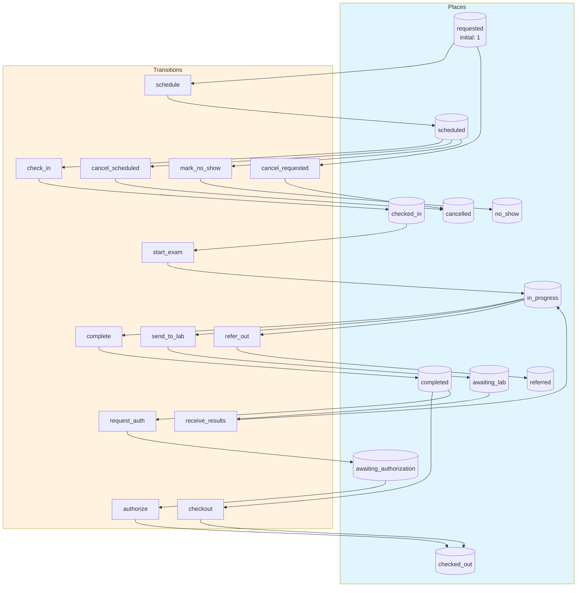

# vet-clinic

A Petri net-based workflow application generated by [petri-pilot](https://github.com/pflow-xyz/petri-pilot).

## Quick Start

```bash
# Build and run
go build -o server .
./server

# Server starts on http://localhost:8080
```

## Architecture

This application uses **event sourcing** with a **Petri net** state machine to model workflows. All state changes are captured as immutable events, enabling:

- Full audit trail of all transitions
- Time-travel debugging
- Event replay for recovery
- Deterministic state reconstruction

## State Machine

### Places (States)

| Place | Type | Initial | Description |
|-------|------|---------|-------------|
| `requested` | Token | 1 | - |
| `scheduled` | Token | 0 | - |
| `checked_in` | Token | 0 | - |
| `in_progress` | Token | 0 | - |
| `completed` | Token | 0 | - |
| `checked_out` | Token | 0 | - |
| `cancelled` | Token | 0 | - |
| `no_show` | Token | 0 | - |
| `awaiting_lab` | Token | 0 | - |
| `awaiting_authorization` | Token | 0 | - |
| `referred` | Token | 0 | - |


### Transitions (Actions)

| Transition | Event | Guard | Description |
|------------|-------|-------|-------------|
| `schedule` | `Scheduleed` | - | - |
| `check_in` | `CheckIned` | - | - |
| `start_exam` | `StartExamed` | - | - |
| `complete` | `Completeed` | - | - |
| `checkout` | `Checkouted` | - | - |
| `cancel_requested` | `CancelRequested` | - | - |
| `cancel_scheduled` | `CancelScheduled` | - | - |
| `mark_no_show` | `MarkNoShowed` | - | - |
| `send_to_lab` | `SendToLabed` | - | - |
| `receive_results` | `ReceiveResultsed` | - | - |
| `request_auth` | `RequestAuthed` | - | - |
| `authorize` | `Authorizeed` | - | - |
| `refer_out` | `ReferOuted` | - | - |


### Petri Net Diagram

```mermaid
stateDiagram-v2
    direction LR

    state "requested (1)" as PlaceRequested
    state "scheduled" as PlaceScheduled
    state "checked_in" as PlaceCheckedIn
    state "in_progress" as PlaceInProgress
    state "completed" as PlaceCompleted
    state "checked_out" as PlaceCheckedOut
    state "cancelled" as PlaceCancelled
    state "no_show" as PlaceNoShow
    state "awaiting_lab" as PlaceAwaitingLab
    state "awaiting_authorization" as PlaceAwaitingAuthorization
    state "referred" as PlaceReferred


    state "schedule" as t_TransitionSchedule
    state "check_in" as t_TransitionCheckIn
    state "start_exam" as t_TransitionStartExam
    state "complete" as t_TransitionComplete
    state "checkout" as t_TransitionCheckout
    state "cancel_requested" as t_TransitionCancelRequested
    state "cancel_scheduled" as t_TransitionCancelScheduled
    state "mark_no_show" as t_TransitionMarkNoShow
    state "send_to_lab" as t_TransitionSendToLab
    state "receive_results" as t_TransitionReceiveResults
    state "request_auth" as t_TransitionRequestAuth
    state "authorize" as t_TransitionAuthorize
    state "refer_out" as t_TransitionReferOut


    PlaceRequested --> t_TransitionSchedule
    t_TransitionSchedule --> PlaceScheduled

    PlaceScheduled --> t_TransitionCheckIn
    t_TransitionCheckIn --> PlaceCheckedIn

    PlaceCheckedIn --> t_TransitionStartExam
    t_TransitionStartExam --> PlaceInProgress

    PlaceInProgress --> t_TransitionComplete
    t_TransitionComplete --> PlaceCompleted

    PlaceCompleted --> t_TransitionCheckout
    t_TransitionCheckout --> PlaceCheckedOut

    PlaceRequested --> t_TransitionCancelRequested
    t_TransitionCancelRequested --> PlaceCancelled

    PlaceScheduled --> t_TransitionCancelScheduled
    t_TransitionCancelScheduled --> PlaceCancelled

    PlaceScheduled --> t_TransitionMarkNoShow
    t_TransitionMarkNoShow --> PlaceNoShow

    PlaceInProgress --> t_TransitionSendToLab
    t_TransitionSendToLab --> PlaceAwaitingLab

    PlaceAwaitingLab --> t_TransitionReceiveResults
    t_TransitionReceiveResults --> PlaceInProgress

    PlaceCompleted --> t_TransitionRequestAuth
    t_TransitionRequestAuth --> PlaceAwaitingAuthorization

    PlaceAwaitingAuthorization --> t_TransitionAuthorize
    t_TransitionAuthorize --> PlaceCheckedOut

    PlaceInProgress --> t_TransitionReferOut
    t_TransitionReferOut --> PlaceReferred

```



### Workflow Diagram




## Events

Events are immutable records of state transitions. Each event captures the transition that occurred and any associated data.

| Event Type | Transition | Fields |
|------------|------------|--------|
| `AppointmentScheduled` | `schedule` | `aggregate_id`, `timestamp`, `patient_name`, `owner_name`, `phone`, `appointment_type`, `scheduled_time`, `duration_minutes`, `assigned_provider`, `provider_type`, `assigned_room`, `notes` |
| `PatientCheckedIn` | `check_in` | `aggregate_id`, `timestamp`, `arrival_time`, `weight_lbs` |
| `ExamStarted` | `start_exam` | `aggregate_id`, `timestamp`, `provider_name`, `room` |
| `VisitCompleted` | `complete` | `aggregate_id`, `timestamp`, `diagnosis`, `treatment`, `follow_up_needed` |
| `PatientCheckedOut` | `checkout` | `aggregate_id`, `timestamp`, `services_pct`, `products_pct`, `next_appointment` |
| `AppointmentCancelled` | `cancel_requested` | `aggregate_id`, `timestamp`, `reason`, `rescheduled` |
| `AppointmentCancelled` | `cancel_scheduled` | `aggregate_id`, `timestamp`, `reason`, `rescheduled` |
| `MarkedNoShow` | `mark_no_show` | `aggregate_id`, `timestamp`, `attempted_contact`, `notes` |
| `LabRequested` | `send_to_lab` | `aggregate_id`, `timestamp`, `test_type`, `lab_name`, `urgency` |
| `LabResultsReceived` | `receive_results` | `aggregate_id`, `timestamp`, `results_summary`, `abnormal_findings`, `recommendations` |
| `AuthorizationRequested` | `request_auth` | `aggregate_id`, `timestamp`, `procedure_type`, `estimated_cost`, `justification` |
| `AuthorizationGranted` | `authorize` | `aggregate_id`, `timestamp`, `approved_by`, `conditions` |
| `PatientReferred` | `refer_out` | `aggregate_id`, `timestamp`, `referral_reason`, `specialist_type`, `referred_to`, `urgency` |

```mermaid
classDiagram
    class Event {
        +string ID
        +string StreamID
        +string Type
        +int Version
        +time.Time Timestamp
        +json.RawMessage Data
    }


    class AppointmentScheduledEvent {
        +string AggregateId
        +time.Time Timestamp
        +string PatientName
        +string OwnerName
        +string Phone
        +string AppointmentType
        +string ScheduledTime
        +float64 DurationMinutes
        +string AssignedProvider
        +string ProviderType
        +string AssignedRoom
        +string Notes
    }
    Event <|-- AppointmentScheduledEvent

    class PatientCheckedInEvent {
        +string AggregateId
        +time.Time Timestamp
        +string ArrivalTime
        +float64 WeightLbs
    }
    Event <|-- PatientCheckedInEvent

    class ExamStartedEvent {
        +string AggregateId
        +time.Time Timestamp
        +string ProviderName
        +string Room
    }
    Event <|-- ExamStartedEvent

    class VisitCompletedEvent {
        +string AggregateId
        +time.Time Timestamp
        +string Diagnosis
        +string Treatment
        +bool FollowUpNeeded
    }
    Event <|-- VisitCompletedEvent

    class PatientCheckedOutEvent {
        +string AggregateId
        +time.Time Timestamp
        +float64 ServicesPct
        +float64 ProductsPct
        +string NextAppointment
    }
    Event <|-- PatientCheckedOutEvent

    class AppointmentCancelledEvent {
        +string AggregateId
        +time.Time Timestamp
        +string Reason
        +bool Rescheduled
    }
    Event <|-- AppointmentCancelledEvent

    class AppointmentCancelledEvent {
        +string AggregateId
        +time.Time Timestamp
        +string Reason
        +bool Rescheduled
    }
    Event <|-- AppointmentCancelledEvent

    class MarkedNoShowEvent {
        +string AggregateId
        +time.Time Timestamp
        +bool AttemptedContact
        +string Notes
    }
    Event <|-- MarkedNoShowEvent

    class LabRequestedEvent {
        +string AggregateId
        +time.Time Timestamp
        +string TestType
        +string LabName
        +string Urgency
    }
    Event <|-- LabRequestedEvent

    class LabResultsReceivedEvent {
        +string AggregateId
        +time.Time Timestamp
        +string ResultsSummary
        +bool AbnormalFindings
        +string Recommendations
    }
    Event <|-- LabResultsReceivedEvent

    class AuthorizationRequestedEvent {
        +string AggregateId
        +time.Time Timestamp
        +string ProcedureType
        +float64 EstimatedCost
        +string Justification
    }
    Event <|-- AuthorizationRequestedEvent

    class AuthorizationGrantedEvent {
        +string AggregateId
        +time.Time Timestamp
        +string ApprovedBy
        +string Conditions
    }
    Event <|-- AuthorizationGrantedEvent

    class PatientReferredEvent {
        +string AggregateId
        +time.Time Timestamp
        +string ReferralReason
        +string SpecialistType
        +string ReferredTo
        +string Urgency
    }
    Event <|-- PatientReferredEvent

```





## Access Control

Role-based access control (RBAC) restricts which users can execute transitions.


### Roles

| Role | Description | Inherits |
|------|-------------|----------|
| `office_manager` | - | - |
| `dvm` | - | - |
| `rvt` | - | - |
| `vet_assistant` | - | - |
| `front_desk` | - | - |


### Permissions

| Transition | Required Roles | Guard |
|------------|----------------|-------|
| `schedule` | `front_desk`, `office_manager` | - |
| `cancel_requested` | `front_desk`, `office_manager` | - |
| `cancel_scheduled` | `front_desk`, `office_manager` | - |
| `mark_no_show` | `front_desk`, `office_manager` | - |
| `check_in` | `front_desk`, `vet_assistant`, `office_manager` | - |
| `start_exam` | `dvm`, `rvt`, `office_manager` | - |
| `send_to_lab` | `dvm`, `rvt`, `office_manager` | - |
| `receive_results` | `dvm`, `rvt`, `office_manager` | - |
| `complete` | `dvm`, `rvt`, `office_manager` | - |
| `request_auth` | `dvm`, `office_manager` | - |
| `authorize` | `dvm`, `office_manager` | - |
| `refer_out` | `dvm`, `office_manager` | - |
| `checkout` | `front_desk`, `vet_assistant`, `office_manager` | - |

```mermaid
graph TD
    subgraph Roles
        role_office_manager["office_manager"]
        role_dvm["dvm"]
        role_rvt["rvt"]
        role_vet_assistant["vet_assistant"]
        role_front_desk["front_desk"]
    end

    subgraph Transitions
        t_schedule["schedule"]
        t_cancel_requested["cancel_requested"]
        t_cancel_scheduled["cancel_scheduled"]
        t_mark_no_show["mark_no_show"]
        t_check_in["check_in"]
        t_start_exam["start_exam"]
        t_send_to_lab["send_to_lab"]
        t_receive_results["receive_results"]
        t_complete["complete"]
        t_request_auth["request_auth"]
        t_authorize["authorize"]
        t_refer_out["refer_out"]
        t_checkout["checkout"]
    end


    role_front_desk -.->|can execute| t_schedule
    role_office_manager -.->|can execute| t_schedule

    role_front_desk -.->|can execute| t_cancel_requested
    role_office_manager -.->|can execute| t_cancel_requested

    role_front_desk -.->|can execute| t_cancel_scheduled
    role_office_manager -.->|can execute| t_cancel_scheduled

    role_front_desk -.->|can execute| t_mark_no_show
    role_office_manager -.->|can execute| t_mark_no_show

    role_front_desk -.->|can execute| t_check_in
    role_vet_assistant -.->|can execute| t_check_in
    role_office_manager -.->|can execute| t_check_in

    role_dvm -.->|can execute| t_start_exam
    role_rvt -.->|can execute| t_start_exam
    role_office_manager -.->|can execute| t_start_exam

    role_dvm -.->|can execute| t_send_to_lab
    role_rvt -.->|can execute| t_send_to_lab
    role_office_manager -.->|can execute| t_send_to_lab

    role_dvm -.->|can execute| t_receive_results
    role_rvt -.->|can execute| t_receive_results
    role_office_manager -.->|can execute| t_receive_results

    role_dvm -.->|can execute| t_complete
    role_rvt -.->|can execute| t_complete
    role_office_manager -.->|can execute| t_complete

    role_dvm -.->|can execute| t_request_auth
    role_office_manager -.->|can execute| t_request_auth

    role_dvm -.->|can execute| t_authorize
    role_office_manager -.->|can execute| t_authorize

    role_dvm -.->|can execute| t_refer_out
    role_office_manager -.->|can execute| t_refer_out

    role_front_desk -.->|can execute| t_checkout
    role_vet_assistant -.->|can execute| t_checkout
    role_office_manager -.->|can execute| t_checkout

```





## API Endpoints

### Core Endpoints

| Method | Path | Description |
|--------|------|-------------|
| GET | `/health` | Health check |
| GET | `/ready` | Readiness check |
| POST | `/api/vet-clinic` | Create new instance |
| GET | `/api/vet-clinic/{id}` | Get instance state |


### Transition Endpoints

| Method | Path | Transition | Description |
|--------|------|------------|-------------|
| POST | `/api/schedule` | `schedule` | - |
| POST | `/api/check_in` | `check_in` | - |
| POST | `/api/start_exam` | `start_exam` | - |
| POST | `/api/complete` | `complete` | - |
| POST | `/api/checkout` | `checkout` | - |
| POST | `/api/cancel_requested` | `cancel_requested` | - |
| POST | `/api/cancel_scheduled` | `cancel_scheduled` | - |
| POST | `/api/mark_no_show` | `mark_no_show` | - |
| POST | `/api/send_to_lab` | `send_to_lab` | - |
| POST | `/api/receive_results` | `receive_results` | - |
| POST | `/api/request_auth` | `request_auth` | - |
| POST | `/api/authorize` | `authorize` | - |
| POST | `/api/refer_out` | `refer_out` | - |


### Request/Response Format

#### Create Instance
```bash
curl -X POST http://localhost:8080/api/vet-clinic \
  -H "Content-Type: application/json" \
  -H "Authorization: Bearer <token>"
```

#### Execute Transition
```bash
curl -X POST http://localhost:8080/api/<transition> \
  -H "Content-Type: application/json" \
  -H "Authorization: Bearer <token>" \
  -d '{
    "aggregate_id": "<instance-id>",
    "data": { ... }
  }'
```

#### Response Format
```json
{
  "success": true,
  "aggregate_id": "uuid",
  "version": 1,
  "state": { "place1": 1, "place2": 0 },
  "enabled_transitions": ["transition1", "transition2"]
}
```


## Configuration

### Environment Variables

| Variable | Default | Description |
|----------|---------|-------------|
| `PORT` | `8080` | HTTP server port |
| `DB_PATH` | `./vet-clinic.db` | SQLite database path |


## Development

### Project Structure

```
.
├── main.go           # Application entry point
├── workflow.go       # Petri net definition
├── aggregate.go      # Event-sourced aggregate
├── events.go         # Event type definitions
├── api.go            # HTTP handlers
├── auth.go           # Authentication
├── middleware.go     # HTTP middleware
├── permissions.go    # Permission checks
├── frontend/         # Web UI (ES modules)
│   ├── index.html
│   └── src/
│       ├── main.js
│       ├── router.js
│       └── ...
└── go.mod
```

### Testing

```bash
# Run unit tests
go test ./...

# Run with test coverage
go test -cover ./...
```

## Custom Features

### Financial Analytics Dashboard

The dashboard provides real-time insights into clinic financial performance:

| Endpoint | Method | Description |
|----------|--------|-------------|
| `/api/analytics` | GET | Aggregated financial metrics |
| `/api/analytics/report` | GET | Detailed financial report |
| `/dashboard` | - | Web dashboard UI |

**Analytics Response:**
```json
{
  "total_visits": 25,
  "avg_services_pct": 69.5,
  "avg_products_pct": 30.5,
  "by_appointment_type": {
    "wellness": { "visit_count": 10, "avg_services_pct": 72.0 },
    "sick": { "visit_count": 8, "avg_services_pct": 60.0 }
  },
  "by_provider": {
    "Dr. Johnson": { "visit_count": 9, "avg_services_pct": 68.0 }
  },
  "industry_benchmarks": {
    "target_services_pct": 71,
    "target_products_pct": 29
  }
}
```

### Simulation Mode

Generate realistic patient visits for testing and demonstration:

| Endpoint | Method | Description |
|----------|--------|-------------|
| `/api/simulation/start` | POST | Start simulation |
| `/api/simulation/stop` | POST | Stop running simulation |
| `/api/simulation/status` | GET | Get simulation status |
| `/simulation` | - | Web control panel |

**Start Simulation:**
```bash
curl -X POST http://localhost:8080/api/simulation/start \
  -H "Content-Type: application/json" \
  -d '{"visits_to_generate": 20, "delay_ms": 300}'
```

**Appointment Type Distribution:**
- Wellness: 40%
- Sick: 30%
- Dental: 10%
- Surgery: 10%
- Vaccination: 10%

### Staff & Room Scheduling

Appointments track assigned providers and rooms:

| Field | Description |
|-------|-------------|
| `assigned_provider` | Provider handling the visit (e.g., "Dr. Johnson") |
| `provider_type` | DVM or RVT |
| `assigned_room` | Room assignment (e.g., "Exam Room 1", "Surgery Suite") |

---

Generated by [petri-pilot](https://github.com/pflow-xyz/petri-pilot)
